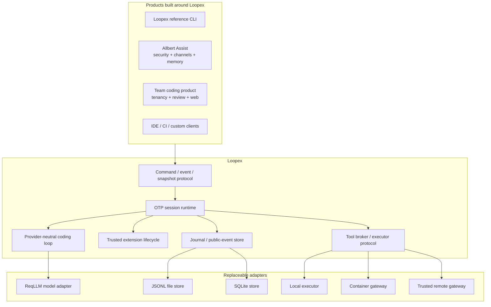
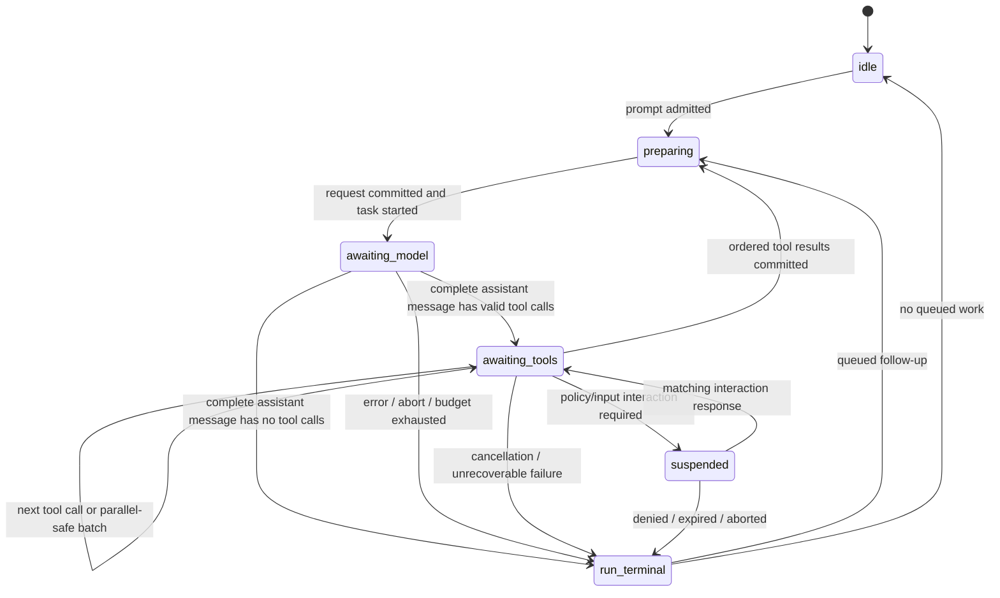

# Loopex — Vision, Architecture, and Project Plan (Draft)

Status: greenfield project proposal, draft for operator review
Date: 2026-08-14
License: **Apache-2.0** (decided)
Name: **Loopex** — "the loop, in Elixir." Chosen over the alternatives after
availability research; final trademark/domain clearance remains a pre-public
checklist item (§18.4).
Scope: Loopex itself. [Allbert Assist](https://github.com/lexlapax/allbert-assist/)
appears only as a future host/integration example.

## Executive summary

Build Loopex as a new repository and a new product boundary:

> **Loopex is an OTP-native, embeddable coding-session runtime: a small,
> provider-neutral agent loop with durable sessions, versioned commands and
> events, location-transparent tool execution, and trusted live extensions.**

An agent is a loop around an LLM. Loopex is that loop made a supervised,
durable, attachable Elixir service — a complete minimal terminal coding
harness on its own, and compact enough for other products to embed (a
relationship the market has already proven viable; §1.1). It is not a rewrite
of any existing product, not an extraction of
[Allbert](https://github.com/lexlapax/allbert-assist/)'s kernel, and not a
generic multi-agent framework.

José Valim's observations are the architectural brief:

1. Elixir already supplies the difficult runtime primitives for a coding
   harness: hot code replacement for a live-reloadable extension system,
   actors that make client-server architecture a byproduct, and built-in
   distribution that isolates the brains (model + session) from the hands
   (sandbox + tools).
2. **"You don't need an external framework for this. The runtime is the
   framework."**

The consequence is stronger than "write Pi in Elixir." Loopex must not hide
OTP behind a second agent framework. Its core is ordinary Elixir/Erlang:

- one serialized coordinator and supervised subtree per active session;
- pure state transitions over plain data;
- `DynamicSupervisor`, `Registry`, supervised tasks, monitors, and messages;
- an append-only session journal plus rebuildable projections;
- explicit behaviours at the model, store, tool-executor, extension, and
  transport boundaries;
- trusted OTP applications for live extensions;
- a narrow job protocol, not remote anonymous functions, between the session
  "brain" and local or remote "hands."

Those pieces organize into named layers — **the Loopex stack** — and this
vocabulary, not any other project's package names, is how the rest of this
document speaks:

- **Loopex protocol** (`Loopex.Protocol`) — the versioned command, event,
  snapshot, and interaction contracts every transport and client shares;
- **Loopex agent core** (`Loopex.Core`) — the pure loop: session reducer,
  run/turn semantics, input queues, typed outcomes, context projection;
- **Loopex session runtime** (`Loopex.Runtime`) — supervision, journal and
  stores, public-event fan-out, extension lifecycle, the executor broker;
- **Loopex edges** — replaceable adapters and clients around that stable
  middle: model adapters (`loopex_llm_reqllm`), store adapters, executors,
  and the terminal/RPC/embedded clients.

No Jido dependency in the core: the LLM-calling layer is a behaviour whose
reference adapter is **ReqLLM used directly** — a standalone library on
Req/Finch, not an agent framework (§9.3). The core must still compile and test
with a fake model adapter and no provider library at all.

The first useful release is deliberately small: one real provider, one durable
session, the seven-tool coding surface, an Elixir API, a JSONL RPC mode,
streamed events, steering/follow-up/cancellation, and a thin terminal client.
Sub-agents, plan mode, enterprise policy, social channels, long-term memory,
background objectives, marketplaces, and Phoenix UI are applications around
Loopex, not Loopex core.

## 1. Why this project, and why now

### 1.1 Pi validates the product shape — and is converging on this architecture

Pi (pi.dev, `earendil-works/pi`, MIT) is a minimal terminal coding harness
adapted through extensions and packages rather than by modifying its
internals: a sub-1,000-token system prompt, a small built-in tool surface
(`read`, `write`, `edit`, `bash`, `grep`, `find`, `ls`), deliberate omissions
(no MCP, no sub-agents, no plan mode, no todos, no permission prompts), and
interactive, print, JSON, RPC, and in-process SDK modes. That is not a bag of
CLI features; it is a proven product shape: **a small loop, a rich extension
seam, and more than one way to host it.**

Pi's implementation is usefully layered — `pi-ai` (provider normalization) →
`pi-agent-core` (loop, queues, abort, events) → `pi-coding-agent` (sessions,
persistence, extensions, compaction, modes) → `pi-tui` — and that layering is
what let OpenClaw consume the bottom layers, replace the top, and eventually
internalize the middle. Loopex keeps the separation but owns every layer
under its own names: the model boundary is the `Loopex.LLM` behaviour and
its adapters, the loop is the Loopex agent core, sessions/extensions/
executors/transports are the Loopex session runtime, and the contracts are
the Loopex protocol (the stack defined in the executive summary, detailed in
§5). Pi's package names appear in this document only in this section, as
prior art — no Loopex construct is defined by pointing at one.

The strongest "why now" signal is Pi's own roadmap: its post-Earendil
experimental `pi-protocol`/`pi-server`/`pi-client` packages hand-build framed
transports, session servers, leases, snapshots, and locking — a session-server
architecture the BEAM supplies natively. Loopex can also improve on Pi where
Pi's runtime cannot follow: a session as a durable supervised service,
explicit tool location, and reconnect/replay semantics specified from the
start.

The OpenClaw history carries a second lesson: it eventually forked Pi's
internals rather than depend on an adjacent project's loop forever. Loopex
must therefore be a stable product boundary in its own right — versioned
contracts, conformance suites — not an internal implementation detail of its
first wrapper.

"Pi written in Elixir" means semantic parity at the harness boundary, with
deliberate OTP-native substitutions:

| Pi capability | Loopex disposition |
| --- | --- |
| Minimal provider-neutral tool loop | Core requirement, expressed as a pure reducer plus supervised OTP work |
| Built-in coding tools | Same seven-tool surface, behind executor ports |
| Streaming and abort | Core requirement with typed terminal and cancellation semantics |
| Steering and follow-up queues | Core requirement with explicit run/settled boundaries |
| Persistent, branchable sessions | Core requirement via a private journal, public events, snapshots, and projections |
| Compaction and branch summarization | Same user capability, as distinct durable operations |
| Context files, skills, prompt templates | Data-only resource packs with progressive disclosure |
| Extensions and shareable packages | Trusted OTP extensions plus separate data and hand-package classes |
| Interactive, print, JSON, RPC, SDK usage | Reference terminal plus embedded Elixir and versioned wire APIs |
| Provider breadth | Adapter ecosystem goal; normalize first, add providers after conformance |
| TUI themes and custom rendering | Reference-client/extension concern, never core state |
| No built-in sub-agents or plan mode | Preserve the omission in core; wrappers may compose sessions |
| TypeScript/npm execution model | Do not copy; OTP applications, Hex/git/local packages, explicit trust |
| Exact Pi APIs and session JSON | Do not copy or promise compatibility in 0.x |

### 1.2 OTP changes which problems require a framework

The BEAM already has the substrate usually rebuilt inside an agent framework:
processes for isolated state ownership and cheap concurrency; supervisors for
lifecycle and restart policy; monitors and links for observable failure;
registries and process groups for discovery; schedulers that keep model I/O
and tool I/O concurrent; code loading and `code_change/3` for deliberate live
evolution; distribution for coordinating trusted remote runtimes; ports and
external processes for OS-isolated workers.

That makes a headless client/server runtime a natural topology. It does
**not** make the public contract automatic. Stable IDs, authentication
boundaries, command deduplication, schema negotiation, reconnect cursors,
backpressure, and ambiguous-effect handling still require explicit design.

The same honesty applies to hot code and distribution:

- the BEAM keeps two versions of a module; loading a third purges the oldest
  and kills processes still executing it — reload must be engineered, not
  assumed;
- `code_change/3` is a deliberate state-migration hook, not automatic
  correctness;
- Mix releases do not provide production hot upgrades out of the box;
- all code loaded into one VM is trusted — compiling Elixir *is* executing it;
- connected distributed Erlang nodes are mutually trusted, even over TLS.

Loopex therefore uses OTP for continuity, concurrency, supervision, and
trusted extensibility; an explicit protocol for durable semantics; and
OS-level isolation for generated code and hostile workloads.

### 1.3 Allbert supplies hard-won evidence about the boundary

[Allbert Assist](https://github.com/lexlapax/allbert-assist/) contains both
halves of the argument.

It contains the seed: a working minimal coding loop — Allbert's gated coding
surface, "Pi-mode" in Allbert's own naming
([ADR 0068](https://github.com/lexlapax/allbert-assist/blob/main/docs/adr/0068-pi-mode-coding-surface-and-local-coding-trust-tier.md)) — in
[`AllbertAssist.Coding.*`](https://github.com/lexlapax/allbert-assist/tree/main/apps/allbert_assist/lib/allbert_assist/coding),
~5.8k LOC with ~3.4k LOC of tests, already cleanly
separable behind three seams (tool execution, configuration, response
shape). §14 maps what transfers.

And it contains the warning: its active v1.4 release is a months-long effort
(the [plan](https://github.com/lexlapax/allbert-assist/blob/main/docs/plans/v1.4-plan.md)
and [request-flow](https://github.com/lexlapax/allbert-assist/blob/main/docs/plans/v1.4-request-flow.md)
documents alone exceed 9,000 lines) to retrofit a
kernel/component boundary into a product that at v1.4 build start had 281
actions, 624 effective settings keys, 42 versioned release gates with 414
ordered steps. The cost was not moving modules; it was discovering years of
coupling among policy, registries, settings, packaging, evidence, UI, and
tests. **Loopex is born as the boundary instead of retrofitting one.**

The reusable lessons are much smaller than the system that produced them:

- one owner serializes a session;
- durable state is written before notifications are published;
- events are observations, not authority or storage;
- commands and effects need stable idempotency identities;
- model-facing content and client-facing rendering are different payloads;
- cancellation is a protocol, not `Task.shutdown/2` sprinkled through code;
- a lost effect can have an unknown outcome and must not be blindly retried;
- generated code must be compiled and tested away from the coordinator;
- channels render and translate; they do not own a private loop;
- policy and delivery receipts belong to the product that owns the user and
  channel, not to a generic coding loop.

The design conclusion: **carry the invariants; leave the product subsystems
behind.**

## 2. Product vision

### 2.1 One sentence

Loopex makes a coding agent an embeddable, supervised Elixir service rather
than a terminal process that happens to call tools.

### 2.2 What users should be able to build

The same Loopex runtime should support:

1. **The reference Loopex CLI** — a fast, minimal terminal coding harness
   for one trusted developer and one repository.
2. **[Allbert Assist](https://github.com/lexlapax/allbert-assist/)** — a
   policy-rich personal assistant that maps identity,
   confirmations, Security Central, long-term memory, and many channels onto
   Loopex sessions and tools.
3. **A team coding service** — tenancy, worktree allocation, repository
   policy, review, audit, quotas, remote workers, and a web UI around Loopex.
4. **IDE and editor integrations** — clients that attach, replay from a
   cursor, submit prompts or steering, and render the same event stream.
5. **Build and CI agents** — headless processes using the Elixir API or wire
   protocol without a TUI.
6. **Specialized developer tools** — debugging, migration, documentation,
   incident-response, or data agents contributing tools and context while
   reusing the same loop.

### 2.3 The north-star experience

A developer starts a Loopex daemon in a repository and attaches a terminal.
They ask for a change. The session streams model output, reads code, edits
files, runs tests, accepts steering while active, and records a branchable
history. The terminal can disconnect without killing the work. A second
client attaches as an observer and reconstructs state from a snapshot plus
later events.

During that session a trusted extension is rebuilt. Loopex compiles and
validates the candidate in a disposable validation VM, queues new work that
would use the extension, lets affected in-flight runs settle, and then
replaces the extension without discarding session history. If post-load
health or state migration fails, Loopex reloads the retained prior artifact
before releasing queued work. This is a brief activation barrier, not
simultaneous routing to two same-name module revisions inside one VM (§11.3).

The same session can later execute a compiler or tests inside a local
container or on a remote worker. The session still owns the model and
history; the worker owns the workspace and OS processes. A lost worker
produces a truthful `outcome_unknown` when Loopex cannot prove whether an
effect completed.

### 2.4 Product principles

1. **The runtime is the framework.** OTP primitives and small behaviours over
   an agent DSL, workflow engine, or macro layer.
2. **Session before surface.** The runtime is headless. CLI, TUI, Phoenix,
   IDE, chat, and API clients are peers over one contract.
3. **Events are a public contract, not a log format.** Private recovery
   records, durable public events, authoritative snapshots, and transient
   progress have distinct semantics.
4. **Brains and hands are separate.** The coordinator never gains implicit
   host authority merely because a tool exists.
5. **Mechanism in Loopex; policy in the host.** Loopex supplies interception,
   suspension, grants, receipts, and execution boundaries. Hosts decide who
   may do what.
6. **Generated code is a candidate, not an extension.** Compile and test it
   in an isolated hand; promote it through an explicit trusted lifecycle.
7. **Minimal defaults, open composition.** Seven default tools inside a
   ≤1,000-token prompt budget, no built-in plan mode, no built-in sub-agents,
   no built-in team workflow.
8. **Plain data crosses boundaries.** Public contracts carry stable IDs and
   versioned values — never PIDs, ports, anonymous functions, or arbitrary
   Erlang terms.
9. **Failure is a first-class result.** Cancellation, timeout, denial,
   unavailable workers, and ambiguous effects are modeled, not hidden.
10. **Restart and replay before production hot upgrades.** Live extension
    reload is an early feature; full release hot upgrade is a later
    operations feature.

## 3. Deliberate scope

### 3.1 Loopex owns

- the provider-neutral model request, stream, message, usage, and tool-call
  vocabulary;
- one serial agent loop per session;
- prompt, steering, follow-up, abort, retry, and settled semantics;
- an append-only private session journal, durable public-event projection,
  snapshots, replay, branching, and context projection;
- the public command, event, snapshot, and interaction contracts;
- logical client attachment, snapshot/cursor, command-admission, and
  interaction mechanics;
- tool definitions, validation, execution requests, streamed output, results,
  cancellation, and unknown-outcome semantics;
- local, container-gateway, and trusted-remote executor ports;
- trusted extension discovery, quiescent activation, drain, state migration,
  rollback, and health;
- reference Elixir and JSONL APIs;
- a small reference coding distribution and terminal client.

### 3.2 Hosts and wrappers own

User/organization/tenant/channel identity; authentication and authorization
policy; durable confirmation policy and approval UX; secrets, credential
custody, redaction policy, audit retention; social-channel adapters,
deduplication, outboxes, delivery retries, "user saw this" receipts;
long-term memory; objectives, schedules, background jobs, multi-agent fan-out
and joins; billing, quotas, repository governance, review rules, deployment
policy; product settings, onboarding, model recommendations, fallbacks; web
workspaces, dashboards, enterprise administration; extension trust decisions
and package signing policy.

### 3.3 Explicit non-goals for 0.x core

An [Allbert](https://github.com/lexlapax/allbert-assist/) compatibility layer
inside Loopex; a generic autonomous-agent
framework; a workflow DAG or durable objective engine; built-in sub-agent
scheduling; built-in plan mode or to-dos; a social-channel framework; MCP
server/client parity; a marketplace or remote auto-installer; arbitrary
model-generated Elixir loaded into the brain VM; treating a BEAM process,
node, or supervision tree as a security sandbox; exactly-once remote effects;
multi-tenant authorization; a Phoenix or LiveView dependency in core; Jido
Agent/Action/Signal as a public or internal runtime spine; production
`.appup`/`.relup` hot upgrades before restart/replay and extension reload are
proven.

## 4. Domain model

| Term | Meaning |
| --- | --- |
| **Session** | Durable coding conversation and configuration, identified by `session_id`. An active process is a cache/owner, not the source of truth. |
| **Run** | Work triggered by one prompt or queued follow-up, from admission until terminal outcome. One run is active per session in 0.x. |
| **Turn** | One model response plus the tool batch it requests. A run may contain many turns. |
| **Command** | Versioned client request: prompt, steer, follow-up, abort, compact, fork, set model, respond to interaction. |
| **Journal record** | Private durable transition used to recover the session and reconcile work. Not a public API. |
| **Public event** | Stable, durable projection of committed journal state for clients. Public event sequences are independent of private journal versions. |
| **Progress** | Transient stream hint (token, stdout delta). Not canonical state. |
| **Snapshot** | Authoritative materialized session view. Public snapshots anchor to `event_sequence`; private recovery snapshots anchor to `journal_version`. |
| **Channel** | A logical attachment between a client and a session, carrying commands, snapshots, and events. Not Slack/Discord-specific. |
| **Interaction** | Generic suspended decision/input request answered by exact `interaction_id`. A host may render it as an approval, question, or form. |
| **Tool** | Model-visible name, description, parameter schema, result shape, execution requirements. |
| **Tool call** | One model-requested invocation with a stable `tool_call_id`. |
| **Executor** | Local or remote implementation that performs a tool job. |
| **Brain** | Session, model credentials, context, journal truth, public projection, scheduling. |
| **Hand** | Workspace, compilers, shell, filesystem mutation, generated programs. |
| **Workspace** | Opaque executor-owned repository/filesystem reference, not necessarily a local path on the brain. |
| **Artifact** | Content-addressed output too large or unsuitable for inline events. |
| **Extension** | Trusted code package implementing versioned Loopex behaviours. Full authority in the VM where it loads. |
| **Resource pack** | Data-only prompts, skills, and context. Cannot execute by itself. |
| **Projection** | Rebuildable view derived from journal records: model context, public events, client snapshots. |

## 5. Architecture

### 5.1 Ecosystem boundary



Dependency direction is one-way. Loopex never imports an Allbert module or an
enterprise-product concept. Hosts depend on the Loopex protocol/API and
supply adapters.

### 5.2 "Runtime is the framework" dependency rule

The core has a hard dependency budget:

- the initial `loopex` OTP application contains `Loopex.Protocol`,
  `Loopex.Core`, and `Loopex.Runtime` namespaces and depends only on the
  Elixir/Erlang standard runtime;
- JSON, SQLite, ReqLLM, terminal, HTTP, container, and telemetry libraries
  live in adapter/reference applications;
- no compile-time Phoenix, Ecto, Jido, Docker, Kubernetes, or cloud SDK
  dependency in `loopex`;
- event fan-out uses the runtime's own primitives (`Registry` dispatch
  locally, `:pg` across nodes), not an external pub/sub library;
- a namespace becomes a separate OTP application or Hex package only after an
  observed compile, runtime, ownership, or publication boundary requires it.

No agent DSL. Tools and extensions implement ordinary behaviours. `GenServer`
and `Supervisor` are not wrapped in macros to look framework-like. The
codebase doubles as practical learning material for Elixir-and-AI — a real
gap Valim's thread called out: a reader should be able to point from each
architectural promise to the OTP primitive that implements it.

### 5.3 Repository and application layout

One monorepo, one version during 0.x. M0 begins with three applications, not
a speculative component framework:

```text
loopex/
  apps/
    loopex/               # Protocol/Core/Runtime/Store namespaces; standard OTP only
    loopex_llm_reqllm/    # reference model adapter (ReqLLM)
    loopex_cli/           # M0 JSONL/reference-client spike, later the real CLI
  examples/
    embedded/
    custom_tool/
    custom_client/
    trusted_extension/
  conformance/
    provider/
    executor/
    store/
    protocol/
```

During v0.1, SQLite and the native executor may become `loopex_store_sqlite`
and `loopex_executor_local` once their behaviours and dependency pressure are
real. Later container, cluster, WebSocket/HTTP, and client packages follow
the same rule. One release train; no configurable pack system, component
catalog, generated registry, or cross-component release gate merely to
preserve folder boundaries — the boundary that matters is the dependency
budget, enforced in CI.

### 5.4 Supervision topology

```text
Loopex.Runtime.Application
├── Store
├── SessionRegistry
├── ModelAdapterRegistry
├── ExecutorDirectory
├── ExtensionManager
├── SessionSupervisor (DynamicSupervisor)
│   ├── SessionTree[session_id] (Supervisor, :one_for_all)
│   │   ├── Coordinator (GenServer)
│   │   └── WorkSupervisor (Task.Supervisor)
│   └── SessionTree[session_id] ...
└── TransportSupervisor
    ├── Embedded API adapter
    ├── JSONL stdio/RPC adapter
    └── later local socket / WebSocket adapters
```

The `Coordinator` is a serialization shell around a pure transition module:

```text
{new_state, journal_records, public_events, requested_operations}
  = Loopex.Core.Session.reduce(state, input)
```

The coordinator's one permitted synchronous external barrier is a bounded
local journal transaction. That transaction atomically stores private
records, command/operation idempotency rows, and any stable public-event
outbox rows. Only after commit does the coordinator update its cache, publish
public events, and start requested model/tool work. A failed or timed-out
append leaves the prior state authoritative and starts no effect. Provider,
compiler, filesystem, arbitrary database, and network work never runs inside
the coordinator callback.

Each `SessionTree` uses `:one_for_all` initially. Coordinator or
work-supervisor loss terminates all tasks owned by that session before the
subtree restarts; a new session epoch is committed before more work is
admitted. Every async message carries `operation_id`, `attempt`, and
session/executor epoch. An unsolicited live completion must match the current
dispatch attempt and epochs; the coordinator rejects an old one. Prior-epoch
receipts are considered only through the solicited reconciliation path
(§5.5). This prevents a surviving or late task from completing work against
reconstructed state, without making durable recovery evidence unreadable.

Durable session state contains plain serializable data — never PIDs, ports,
monitors, anonymous functions, open streams, or extension process state. On
restart the process loads the latest compatible snapshot, replays later
private records, advances its epoch, and reconciles any operation active at
the last committed journal version.

### 5.5 Durable operation protocol

Command deduplication alone cannot prevent a shell command from running
twice. Every model request and tool job therefore has an operation lifecycle
in the private journal and execution ledger:

```text
intent committed
  -> lease/dispatch attempt recorded
  -> executor accepted or reconciliation required
  -> terminal receipt committed
```

An operation carries stable `operation_id`, `attempt`, session epoch,
executor epoch, idempotency class, and fencing token. The executor durably
deduplicates effectful `operation_id` values and retains terminal receipts
long enough for brain recovery. Crash behavior is explicit:

- after intent but before dispatch, recovery may dispatch the same operation
  ID;
- after dispatch but before the brain stores a result, recovery asks the
  executor for its receipt using a new `reconciliation_query_id` issued under
  the current session epoch;
- if the executor proves no start, policy may create a new attempt;
- if it proves a terminal result, the brain commits that result once;
- if it cannot prove whether an effect ran, the operation becomes
  `outcome_unknown` and is not automatically repeated;
- unsolicited stale results fail their epoch/fencing check; a reconciliation
  response may carry the persisted origin attempt's old epochs only when its
  outer envelope matches the current recovery query, and its embedded receipt
  matches the journaled operation identity and fencing token — the
  coordinator recommits the decision under the current epoch and never
  reclassifies an old receipt as a live completion.

The native v0.1 executor and `bash` tool implement this minimum protocol,
process-tree ownership, cancellation escalation, terminal receipts, and
unknown outcomes. v0.4 adds OS isolation and resource controls; it does not
introduce correct effect semantics for the first time.

## 6. The agent loop

### 6.1 Minimal state machine



One active run per session is a feature, not a temporary limitation. It makes
context ordering, tool effects, steering, and recovery understandable.
Products that need concurrency create more sessions and coordinate them
outside the core.

### 6.2 One run

1. Admit a prompt with a unique `command_id`; commit a private
   command-admission record and idempotency row before acknowledging it.
2. Project the canonical session history into provider messages using the
   active context policy, model capabilities, tool set, and active extension
   set.
3. Atomically commit a private model-operation intent and the `run.started`
   public projection; publish after commit, then launch the model stream in a
   supervised task with its operation identity, attempt, and epochs.
4. Publish text/reasoning/tool-call deltas as transient progress. On
   completion, commit one full assistant message to the private journal and
   emit its stable public event.
5. If the message contains no complete tool calls, finish the run. An output
   limit or malformed/truncated tool-call payload never executes a partial
   call.
6. Validate each requested tool against the active definition and host policy
   port. The decision is `allow`, `deny`, or `defer` with an interaction.
7. Commit each allowed tool-operation intent before dispatching it to an
   executor with deadlines, cancellation, workspace identity, budgets, stable
   IDs, attempt, epochs, and fencing token.
8. Stream progress, reconcile a terminal executor receipt, then commit tool
   results and their stable public projections in the model's original
   tool-call order. Client progress may arrive in completion order.
9. Apply pending steering before the next model request and repeat.
10. Commit a typed terminal outcome and the `run.finished` public event. If
    no follow-up is pending, also expose `session.settled`; otherwise start
    the next run.

`run.finished` and `session.settled` are separate public events on purpose:
a run ending is not the session going quiet. Retries, compaction, or queued
follow-ups may still be pending after a run's terminal outcome, and a client
that conflates the two will prompt into a session that is about to act on
queued work.

### 6.3 Input queues

Four explicit cases in 0.x:

- **`prompt`** starts a run only while settled. If a run is active, the
  caller must say whether it means steer or follow-up; Loopex never guesses.
- **`steer`** queues input for the current run, injected after the current
  turn's tool batch finishes and before the next model call. It does not
  pretend to roll back a tool already started.
- **`follow_up`** queues a new run after the current run and its steering
  settle.
- **`respond_interaction`** supplies the exact pending `interaction_id`, the
  answer, and host decision context. A stale, duplicate, or mismatched
  response is rejected and cannot resume another interaction.

`abort` is separate: cooperative cancellation of model and executor work,
escalation through the executor's shutdown contract, and a terminal public
event only after cleanup or an explicit unknown outcome. Queue mode is
one-at-a-time initially; "deliver all" batching is a later explicit session
option.

### 6.4 Tool ordering and concurrency

The first implementation executes tool calls sequentially — the dominant
filesystem-mutation case does not commute, and pretending otherwise is how
harnesses corrupt worktrees. Later, a tool definition may declare
`parallel_safe: true` with a resource scope; only a batch whose complete
conflict set is known runs concurrently, and even then progress may
interleave, final results persist in assistant source order, one serial tool
serializes its batch, cancellation and deadlines apply per call and per
batch, and an extension or host policy may always force serial execution.

### 6.5 Typed outcomes

Runs and jobs terminate with a closed initial algebra, never free-form
exception text:

```text
completed
cancelled
denied
failed(category, retryable?)
unavailable(category)
outcome_unknown(reconciliation_ref)
```

`needs_interaction` is a suspended state, not a terminal success.
Model-facing tool content is separate from client-facing details and
artifacts — the split-payload rule: what helps the next model turn and what
a UI needs to render are different data, and keeping them apart is what
keeps every renderer out of core.

## 7. Channels, commands, and public events

### 7.1 A channel is an attachment, not a product adapter

A Loopex channel: attaches to one session with a stable host-supplied client
identity; obtains an authoritative snapshot and durable cursor; submits
versioned commands; receives correlated admission responses; streams
committed public events and transient progress; responds to exact
interactions; detaches and resumes without owning or terminating the
session. It does not identify a Slack user, retry a Telegram message, infer
thread identity, store email receipts, or decide authorization — wrapper
responsibilities, all.

### 7.2 Attachments and writer policy

The core does not own a controller lease. A session coordinator already
serializes admitted commands from any number of callers, so a mandatory
lease would turn one reference client's collaboration policy into a
universal kernel rule.

- the embedded API and core protocol accept commands in committed admission
  order;
- authentication and the right to write are decided before a host invokes
  the core;
- read-only subscribers attach without gaining a command capability;
- the reference daemon implements one-controller/many-observer leases as an
  adapter policy;
- an enterprise host may implement another policy without changing session
  semantics;
- a host needing stale-writer fencing may carry a host-issued writer epoch in
  admitted command metadata; Loopex does not acquire, renew, or transfer it.

Determinism comes from durable command admission, not from a built-in user
model.

### 7.3 Attach without a race

Snapshot-first handshake: negotiate protocol version and features → host
authorizes transport admission → attach to the live session event hub → read
an authoritative snapshot at public-event sequence `N` → deliver committed
events from `N + 1` → deduplicate by event ID/sequence. The runtime closes
the subscription/snapshot race internally; clients never read state and then
separately subscribe.

### 7.4 Command envelope

```json
{
  "protocol_version": 1,
  "command_id": "cmd_...",
  "session_id": "ses_...",
  "client_id": "client_...",
  "type": "prompt",
  "payload": {"content": [{"type": "text", "text": "Fix the test"}]}
}
```

`command_id` is the idempotency key. Admission is serialized by the session;
repeating the same command returns the prior admission/terminal reference;
the same ID with different bytes rejects. `client_id` is correlation
metadata, not an authority claim. An admission response means the command was
durably accepted or rejected; work after acceptance reports through public
events; a client never receives a second contradictory response for the same
command.

### 7.5 Event envelope

```json
{
  "schema_version": 1,
  "event_id": "evt_...",
  "session_id": "ses_...",
  "event_sequence": 42,
  "run_id": "run_...",
  "turn_id": "turn_...",
  "tool_call_id": null,
  "correlation_id": "cmd_...",
  "causation_id": "evt_...",
  "occurred_at": "2026-08-14T12:00:00.000000Z",
  "type": "assistant.message_completed",
  "payload": {}
}
```

Rules: `event_sequence` is total only within one session's public stream;
public events are immutable, durably stored, delivered at least once; clients
deduplicate by `event_id`/`event_sequence`; no cross-session order is
promised; publication happens only after the journal/outbox transaction
commits; unknown event types are ignored or surfaced per negotiated
compatibility, never interpreted as authority; PIDs, module atoms,
stacktraces, provider secrets, and raw Erlang terms are not public payloads.

### 7.6 Public stream planes

The recovery journal is not the client protocol. Clients see three planes:

1. **Durable public events** — stable messages and outcomes with
   monotonically increasing public sequence numbers.
2. **Authoritative snapshots** — projections at a public-event sequence; a
   client may replace its local canonical state with a compatible snapshot.
3. **Transient progress** — token, reasoning, stdout/stderr, tool-progress
   deltas with a stream offset and `based_on_event_sequence`; never reduced
   into canonical state, never guaranteed to replay.

A client that disconnects mid-token-stream is owed the durable full
assistant message, not every delta. If the brain dies mid-stream, the private
journal drives retry, cancellation, or failure; the public stream exposes
only the resulting stable outcome. Internal telemetry is a fourth,
non-protocol plane and never changes business behavior.

### 7.7 Initial public taxonomy

Deliberately smaller than the recovery state machine:

```text
session.created | session.forked | session.settled
run.started | run.finished
user.message_appended | assistant.message_completed
tool.started | tool.finished {outcome}
interaction.requested | interaction.resolved | interaction.expired
context.compacted | branch.summarized
```

Transient progress:

```text
model.text_delta | model.reasoning_delta | model.tool_call_delta
tool.stdout_delta | tool.stderr_delta | tool.progress
retry.scheduled | context.compaction_progress | extension.reload_progress
```

Model attempts, dispatch attempts, leases, retries, receipts, recovery
epochs, and extension-activation diagnostics are private journal or
administrative records and may evolve without a public protocol migration.

## 8. Durable sessions and context

### 8.1 Journal-store behaviour

`Loopex.JournalStore` is a private recovery port, not the client protocol.
Five capabilities: transact at an expected private `journal_version`; append
private records and command/operation idempotency rows in that transaction;
append derived public-event outbox rows in the same transaction with their
own per-session `event_sequence`; load private records after a journal
version and public events after an event sequence; store/load compatible
snapshots and terminal effect receipts.

Three adapters, in arrival order:

- **In-memory** — unit and embedding tests.
- **JSONL tree file** — the reference CLI default: one append-only file per
  session under `$LOOPEX_HOME/sessions/`, a header line plus
  `id`/`parent_id` entries forming a branchable tree. Human-readable and
  greppable; this is Loopex journal format v1, an owned contract compatible
  with nothing but Loopex. A single-writer append with fsync satisfies the
  transaction contract for the embedded/CLI case; command dedup uses a
  live-session window plus journal scan on resume.
- **SQLite** — the daemon-grade store: WAL, bounded transactions, one
  deliberate write-ownership strategy (a held sidecar-file lock of the kind
  Allbert's [`WriterLock`](https://github.com/lexlapax/allbert-assist/blob/main/apps/allbert_kernel/lib/allbert_assist/runtime/writer_lock.ex)
  proved: an OS `fcntl` lock, cross-process,
  auto-released on death), full idempotency/receipt ledger. Recommended
  whenever the daemon serves multiple clients.

Local commit is never confused with exactly-once: external tool effects have
separate receipts (§5.5). Internal journal schemas may migrate without
changing the public protocol; public-event compatibility is a separate
promise tested through wire fixtures. PostgreSQL can be a host-supplied
adapter later without changing core.

### 8.2 Canonical history versus projections

The journal preserves admitted user content; complete assistant messages and
provider usage; complete tool calls/results and outcome receipts; model,
reasoning, and active-tool changes; queued steering/follow-up state;
interaction state; compaction checkpoints and branch summaries; fork
lineage; extension-set revisions; recovery and unknown-outcome decisions.
Model context is a projection of this history; a client snapshot is another;
neither may rewrite the records it summarizes.

### 8.3 Branching and forks

**navigate/branch** selects a different leaf in the same session history;
**fork** creates a new session whose origin references the source session
and sequence/entry. The model projection follows the selected lineage.
Abandoned-branch summaries and context compaction are separate operations
because they answer different questions.

### 8.4 Compaction

A compaction checkpoint records: the exact source range/lineage summarized;
the summary and structured carry-forward fields; strategy/extension
revision; model/provider identity and usage when an LLM produced it; the
first later entry kept verbatim; an integrity digest over the summarized
input identities. Raw journal records remain; context projection may
substitute the checkpoint. An extension may propose or implement a
compaction strategy, but a generated summary never gains authority to alter
tool receipts or historical outcomes.

### 8.5 Artifacts

Large outputs, patches, images, test logs, and generated bundles use an
`ArtifactStore` port. Events carry content digest, media type, size, logical
role, and an opaque retrieval reference; the store and host decide location,
encryption, retention, and access.

## 9. Model/provider boundary

### 9.1 Loopex owns the canonical types

Loopex-owned types for model identity and capabilities; system/user/
assistant/tool messages; text, image, reasoning, and artifact-reference
content blocks; tool definitions and calls; streamed deltas; finish/stop
reasons; token/cache usage and optional cost; retryable and terminal
provider errors; cancellation and timeout. Provider-specific metadata may
ride in a versioned opaque diagnostics map, but no provider struct enters
the journal or wire protocol.

### 9.2 The adapter contract

`Loopex.LLM` accepts a canonical request and emits canonical stream items
from a supervised task. It does not own a session, queue, tool execution,
compaction, or retry policy. Capability negotiation happens before a request
is admitted. The conformance suite proves: text streaming and final-message
reconstruction; reasoning levels where supported; tool-call delta
reconstruction and schema round-trip; cancellation and timeout; context/tool
message conversion; usage and stop-reason normalization; malformed/truncated
tool calls are non-executable; provider error categorization; cross-model
context portability for the supported content subset.

### 9.3 The reference adapter is ReqLLM, directly

`loopex_llm_reqllm` builds on **ReqLLM** — the standalone provider layer from
the agentjido ecosystem: post-1.0 with a stated compatibility policy, ~21
providers over an LLMDB model catalog, normalized streaming chunks
(content/reasoning/tool-call), tool-call normalization, usage plus
best-effort cost, `provider:model` specs plus plain maps for local
OpenAI-compatible endpoints (Ollama, vLLM). It is a library on Req/Finch —
explicitly usable without the Jido framework — which is exactly the shape
the doctrine demands: import the wire plumbing, own the loop.

The dependency rule:

```text
Loopex core -> Loopex.LLM behaviour
loopex_llm_reqllm -> ReqLLM
```

and never `Loopex session -> Jido Agent -> Jido Action -> Jido Signal`. If
ReqLLM's API churns, only the adapter and its conformance run change; a host
preferring jido_ai, langchain, or a raw provider SDK implements the same
port. The core compiles and tests against the fake adapter with no provider
library present.

Model roles (`fast` / `capable` / `thinking`) and a unified reasoning knob
(`minimal → max`, mapped per provider) live in the adapter layer's
configuration surface, seeded from Allbert's proven provider-mapping tables
([`Settings.ModelRuntime`](https://github.com/lexlapax/allbert-assist/blob/main/apps/allbert_assist/lib/allbert_assist/settings/model_runtime.ex))
(§14).

## 10. Tools and the brain/hand boundary

### 10.1 Tool definition

A tool definition has: stable `tool_id` and version; model-visible name,
description, and JSON-compatible parameter schema; normalized result
schema/content rules; effect class (`read_only`, `workspace_write`,
`process`, `external_effect`); idempotency class (`safe_retry`,
`reconcile_then_retry`, `never_blind_retry`); required executor capabilities
and platform labels; default wall-time/CPU/memory/process/output budgets;
concurrency/resource scope; optional model prompt snippet and client
renderer hint. Metadata describes mechanics — it never grants permission.
The host policy port decides whether a call may run and may issue an opaque
grant an executor validates.

### 10.2 Default coding surface

The Loopex coding surface is seven tools, enabled by default:

- `read` — bounded, chunked text/binary-aware file reads;
- `write` — explicit file creation/replacement;
- `edit` — checked exact-match patch with mismatch diagnostics;
- `bash` — argv-vs-raw-shell execution through the selected executor;
- `grep` / `find` / `ls` — content search, name matching, listing.

The mutation core is four tools (`read`/`write`/`edit`/`bash`); the search
trio is what makes the harness usable without shell gymnastics on day one.
The enforced constraint is the ≤1,000-token prompt budget, not the tool
count — a seven-tool surface of this shape is known to fit inside it
(§1.1). Hosts may trim the default set in configuration. Language servers, browsers, GitHub, databases, and everything
else are extensions or later reference additions, progressively disclosed.

Tool results are byte-bounded toward the model, with overflow spilled to
artifacts the model can `read` back — file-as-state, not context-as-state.

### 10.3 Executor job protocol

```text
JobRequest
  job_id
  operation_id / attempt
  session_id / run_id / tool_call_id
  session_epoch / executor_epoch
  tool_id / tool_version
  validated_arguments
  workspace_ref / workspace_lease
  capability_grant (opaque to core)
  deadline and resource budgets
  idempotency class
  fencing token
  artifact/output policy
```

Worker events are sequenced per job and echo operation identity, attempt,
both epochs, and the fencing token:

```text
accepted -> started -> progress/stdout/stderr* -> completed|failed|cancelled|unknown
```

The executor returns structured result content, artifacts, usage, and an
effect receipt. Output is bounded and backpressured; truncation points to an
artifact. Receipt reconciliation uses its own request/response envelope
(§5.5) — the only path on which prior-epoch evidence can affect recovered
state.

### 10.4 Local, sandbox, and trusted-cluster transports

Three distinct trust models:

1. **Local native executor.** Runs with the user's OS authority. Fast,
   correct for the reference CLI, explicitly not a sandbox.
2. **Sandbox gateway.** A narrow local socket/stdio protocol to a trusted
   gateway that owns Docker, a process sandbox, or a microVM. Generated code
   never joins the brain's Erlang distribution cluster. When the container
   image is Loopex-built, `:peer` with a stdio connection (no EPMD, no
   listening distribution port) is a clean implementation of this gateway —
   the hands side still exposes only the typed job server, never raw
   erpc/distribution to tool code.
3. **Trusted BEAM gateway.** Native distribution between mutually trusted
   Loopex releases for worker discovery, monitoring, and job routing. The
   gateway — not model-generated code — owns sandbox/container operations.

Distribution cookies and TLS authenticate peers; they do not make a
compromised node least-privileged. Loopex exposes typed jobs, never
`Node.spawn/2` or model-chosen RPC. Livebook's attached/standalone/remote
runtime topology is the prior art for the shape — one brain, disposable
hands — without changing the trust conclusion. Elastic trusted scale-out
(FLAME-style pools) is a possible later executor; it is not a sandbox and is
out of 0.x scope.

### 10.5 Failure, retry, and fencing

Distribution provides monitoring, not exactly-once effects. Read-only/
safe-idempotent jobs may retry when policy permits; an effectful job lost
after `started` becomes `outcome_unknown` until the executor reconciles it;
stale worker completions are rejected by lease/fencing token; a shell
command, commit, deployment, or external write is never blindly repeated;
provider calls may generally retry before a complete assistant message is
committed, with usage and provider-side duplication observable; recovery
decisions append private journal records.

### 10.6 Cancellation

Layered: mark cancellation requested and stop scheduling → signal the
provider/executor cooperatively → bounded grace interval → trusted gateway
terminates the owned process tree/container → record `cancelled` only when
cleanup is confirmed → record `outcome_unknown` when a remote effect cannot
be reconciled. No cancellation result claims rollback of a side effect that
already committed.

## 11. Trusted extensions and dynamic code generation

### 11.1 Three package classes

1. **Resource packs** — prompts, skills, context, display metadata. Data
   only; cannot register processes or tools.
2. **Trusted brain extensions** — compiled OTP applications loaded into the
   brain VM: model adapters, context projectors, policy interceptors,
   commands, event projectors, tool definitions. Full VM/host authority.
3. **Hand/tool packages** — executor-side tools or runtime images behind the
   executor boundary, declaring resource/isolation needs.

### 11.2 Extension manifest

Declares: extension ID, semantic version, Loopex extension-API range;
provenance and content digest; OTP application and entry module from
already-validated trusted bytes; contribution kinds; brain/hand placement;
declared child processes; state schema version and migration callback when
stateful; required features; unload/reload support; dependencies and
conflicts. Untrusted strings never become atoms or module names.
Installation resolves a reviewed package into compiled application metadata;
runtime activation consumes that trusted resolution.

### 11.3 Live activation protocol

Hot code is an explicit quiescent transaction. In one brain VM a module name
is global: Loopex cannot point run A at old `MyExtension` while pointing run
B at new `MyExtension`. The first implementation favors truthful continuity
over zero-interruption A/B routing:

1. compile, test, and health-check the trusted candidate in a disposable
   validation VM;
2. validate manifest, behaviours, dependency direction, API compatibility,
   module/atom budget, and upgrade/downgrade fixtures;
3. retain the exact prior artifact and announce an activation barrier;
4. queue new runs that could invoke the affected extension; let affected
   in-flight runs and callbacks settle;
5. snapshot/version externalized extension state; stop affected supervised
   children in dependency order; verify older code from a previous
   activation can be soft-purged before consuming the BEAM's second code
   slot;
6. load the candidate's same-name modules and run explicit state-migration /
   `code_change/3` callbacks where applicable;
7. restart affected children; run post-load health checks;
8. on success, record the active extension set and provenance, release
   queued runs; on failure, stop candidate children, prove no process or fun
   references old code, soft-purge, reload the retained prior artifact, run
   downgrade/restore and health checks, and only then release the queue;
9. purge old code only when nothing references it; fail closed when safe
   purge cannot be established — if the retained artifact cannot be safely
   reloaded live, restart the brain on it and replay the journal before
   releasing queued work.

Core session state lives in stable Loopex processes and the journal, so an
extension reload never discards the conversation. Stateless extension
callbacks are preferred; stateful extensions externalize versioned state
with tested upgrade/downgrade fixtures. Repeated reloads must respect the
two-code-version limit and the atom table — no unbounded module atoms per
edit. A product that later needs uninterrupted side-by-side revisions puts
revisions in separate supervised extension-host VMs behind a versioned
protocol; that is a later architecture, not an implicit property of the
single-VM design.

### 11.4 What "hot reload" promises — and does not

0.x may promise: a session and its durable history survive extension
replacement; an activation requested during affected work queues new
affected runs and lets current work settle before code replacement; the
first released run after a successful barrier observes the new code; failed
activation restores the retained prior artifact before queued work resumes;
state migration and rollback are tested; repeated reload does not grow
code/atoms without bound.

It may not promise that arbitrary recompilation is a safe production release
upgrade. Core application hot upgrades need `.appup`/`.relup`, version-pair
fixtures, purge checks, mixed-version protocol tests, and operator rollback
— later operations work. Until then, restart plus journal replay is the
deployment strategy.

### 11.5 Generated extension lifecycle

Dynamic code generation is central to Loopex; live authority is not part of
generation:

```text
request
  -> generate source/tests in an isolated workspace
  -> deterministic source checks
  -> compile/test/lint in a disposable hand
  -> bounded repair loop over external diagnostics
  -> candidate artifact + evidence
  -> host/operator trust decision
  -> signed or otherwise approved trusted package
  -> extension activation transaction
```

The model may propose, repair, and explain. Tests and sandbox reports may
prove behavior. Neither authorizes loading code into the brain — the host
owns confirmation, signing, review, and trust.

## 12. Public API and transports

### 12.1 Embedded Elixir API

Small enough to understand without a framework guide:

```elixir
{:ok, session_id} = Loopex.create_session(session_options)

{:ok, channel} =
  Loopex.attach(session_id,
    client_id: "my-app",
    after_event_sequence: 0
  )

{:accepted, command_id} =
  Loopex.command(channel, %Loopex.Command.Prompt{
    id: Loopex.ID.command(),
    content: [%Loopex.Content.Text{text: "Fix the failing test"}]
  })

for event <- Loopex.events(channel) do
  handle_event(event)
end
```

Surface: `create_session / open_session / stop_session`, `attach / detach`,
`command`, `snapshot`, `events`, `list_sessions`. Model, executor, store,
policy, artifact, and extension implementations are behaviours, not a global
plugin macro.

### 12.2 JSONL RPC

The first language-neutral transport is a long-lived stdin/stdout protocol:
strict LF-delimited JSON records; correlated command responses plus
asynchronous events; explicit `hello` and feature negotiation;
attach/snapshot/event handshake; no terminal escapes on protocol stdout;
stderr reserved for bounded diagnostics; identical DTOs to the embedded API;
golden-vector and fragmented-frame tests across at least Elixir, Python, and
JavaScript sample clients. The message families are the Loopex command
vocabulary verbatim — prompt, steer, follow-up, respond-interaction, abort,
snapshot/state, compaction, and session management — with admission
responses separated from later asynchronous work exactly as §7.4 defines,
and interaction requests round-tripping over the same pipe so a host
embedding Loopex renders Loopex dialogs in its own UI.

### 12.3 Later transports

After protocol v1 is proven: Unix-domain socket for the local daemon;
WebSocket for remote/browser clients; HTTP for administrative queries (not
token streaming); a native BEAM adapter for trusted in-cluster callers;
generated client SDKs only after wire schemas stabilize. All transports
implement the same admission and snapshot/cursor semantics; no local caller
gets a privileged back door into coordinator state.

## 13. How products wrap Loopex

### 13.1 Allbert Assist

A future `allbert_loopex` adapter maps, rather than merges, the systems:

| Allbert concern | Loopex seam |
| --- | --- |
| Channel inbound and TUI/Web input | Loopex command after Allbert authenticates and authorizes the caller |
| Security Central decision | `Loopex.Policy` allow/deny/defer result and opaque executor grant |
| Registered `Actions.Runner.run/3` capability | `Loopex.Executor` implementation or tool provider |
| Confirmation | Loopex generic interaction; decision stored/authorized by Allbert |
| Conversation/trace | Loopex public events projected into Allbert's conversation and audit vocabulary |
| Long-term memory/context | Allbert-owned context projector / resource provider |
| Objectives/fan-out | Allbert orchestrates multiple Loopex sessions; Loopex has no private objective loop |
| External delivery receipts | Allbert outbox/receipt layer consuming Loopex public events |
| Secrets and redaction | Allbert policy/store/transport adapters before persistence or publication |

Loopex session IDs, tool metadata, and model output never grant Allbert
authority; Loopex never needs to understand an Allbert user, confirmation
row, setting, channel descriptor, or release Pack. This is the minimal
loop's ergonomics on Allbert's authority spine, with the two halves finally
in two products.

Sequencing consequence (operator's decision, recorded as recommendation):
Allbert v1.4 finishes as planned — its component boundary is precisely what
makes Allbert wrappable later. Loopex runs as a separate repository and
parallel track, not a 1.x ladder entry; the *integration* (Allbert consumes
Loopex behind a flag, `Coding.*` retired) is a future ladder candidate,
natural near the 2.x boundary, and it makes the 2.1 "self-hosting
development" horizon concrete: Allbert developing Allbert is a Loopex
session with an Allbert executor.

### 13.2 Team coding product

Adds organization identity and role-based writer policy; one
worktree/workspace lease per task; review and merge policy; shared observer
dashboards; repository and secret policy; remote executor pools, quotas,
scheduling; audit retention and compliance exports; multi-session
orchestration — all consuming the same contracts without turning the core
into an enterprise product.

### 13.3 Reference CLI posture

Genuinely useful, honestly described: native local execution has the user's
permissions; trusted extensions have full authority in the CLI VM;
project/resource trust is distinct from OS isolation; container execution is
an explicit executor selection; model-generated code is never auto-installed
as a brain extension; secrets are never intentionally written to public
events — and the reference CLI is not a substitute for a policy product.

## 14. Harvest map (Allbert → Loopex)

Allbert's `Coding.*` subsystem is evidence *and* seed. The loop itself is
rewritten around the pure reducer (§5.4) — the one place the greenfield
architecture is strictly better than the existing imperative loop — while
the leaves port with their tests:

| Allbert module(s) | Loopex home | Action |
| --- | --- | --- |
| `Coding.StreamEvent`, `StreamRenderer`, `StreamPipeline` (~520 LOC) | transient-progress vocabulary + reference renderer | Lift, re-typed into the §7.6 progress plane |
| `Coding.PathPolicy`, `Search`, `FileEffects`, `BashSpec` + the six coding actions stripped of their security envelopes (~1,700 LOC) | `loopex_executor_local` tools | Lift; delete per-tool authorize/deny scaffolding (the host policy port replaces it) |
| `Coding.TurnSupervisor` (~400 LOC) | run/task supervision + provider-stream cancel | Lift the mechanics into the SessionTree design |
| `Settings.ModelRuntime`, `ProviderCatalog`, `models.json`, `Models.*` failure taxonomy (~1,400 LOC) | `loopex_llm_reqllm` configuration | Lift-with-rewrite; config reads move to a `Loopex.Config` seam |
| `Runtime.WriterLock` (+Holder, ~150 LOC) | SQLite store write-ownership | Lift verbatim |
| `Coding.Prompt` (~1,000-token system prompt + tool budget check) | default prompt | Lift; keep the budget test |
| `Coding.StreamingTurn`, `ToolLoop` (~930 LOC) | — | Rewrite as reducer + coordinator; port the behavioral tests |
| `AllbertTUI.LiveRegion`, `InputDriver` (~950 LOC) | reference terminal | Reference implementation; reimplement thin on owl |
| `CommandGrants`, `SessionGuard`, Security/Settings Central, Signals, Intent, Objectives, Memory, Packs | — | Stay in Allbert; they are the wrapper |

Design inputs to re-read at build time: Allbert ADR 0068 (its "Pi-mode"
coding surface), 0067/0029 (split payload and typed responses), 0085
(cooperative cancellation), 0091 (daemon/attach), 0032 (sandboxed generated
code), and
`docs/archives/pi-integration-rethink.md` (the authority axis that puts
YOLO-core and gated-wrapper in different products). Ported code is
Apache-2.0 relicensed by its author; record provenance in the Loopex repo.

## 15. Implementation plan

Vertical releases, not one foundation release that becomes useful at the
end. Bands are engineering effort for one experienced Elixir developer with
focused review, not calendar commitments. Adapter work parallelizes only
after each contract barrier.

### M0 — Contract spike (10 working days)

Build: the `loopex` application with Protocol/Core/Runtime/Store namespaces;
one session coordinator and pure reducer; in-memory private journal with a
separate stable public-event projection; fake streaming model and the real
ReqLLM adapter; one fake tool and one bounded local read tool; prompt → one
tool round → final answer → abort; embedded API plus minimal JSONL stream;
snapshot at explicit journal version and event sequence; crash/replay
experiment; same-name A→B extension reload between runs with compilation and
health checks in a disposable validation VM; two disposable, mutually
trusted local BEAM nodes running one typed read-only executor job with
node-loss evidence — no public PID, arbitrary RPC, or model-selected
module/function crossing the boundary.

Exit evidence: the same scripted session produces equivalent public events
and final snapshots through embedded and JSONL APIs; killing the model task
does not kill the session; killing the session subtree reconstructs state
from the journal and advances its epoch; client disconnect does not end the
run; abort yields one terminal result; the real adapter streams a complete
answer with usage; the reload experiment changes A to same-name B between
runs without losing history, and a deliberately failing B health check
restores A; the read-only job crosses a real node boundary with node loss
observed; no provider type appears in core, store, or protocol code.

Decision barrier: freeze protocol vocabulary and process ownership only
after the spike. M0 is disposable by design.

### v0.1 — Minimal local coding loop (6–10 weeks after M0)

Build: complete single-session loop with supervised provider/tool tasks; the
seven default tools; ReqLLM adapter with one real provider family in
conformance; prompt/steer/follow-up/abort/retry/settled; private journal,
public events, transient deltas, snapshots, idempotent admission; sequential
tools and split payloads; in-memory + JSONL-file stores; embedded API,
long-lived JSONL RPC, and a basic owl terminal client; durable tool-operation
intents, executor idempotency/receipt ledger, attempts, epochs, fencing,
reconciliation, `outcome_unknown`; native process-tree ownership and
cooperative-to-forced `bash` cancellation; project context files (AGENTS.md)
and data-only skills with progressive disclosure; usage/cost capture.

Acceptance: a real multi-file coding change with compile/test feedback;
attach/detach/resume without ending the run; replay after coordinator and
full application restart; steer lands before the next model call, follow-up
only after settlement; no partial tool call executes after truncation; crash
tests at every intent/dispatch/acceptance/result boundary produce one
committed terminal outcome or an explicit unknown; duplicates and stale
completions cannot double work or defeat fencing; an unreconcilable lost
`bash` effect becomes `outcome_unknown` and is not repeated; formatter,
static analysis, property tests, focused integration tests, and one
real-provider walkthrough green. **Journal v1 and the public event
vocabulary freeze here.**

Out of scope: branching UI, compaction, production extension support,
containers, distributed scheduling beyond M0's proof, sub-agents, MCP,
Phoenix.

### v0.2 — Durable daemon and session service (3–4 weeks)

Build: local daemon and Unix-socket transport over protocol v1; the
reference daemon's one-controller/many-observer policy implemented above the
core attachment contract; race-free snapshot-plus-stream attach; session
list/open/stop; branch navigation, fork lineage, labels, JSONL
export/import; print mode and one-way JSON event mode; context projection
and compaction checkpoints; artifact port with filesystem adapter; SQLite
store with migrations, snapshot compatibility, and corruption diagnostics;
backpressure and slow-consumer policy; daemon reconnect/recovery around the
operation ledger.

Acceptance: terminal replacement does not replace the session; two
observers see one durable order; reconnect from every tested cursor has no
public-event gap and at most duplicate delivery; process and node crash
recover queue, branch leaf, transcript, and committed terminal state, then
reconcile active operations; compaction changes projection without deleting
journal records; a slow observer cannot block the coordinator. **Protocol v1
and snapshot/cursor semantics freeze here.**

### v0.3 — Trusted extensions and live reload (4–6 weeks)

Build: manifest and trusted package resolver (local/Hex/git development
inputs); versioned behaviours for tools, model adapters, context
projectors, interceptors, commands, event projectors; extension-owned
supervision children; disposable validation VM and retained prior
artifacts; the announce/queue/settle/load/migrate/health/commit-or-rollback
barrier; state schema migrations; file-watched developer reload; resource
packs; bounded code/atom growth; extension conformance kit and examples.

Acceptance — the thesis demo, on camera: a reload requested during an
active session loses no journal records, public events, or queued input;
the affected run settles on the old code and the next run uses the new; a
deliberately failing health check or migration restores the retained
artifact with stop/ref-check/soft-purge/reload order asserted; a third
activation plus reload stress proves bounded code/atom growth; an extension
crash does not touch unrelated sessions; no unreviewed or model-generated
module can enter the trusted activation path.

### v0.4 — Isolated local hands and generated-code trials (4–6 weeks)

Build: trusted worker gateway and narrow framed job protocol; disposable
process/container executor (the `:peer`-stdio implementation where the
image is Loopex-built); workspace and artifact leases; CPU/memory/wall-time/
process/disk/output budgets; mount and environment allowlists; the v0.1
cancellation/receipt/idempotency/fencing/reconciliation contract extended
across the gateway boundary; the generated-extension
compile/test/lint/repair candidate workflow; explicit promotion handoff to
host policy.

Acceptance: generated code cannot reach brain model credentials; timeout,
cancellation, output flood, fork bomb, worker crash, and disk-limit tests
produce bounded outcomes; a lost effect is not blindly retried; compilation
and tests happen outside the brain VM; patch, logs, artifacts, and evidence
return through the protocol; source and packaged CLI exercise the same
executor contract.

### v0.5 — Remote hands and ecosystem beta (4–6 weeks)

Build: worker discovery, capability advertisement, leases, heartbeats,
scheduling; trusted BEAM gateway transport with TLS/allowlists and
compatibility handshake; portable narrow wire transport for
non-BEAM/sandbox gateways; partition, stale-lease, fencing, and
reconciliation behavior; multiple attached sessions and workers; client
SDK/reference libraries after protocol conformance; **the Allbert adapter:
one Security-Central-gated registered action mapped to a Loopex tool behind
a flag, plus a small team-product sample host**; operational telemetry;
installable binary release (burrito or mix release per platform — the
release must include the `:compiler` application for runtime extension
compilation) and Hex packages.

Acceptance: one brain coordinates two workers with different capabilities;
killing a worker reroutes only safe-retry jobs; an ambiguous effect stays
unknown until reconciled; an untrusted sandbox never becomes a distribution
peer; mixed compatible releases pass handshake tests; Allbert maps a
secured action to a Loopex tool without Loopex importing Allbert; every
example uses public contracts only.

### Later — production core hot upgrades

Only after v0.5: exact old/new release fixtures; `.appup`/`.relup`
generation and review; upgrade/downgrade tests for every state-bearing
process; purge checks; mixed-node compatibility; interrupted-upgrade
rollback; storage and protocol migration compatibility; operator evidence
on packaged releases. Restart plus replay remains supported regardless.

### Delivery estimate

Useful local v0.1: **~8–12 engineering weeks including M0.** Extension,
isolated-hand, and remote ecosystem beta: **~23–34 engineering weeks
total** for one senior contributor before organizational contingency, with
review and real-provider/real-executor validation. Store, adapter,
terminal, and worker implementations parallelize only after their contract
barriers; session semantics, effect recovery, and protocol evolution remain
serial ownership.

### Workstreams and rejoin points

| Workstream | Owns | Must not own |
| --- | --- | --- |
| Core/runtime | reducer, coordinator, queues, recovery, event ordering | provider HTTP, terminal UI, host policy |
| Protocol/store | DTOs, compatibility, JSONL/SQLite, snapshot/replay, conformance vectors | session decisions, renderer behavior |
| LLM/context | ReqLLM adapter, canonical conversion, compaction strategies | session ownership, tool execution |
| Executors/tools | tool definitions, local/container/remote gateway, cancellation | model context, authorization policy |
| Clients/extensions | terminal/RPC clients, extension SDK/lifecycle, examples/docs | private process access, alternative loops |

Serial barriers: M0 vocabulary/ownership → v0.1 journal/event/ledger/
admission semantics → v0.2 protocol v1 freeze → v0.3 extension lifecycle
freeze → v0.4 gateway/isolation conformance. Every release rejoins with
core property tests, all adapter conformance suites, direct-API vs wire
equivalence, crash/cancellation/replay tests, real-provider (and where
relevant real-executor) validation, compiled-and-executed documentation
examples, a dependency-direction check, and one end-to-end coding task from
a clean install.

## 16. Verification strategy

**Test layers.** (1) Pure reducer/property tests: generated
command/result/failure sequences asserting legal states, monotonic
sequences, terminal uniqueness, queue ordering, replay equivalence. (2)
Behaviour conformance suites for every LLM, store, executor, artifact,
policy, and transport adapter. (3) Process-fault tests killing provider
tasks, tool tasks, coordinators, extension children, stores, clients, and
workers at each transition. (4) Protocol vectors: canonical JSON fixtures,
schema compatibility, fragmented frames, unknown fields, duplicate
commands, reconnect cursors, slow consumers. (5) Real integrations: one
configured provider and the native executor from v0.1; a real container
executor from v0.4; real trusted remote nodes from v0.5. (6) Packaging:
install and run the exact built artifact. All tests run against temp
`LOOPEX_HOME` roots; nothing touches a real user home.

**Core invariants.** One active run per session; one terminal public event
per admitted run and tool job; public events publish only after the
journal/outbox transaction commits; journal replay reaches the same
canonical state as uninterrupted execution; repeated `command_id` cannot
duplicate work; every effect intent commits before dispatch; every async
result carries operation identity, attempt, and current epochs, and stale
completions are rejected; a session subtree owns its work strongly enough
that restart cannot leave an unfenced child completing against
reconstructed state; complete tool results match complete tool calls in
source order; transient progress never becomes canonical state; client
disconnect never owns session lifecycle; coordinator callbacks perform no
blocking external work except the bounded journal transaction; generated
code never loads into the brain VM; distribution peers are trusted gateways
only; no effectful unknown outcome is blindly retried; same-VM extension
activation is settlement-gated and rollback-safe and never claims
simultaneous same-name revision routing; provider types do not cross core
or protocol boundaries.

**Minimalism budgets (architectural tests, not slogans).** Seven default
tools with a four-tool mutation core; default system/tool prompt under
1,000 tokens before project context; no built-in sub-agent, plan,
objective, background-job, social-channel, or policy engine; no external
runtime dependency in the `loopex` core application; no public PIDs, module
atoms, functions, or raw terms; one canonical command/event contract across
transports; one page of code embeds a session and streams its events; each
new core concept must prove it cannot be an extension, adapter, or host
concern.

**Performance evidence.** Measure, never promise: command admission
latency; journal append and snapshot latency; provider first-token vs
Loopex overhead; fan-out cost and slow-consumer behavior; coordinator
mailbox depth; per-session memory; replay time by record count; tool output
throughput under backpressure; extension reload drain time and code/atom
growth; worker scheduling and reconciliation time. Budgets are set after M0
baselines; improvement claims cite recorded before/after numbers from
identical commands.

## 17. Risks and countermeasures

| Risk | Countermeasure |
| --- | --- |
| Loopex becomes a second Allbert | Enforce the owns/hosts-own tables and minimalism budgets; reject identity, memory, objectives, channels, enterprise workflow from core |
| "Runtime is the framework" becomes unstructured OTP code | Pure reducers, stable behaviours, explicit ownership, dependency checks, protocol conformance — still no DSL |
| ReqLLM churn shapes the core | Canonical Loopex types; fake adapter must compile/test the core with no provider library; the adapter seam localizes any swap |
| Provider divergence leaks into sessions | Capability negotiation, canonical conversion, opaque diagnostics, per-adapter conformance |
| Event sourcing becomes infrastructure theater | Private journal holds only records needed for deterministic recovery; the public vocabulary stays small; token deltas and telemetry stay transient |
| Hot reload is oversold | Quiescent-barrier scope with retained-artifact rollback; two-code-version and atom limits documented; restart/replay for core releases |
| Generated Elixir compromises the brain | Compile/run only in disposable hands; explicit host promotion before trusted activation |
| Distributed Erlang mistaken for sandboxing | Distribution connects trusted gateways only; hostile sandboxes get a narrow non-distribution protocol |
| A remote effect runs twice | Stable IDs, receipts, idempotency classes, leases/fencing, reconciliation, `outcome_unknown` |
| Multiple clients create racey control | Core serializes durable admission; the daemon or host layers controller/observer policy and writer fencing |
| The protocol freezes too early | M0 is disposable; journal/event vocabulary freezes at v0.1, protocol v1 at v0.2, after both paths exist |
| Package ecosystem recreates a supply chain problem | Resource/code/hand classes, explicit trust, content digests, no model-driven installer, no auto-loading |
| Planning outruns a working harness | Ten-day M0; real-provider vertical slice; useful v0.1 before extension/distribution work |
| Elixir TUI ecosystem weakness | Line-oriented owl client first (the genre default); RPC mode lets a rich external TUI attach without core changes |
| Split focus against the Allbert 1.x ladder | v1.4 finishes as planned; Loopex M0–v0.1 is deliberately small; the integration decision waits for working software |
| Name clearance | "Loopex" cleared for Hex (unregistered) with no software-project collision found; remaining collisions are distant-industry (an SEO agency, a shipping app). Trademark/domain checks complete before the first public release; renaming is cheap until v0.1 |

## 18. Project and ecosystem posture

### 18.1 API stability

0.x follows semantic versioning; minors may break explicitly experimental
APIs. Protocol versions are independent of package versions. Private
journal records require store migrations for supported upgrades; frozen
public events require compatible evolution or long support windows.
Internal process topology, messages, and structs are never public API.
Extensions declare an API range and receive compatibility diagnostics
before activation. No Pi API/protocol compatibility is promised; a
compatibility adapter, if ever useful, is a separate later package.

### 18.2 License

**Apache-2.0** — decided. A permissive ecosystem with an explicit patent
grant suits the intended commercial and enterprise wrappers. Pi is MIT, so
behavioral research is unencumbered; Loopex is an independent OTP-native
implementation, not a port. Allbert code its author ports into Loopex is
relicensed under Apache-2.0 with provenance recorded.

### 18.3 Documentation as a product feature

Valim's follow-up — that practical Elixir-and-AI learning material barely
exists — shapes the repository: every OTP process gets an ownership-focused
moduledoc; every public behaviour ships a smallest working adapter;
examples progress fake model → real model → custom tool → durable store →
RPC client → trusted extension → container hand → remote hand; architecture
docs name the OTP primitive behind each promise; examples avoid macros and
hidden global state; conformance suites are documented as extension-author
tools; a "build the loop from first principles" guide is maintained against
real code. The goal is to make the case legible in code, not just to use
Elixir for AI.

### 18.4 Name

**Loopex** — the loop, in Elixir: the project's thesis ("an agent is a loop
around an LLM") in the ecosystem's own naming convention. Chosen over
`piex` (collides with Google's piex image library, a PyPI package, a
software company, and inherits the Pi trademark this project must stand
apart from) and `expil` (reads as "expel"; no meaning). The `loopex` Hex
package name is unregistered as of 2026-08-14; known name uses are a
digital-marketing agency and a shipping app, both far outside this trade
class. Before the first public release: trademark search, domain
registration, and a GitHub home under the operator's namespace
(`lexlapax/loopex`; the bare `loopex` GitHub handle is taken).

## 19. Decisions

Recorded now:

1. Greenfield repository; not an Allbert branch or extracted application.
2. **"The runtime is the framework"** is project doctrine; the `loopex`
   core application stays free of external runtime dependencies, with
   Protocol/Core/Runtime namespaces splitting into applications only on
   observed need.
3. The model layer is the `Loopex.LLM` behaviour with Loopex-owned
   canonical types; the reference adapter is ReqLLM directly; no Jido
   framework dependency anywhere in core.
4. The boundary is frozen: Loopex owns coding-session mechanics; wrappers
   own identity, policy, channels, memory, objectives, and product UI.
5. License is Apache-2.0. Name is Loopex, pending final clearance.
6. M0 is time-boxed to ten working days and must show one real provider,
   one tool round, replay, abort, JSONL equivalence, the same-name reload
   experiment, and one typed job across two disposable BEAM nodes before
   the plan expands.
7. A useful local v0.1 precedes production extension, sandbox, or
   distributed-worker work; extension reload, generated-code isolation,
   and remote hands are three separate milestones.
8. Restart plus journal replay is the continuity mechanism; production hot
   release upgrades come only after v0.5.
9. Allbert v1.4 completes unchanged; Loopex is a parallel track; the
   Allbert integration enters the Allbert roadmap as its own future entry.

Open for the operator:

1. Final name clearance outcome (trademark/domain) — or a rename before
   v0.1.
2. TUI ambition beyond the line-oriented reference client (rich alt-screen
   TUI vs external TUI over RPC).
3. Whether a Loopex-built hands container image is a published v0.x
   artifact or documentation-only.
4. When the Allbert integration enters the Allbert roadmap ladder.

## 20. Sources

External:

- José Valim, [the Elixir coding-harness thread](https://x.com/josevalim/status/2088186994849468659)
  and the follow-up "the runtime is the framework" exchange.
- Pi: [pi.dev](https://pi.dev), [coding-agent README](https://github.com/earendil-works/pi/blob/main/packages/coding-agent/README.md),
  [agent core](https://github.com/earendil-works/pi/blob/main/packages/agent/README.md),
  [AI/provider layer](https://github.com/earendil-works/pi/blob/main/packages/ai/README.md),
  [SDK](https://pi.dev/docs/latest/sdk), [RPC](https://pi.dev/docs/latest/rpc),
  [session format](https://pi.dev/docs/latest/session-format),
  [extensions](https://pi.dev/docs/latest/extensions),
  [security](https://pi.dev/docs/latest/security),
  [experimental protocol](https://github.com/earendil-works/pi/blob/main/packages/protocol/README.md).
- OpenClaw: [agent-runtime architecture](https://github.com/openclaw/openclaw/blob/main/docs/agent-runtime-architecture.md).
- OpenCode: [server architecture](https://dev.opencode.ai/docs/server/).
- ReqLLM: [agentjido/req_llm](https://github.com/agentjido/req_llm) and its
  [Hex package](https://hex.pm/packages/req_llm).
- Erlang/Elixir: [code loading](https://www.erlang.org/doc/apps/kernel/code.html),
  [release handling](https://www.erlang.org/doc/system/release_handling.html),
  [secure coding](https://www.erlang.org/docs/29/system/secure_coding.html),
  [distributed Erlang](https://www.erlang.org/docs/28/system/distributed.html),
  [GenServer](https://hexdocs.pm/elixir/GenServer.html),
  [Livebook runtimes](https://livebook.hexdocs.pm/runtime.html).

Allbert evidence consulted: `docs/plans/v1.4-plan.md` and request flow;
archived v1.1 plan and request flow; ADR 0029, 0032, 0067, 0068, 0083,
0084, 0085, 0091; `docs/developer/delegate-agents.md`,
`channel-parity.md`, `cross-channel-threading.md`;
`docs/archives/pi-integration-rethink.md`;
`docs/research/codegen-agent-loop-research.md`.

## Closing thesis

Pi demonstrates that a coding harness becomes powerful by keeping its loop
small and its extension surface open. Allbert demonstrates that identity,
policy, channels, durable delivery, memory, and release assurance are real
product concerns — and that they should not be prerequisites for evolving
the loop.

Elixir supplies the missing middle. A session can be an actor. A client can
come and go while the actor lives. Provider and tool I/O can be concurrent
without making state concurrent. Trusted behavior can change while session
state remains in place. A brain can monitor and coordinate hands on other
machines. Failures can be observed and recovered under supervision.

Loopex exposes those runtime properties directly, with durable commands and
events around them, and stops there. That small boundary is what lets a
personal assistant, a team coding platform, a terminal harness, and future
applications all wrap the same core without forcing the core to become any
one of them.
