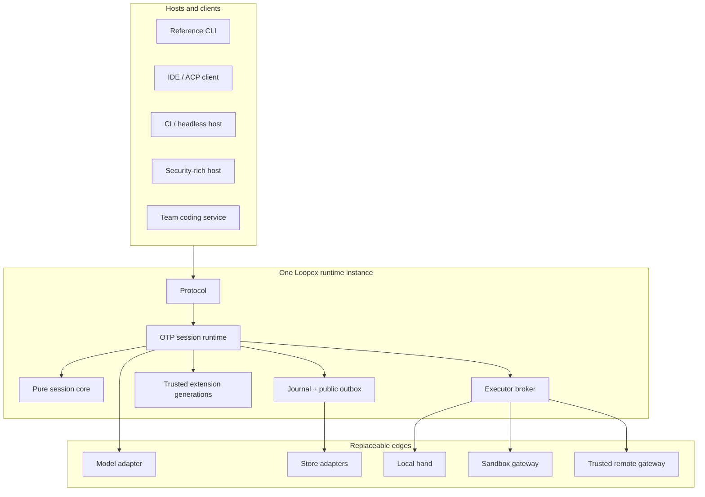
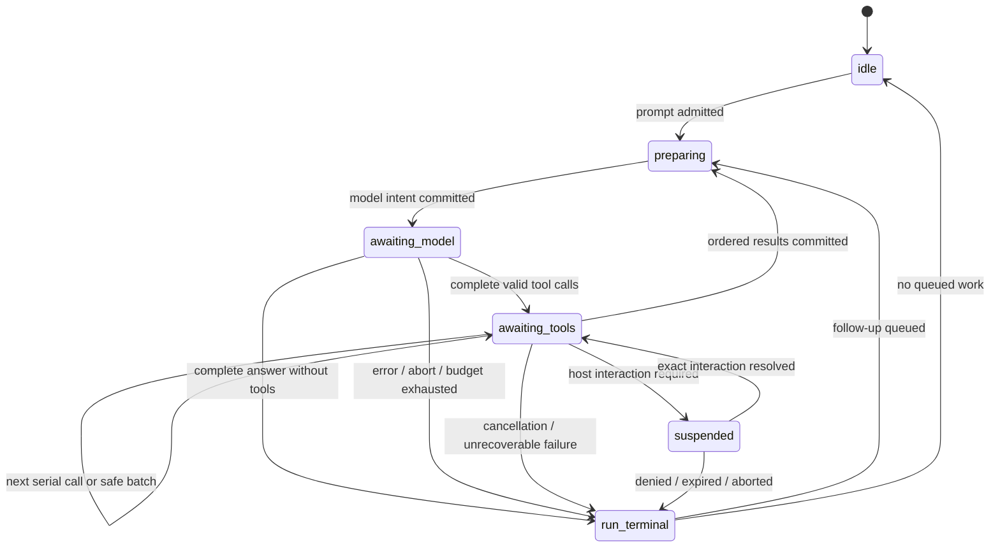

# Loopex — Founding Vision and Architecture

Status: **standalone repository seed, draft for founding review**

Date: **2026-08-14**

Project: **Loopex — “the loop, in Elixir”**

License: **Apache-2.0**

Public name: **provisional pending trademark, domain, package, and repository clearance**

## 1. Purpose and authority

This document is the founding vision for a new Loopex repository. It defines
the durable product boundary, architectural doctrine, domain language,
non-negotiable correctness properties, ecosystem posture, and intended release
ladder. It is deliberately complete enough to seed:

- the repository `README.md`;
- a compact `AGENTS.md`;
- architectural decision records;
- public protocol and conformance documentation;
- implementation plans for M0 and v0.1 through v0.5;
- contributor, operator, extension-author, and executor-author guides.

This is a north-star and boundary document. It is not itself a frozen wire
schema, a versioned release contract, an operational runbook, or permission to
ship every feature described here in one release. Those artifacts must be
created separately and must remain consistent with this vision.

When later project sources disagree, use this authority order:

1. the current maintainer or operator decision;
2. accepted security and architecture ADRs plus already released public
   contracts;
3. the active versioned plan and its acceptance evidence;
4. this founding vision;
5. historical plans and archived design material.

An ADR may refine this vision. A release plan may select a subset of it. Neither
may silently reverse a core boundary or correctness invariant. A deliberate
reversal must identify the affected principle, evidence, compatibility impact,
and migration path.

## 2. Executive thesis

> **Loopex is an OTP-native, multi-instance, embeddable runtime for durable
> coding-agent sessions and controlled effects. It combines a small,
> provider-neutral model loop with truthful recovery, versioned client
> contracts, location-transparent tool execution, and governed live
> extensions.**

An agent is a loop around an LLM. Loopex makes that loop a supervised,
durable, attachable Elixir service. It should be useful as a minimal terminal
coding harness on its own and small enough to disappear inside a larger host.

The architectural brief comes from José Valim’s observation that Elixir is an
unusually strong substrate for a coding harness:

- hot code facilities can support live extension evolution without discarding
  durable session state;
- the actor model makes a client/server architecture a natural process
  topology;
- IO and CPU work can proceed concurrently while one actor serializes session
  truth;
- built-in distribution can separate a session “brain” from local or remote
  “hands”; and
- **“You don’t need an external framework for this. The runtime is the
  framework.”**

Loopex takes that statement literally. It does not hide OTP behind an agent
framework, workflow DSL, actor abstraction, or macro-heavy plugin system. It
uses ordinary Elixir and Erlang:

- `Supervisor`, `DynamicSupervisor`, and explicit failure domains;
- `GenServer` only where a process must own serial state;
- pure transitions over plain data for the core loop;
- tasks, monitors, links, messages, registries, and process groups;
- the BEAM code server for governed trusted-code evolution;
- ports, sockets, containers, and microVMs for real OS isolation;
- Erlang distribution only among mutually trusted runtimes;
- explicit behaviours where durability, trust, persistence, transport, or
  compatibility crosses a boundary.

OTP supplies mechanisms, not the complete product contract. Supervision does
not make effects transactional. Distribution does not create authorization or
exactly-once execution. A registry is not a durable event stream. Hot loading
does not make arbitrary generated code safe. Loopex therefore adds stable IDs,
transactions, receipts, fencing, reconciliation, protocol versions,
backpressure, and trust boundaries exactly where those properties are needed.

The desired result is not merely “Pi rewritten in Elixir.” It is a reusable
session-and-effects substrate from which all of these can be built without
forking the loop:

- a small Pi-shaped reference CLI;
- an IDE coding agent through the Agent Client Protocol;
- a CI or headless coding harness;
- a security-rich personal assistant host;
- a multi-tenant team coding service;
- a remote executor fleet;
- specialized debugging, migration, documentation, incident-response, or
  data-development tools.

## 3. Product definition

### 3.1 What Loopex is

Loopex is simultaneously:

1. **A coding-session runtime.** It turns admitted inputs into ordered model
   turns, validated tool operations, durable messages, and typed outcomes.
2. **An effects runtime.** It records intent before dispatch, owns operation
   identity, distinguishes retry from reconciliation, and tells the truth when
   an external effect cannot be proven.
3. **An embeddable OTP service.** Multiple independently configured Loopex
   runtimes can coexist in one BEAM, each hosting many durable sessions.
4. **A versioned client boundary.** Embedded callers, terminal clients,
   daemons, IDEs, and web hosts consume the same command, event, snapshot, and
   interaction semantics.
5. **A trusted extension host.** Reviewed OTP applications can contribute
   tools, adapters, projectors, commands, and supervised children through a
   governed generation lifecycle.
6. **A reference coding product.** The repository ships a deliberately small
   CLI that proves the core is pleasant and useful rather than merely
   theoretically embeddable.
7. **Practical Elixir-and-AI learning material.** Every architectural promise
   should be traceable to the OTP primitive and contract that implements it.

### 3.2 What Loopex is not

Loopex is not:

- a generic autonomous-agent framework;
- a workflow DAG, objective engine, durable goal system, or built-in sub-agent
  scheduler;
- a user, organization, tenant, role, identity, authentication, or billing
  system;
- an enterprise policy engine, secret vault, or confirmation database;
- an IDE, web workspace, collaboration dashboard, social-channel framework,
  or delivery outbox;
- a Kubernetes abstraction, cloud control plane, autoscaler, or general job
  scheduler;
- a security sandbox merely because it uses processes, supervisors,
  distribution, or `:peer`;
- an exactly-once remote-effects system;
- a model-driven package installer or extension marketplace;
- a compatibility implementation of Pi’s APIs or session files;
- an MCP, ACP, A2A, Agent Skills, or AG-UI implementation at its core;
- a Jido Agent/Action/Signal runtime under another name;
- a Phoenix or LiveView application with a hidden loop inside it.

These capabilities may exist in hosts, adapters, extensions, examples, or later
projects. They do not belong in the session kernel merely because an eventual
product needs them.

### 3.3 The north-star experience

A developer starts a Loopex runtime for a repository and attaches a terminal.
They request a change. The session streams model output, reads code, edits
files, runs tests, accepts steering while active, queues follow-up work, and
records branchable durable history. The terminal may disconnect without
terminating the session. Another authorized client can attach as an observer
and reconstruct the same state from a snapshot plus subsequent events.

The same brain can dispatch a compiler or test suite to a local process, an
isolated container, a microVM, or a remote worker. The brain owns the session
and durable operation ledger. The hand owns the workspace and OS processes.
The tool contract does not change when placement changes.

During a session, a trusted extension candidate may be validated in a
disposable VM. Loopex creates an activation barrier, drains every affected
extension entry point, atomically changes the trusted module generation,
migrates or restores externalized state, verifies health, and resumes queued
work. A failed activation restores the retained previous generation or restarts
the brain on that generation and replays the journal. Session history remains
intact.

If a worker disappears after an effect may have started, Loopex does not invent
success, failure, or safety. It reconciles a retained receipt when possible and
otherwise commits `outcome_unknown`. An unknown effect is never blindly
repeated.

## 4. Product principles

These principles are intended to become the compact non-negotiables in the
future `AGENTS.md`.

1. **The runtime is the framework.** Use OTP directly. Add an abstraction only
   where it creates a durable boundary or allows a genuinely replaceable edge.
2. **Session before surface.** The runtime is headless. CLI, IDE, daemon, web,
   and embedded callers are peers over one semantic contract.
3. **One serial owner per session.** One coordinator commits durable session
   decisions. Concurrent work reports back; it does not mutate session truth.
4. **Durable intent precedes effects.** No provider or executor operation is
   dispatched before its durable intent and identity are committed.
5. **Durable facts precede publication.** Stable public events come only from a
   committed outbox. Notifications are never truth.
6. **Commit ambiguity is explicit.** A timeout is not proof of non-commit.
   Unknown commit status fences the coordinator until the store resolves it.
7. **Unknown outcomes are honest.** Uncertain external effects become terminal
   unknown attempts, not optimistic retries.
8. **Recovery never trusts stale work.** Live completions require current
   epochs and fences. Prior evidence enters only through current,
   fully-validated reconciliation.
9. **Runtime instances are isolated.** Core APIs and process names never assume
   a global singleton or use global application environment for instance state.
10. **Brains and hands are different trust roles.** The brain coordinates; the
    hand performs effects. Workspace location and execution placement remain
    opaque to the core.
11. **Mechanics in Loopex; governance in the host.** Loopex supplies suspension,
    interactions, grants, receipts, and enforcement hooks. Hosts own identity,
    policy, credentials, tenancy, quotas, placement, retention, and UX.
12. **Metadata never grants authority.** Model output, tool declarations,
    extension manifests, resource metadata, IDs, writer epochs, traces, and UI
    answers are data until a host authority makes a decision.
13. **Plain data crosses boundaries.** Public and executor contracts never carry
    PIDs, ports, functions, monitors, arbitrary Erlang terms, or atoms created
    from untrusted input.
14. **Events are a public contract, not a recovery log.** Private journal,
    durable events, authoritative snapshots, transient progress, and
    administrative diagnostics have different guarantees.
15. **Generated code is a candidate, not authority.** It runs in an isolated
    hand unless an explicit reviewed promotion creates a trusted retained
    artifact.
16. **Extensions are trusted generations.** Same-VM code has full VM authority.
    Activation is quiescent, versioned, bounded, rollback-tested, and never an
    implicit sandbox.
17. **Local correctness precedes distribution.** A useful single-machine loop
    ships before extension, sandbox, and remote-worker complexity.
18. **Restart and replay precede production release hot upgrades.** Extension
    reload is an early feature; `.appup`/`.relup` release evolution is later,
    separately proven operations work.
19. **Compatibility is behavioral.** Public claims require schemas, golden
    vectors, multiple consumers, migrations, and upgrade/rollback evidence.
20. **Every core concept pays rent.** If a concern can be a host policy,
    adapter, extension, executor, or client feature, it stays out of core.

## 5. Stable domain language

| Term | Meaning |
| --- | --- |
| **Runtime** | One independently supervised and configured Loopex instance. A runtime owns stores, registries, sessions, adapters, extensions, dispatchers, and host ports. |
| **Host** | The application embedding or operating a runtime. It owns product authority and governance. |
| **Session** | Durable coding conversation, configuration, history, lineage, queues, and operation state identified by `session_id`. The live process is an owner/cache, not truth. |
| **Coordinator** | Sole serial writer of one active session’s durable decisions. |
| **Run** | Work caused by one prompt or queued follow-up, from durable admission to one terminal outcome. One run is active per session in 0.x. |
| **Turn** | One model response and the ordered tool batch it requests. A run can contain many turns. |
| **Command** | Versioned client request such as create, prompt, steer, follow-up, abort, fork, compact, set model, or respond to interaction. |
| **Operation** | Durable intent to perform a provider call, tool job, compaction, extension action, or other asynchronous work. |
| **Attempt** | One fenced dispatch of an operation. An operation can have another attempt only when policy and evidence make that safe. |
| **Epoch** | Monotonic ownership generation used to reject work from an earlier session or executor incarnation. |
| **Fencing token** | Attempt-specific evidence that prevents a stale executor from authoritatively starting or completing work. |
| **Journal record** | Private durable transition required for recovery or reconciliation. Not a client API. |
| **Transaction** | Atomic store change covering private records, idempotency rows, public outbox rows, and their allocated sequence numbers. |
| **Outbox** | Durable records ready to become stable public events after transaction commit. |
| **Public event** | Immutable, versioned observation of committed session state for clients. |
| **Snapshot** | Authoritative public projection anchored to an event sequence, or private recovery projection anchored to a journal version. The two forms are distinct. |
| **Progress** | Best-effort token, reasoning, stdout, stderr, or activity delta. Never canonical and never replay-required. |
| **Diagnostic** | Operational or administrative information for maintainers. Not product session history. |
| **Attachment** | Logical client subscription to one session, with a snapshot/cursor and optional command capability. |
| **Interaction** | Generic suspended input or decision request resumed only by the exact `interaction_id`. |
| **Tool** | Versioned model-visible capability description, schema, mechanics, effect class, and executor requirements. A tool definition grants no permission. |
| **Tool call** | One model-requested invocation identified by `tool_call_id`. |
| **Job** | Typed request sent to an executor for one operation attempt. |
| **Receipt** | Executor-retained evidence that an attempt was not started, started, or reached a terminal result. |
| **Reconciliation** | Current, fenced inquiry that evaluates retained evidence from a possibly stale prior attempt. |
| **Executor / hand** | Component that interprets a workspace reference, owns OS processes, performs effects, enforces local budgets, and retains receipts. |
| **Brain** | Runtime side that owns model coordination, durable session truth, operation state, context projection, and scheduling. |
| **Workspace** | Opaque executor-owned repository or filesystem reference. It is not necessarily a brain-local path. |
| **Artifact** | Content-addressed output carried by digest, metadata, and opaque retrieval reference rather than inline bytes. |
| **Grant** | Opaque, scoped, expiring host-issued authority evidence validated by an executor. |
| **Broker** | Replaceable selector of an eligible executor. It is not a fleet control plane. |
| **Extension** | Trusted retained OTP artifact contributing versioned behaviours. It has full authority in its VM. |
| **Extension generation** | Immutable set of activated extension artifacts and contribution revisions. |
| **Resource pack** | Prompts, context, skills, templates, and static assets. “Data-only” means no direct code loading, not inherently safe instructions. |
| **Projection** | Rebuildable view derived from durable records: model context, public snapshot, search index, or client rendering state. |

Use precise qualifiers when saying “agent state.” Session state, private
journal state, public projection state, provider-native continuation state,
extension state, and host policy state have different owners and guarantees.

## 6. Ownership and trust boundaries

### 6.1 Normative ownership map

| Concern | Loopex | Host | Executor |
| --- | --- | --- | --- |
| Runtime and session lifecycle | Owns durable mechanics | Chooses configuration and lifecycle policy | Observes jobs only |
| Session ordering and journal | Owns | Supplies or selects store | No access unless explicitly granted |
| Model/provider conversion | Defines adapter contract | Selects model and credential reference | None |
| Credential custody | Stores references only | Owns encryption, resolution, rotation | Receives only scoped ephemeral values when required |
| User/tenant identity | Carries bounded opaque references | Owns | Validates scoped grant audience only |
| Authorization and confirmation | Suspends and transports results | Owns decisions and grants | Validates grant fail-closed |
| Tool mechanics | Defines schema and effect metadata | Approves exposure | Performs declared effect |
| Workspace meaning | Treats reference as opaque | Creates or leases | Interprets and enforces it |
| Sandbox policy | Defines transport contract only | Chooses isolation requirements | Implements actual boundary |
| Placement | Requests capabilities through broker | Owns locality, priority, quotas, cost, fleet | Advertises capabilities |
| Public events | Owns committed semantic facts | Projects into product vocabulary | Emits bounded progress and receipts |
| Rendering and channels | Supplies renderer-neutral payloads | Owns UI and delivery | Optional progress only |
| Long-term memory/objectives | Does not own | Owns and composes sessions | None |
| Extension trust/signing | Verifies supplied decision and artifact | Owns admission/signing policy | May validate hand packages |
| Audit/retention | Supplies facts and references | Owns obligations and storage policy | Supplies receipts and diagnostics |

### 6.2 Planes

Loopex is easiest to reason about as four planes:

1. **Data plane.** Session reducer, journal, command admission, operations,
   dispatch, receipts, fencing, reconciliation, public outbox, and replay.
2. **Host control plane.** Identity, authorization, confirmation, grants,
   credentials, tenancy, quotas, repository governance, placement, extension
   trust, retention, and fleet operations.
3. **Presentation plane.** Reference CLI, IDE, daemon client, web UI, channel,
   dashboards, and generated SDKs.
4. **Diagnostics plane.** Metrics, traces, crash detail, health, extension
   activation diagnostics, backpressure state, and operator evidence.

Only the data plane is Loopex’s architectural center. The other planes connect
through explicit ports and protocols. Presentation and diagnostics never become
authority channels.

### 6.3 Authority grants

The host may issue an opaque capability grant after its policy process allows an
operation. A grant is bound at least to:

```text
operation_id / attempt
tool_id / tool_version
workspace_lease
executor audience
effect class
expiry
fencing token
optional bounded policy context
```

Loopex transports and binds this evidence but does not interpret a host’s user,
role, policy, or approval semantics. The executor validates the grant
fail-closed before starting an effectful job. An expired, wrong-audience,
wrong-attempt, or wrong-fence grant is rejected.

A grant cannot bypass the host’s own capability registry, confirmation,
security, or audit boundaries. An interaction response alone is not a grant.
Extension metadata and tool declarations cannot create one.

### 6.4 Host policy port

`Loopex.Policy` is a mechanics seam, not a policy language. It supports:

```text
allow(grant_reference)
deny(reason_category)
defer(interaction_request)
```

A synchronous policy callback must be pure or bounded local work. Policy that
needs user input, durable host storage, or an external service returns `defer`;
the session commits a suspended interaction and resumes only after the host
makes a durable decision. Timeout, host failure, or malformed response fails
closed into denial or continued suspension. It never falls through to allow.

The reference CLI may deliberately use an `AllowAll` host policy for a trusted
single developer. That convenience is documented as permissive local authority,
not a security model for other products.

## 7. The Loopex stack and dependency doctrine

### 7.1 Four layers

The project uses this vocabulary:

- **Loopex Protocol (`Loopex.Protocol`)** — transport-neutral, versioned
  commands, admissions, events, snapshots, interactions, content blocks, and
  compatibility negotiation.
- **Loopex Core (`Loopex.Core`)** — pure session reducer, run/turn semantics,
  queue semantics, outcomes, and context projection rules.
- **Loopex Runtime (`Loopex.Runtime`)** — runtime instances, supervision,
  journal coordination, dispatch, event delivery, extension generations,
  executor broker, recovery, and host ports.
- **Loopex edges** — model, store, policy, artifact, executor, transport,
  observability, and client adapters.



Dependency direction is one-way. Hosts depend on Loopex. Loopex does not
import host product concepts or code.

### 7.2 Core dependency budget

The initial `loopex` OTP application depends only on the Elixir/Erlang runtime.
The core has no compile-time dependency on:

- ReqLLM or another provider library;
- Jido Agent, Action, Signal, or AI loop packages;
- JSON codecs;
- SQLite, Ecto, or another database;
- Phoenix, LiveView, or an HTTP server;
- a terminal library;
- Docker, Kubernetes, FLAME, or a cloud SDK;
- OpenTelemetry or an external pub/sub system.

Those dependencies belong in adapters or reference applications. CI enforces
namespace and dependency direction with `mix xref`, compile-time checks, and
tests that build the core against only fake edge implementations.

Use one repository and one release version through 0.x. Physical application
or Hex-package splits require demonstrated compile, runtime, ownership,
deployment, or external-consumer pressure and an ADR. Folder structure alone is
not evidence for a package boundary.

### 7.3 No hidden framework

No macro should disguise `GenServer`, `Supervisor`, messages, or behaviours as
a proprietary agent DSL. Tools and extensions implement ordinary behaviours.
Session transitions remain inspectable plain functions. Each state-bearing
process documents:

- the state it owns;
- why it is a process rather than a pure value;
- its supervisor and restart policy;
- its durable recovery source;
- what messages it accepts;
- how stale messages are rejected.

This is both architecture discipline and educational product value.

## 8. Runtime instances and supervision

### 8.1 Multi-instance API

Loopex is never a global singleton. A runtime is an opaque supervised instance:

```elixir
{:ok, runtime} = Loopex.start_link(runtime_options)

{:ok, session_id} =
  Loopex.create_session(runtime, session_options,
    command_id: Loopex.ID.command()
  )
```

The runtime owns its store, registries, adapter configuration, extension
catalog, executor broker, event dispatcher, and host ports. The reference CLI
may create one hidden default runtime, but public core APIs always accept an
explicit runtime reference.

Instance-specific values do not live in global application environment. Global
registered names are forbidden for instance-owned services. Acceptance must
prove two runtimes with distinct stores, models, policies, extensions, and
executors can coexist in one BEAM without collisions or data leakage.

A runtime is not itself a tenant model. A host may choose one runtime per trust
domain, many tenants per isolated deployment, or another arrangement. Identity,
quotas, retention, and tenancy remain host policy.

### 8.2 Conceptual supervision topology

```text
Loopex.Runtime.Supervisor[runtime_ref]
├── StoreSupervisor
├── RuntimeRegistry
├── ModelAdapterRegistry
├── ExecutorBrokerSupervisor
├── ExtensionManagerSupervisor
├── EventDispatcherSupervisor
├── SessionSupervisor (DynamicSupervisor)
│   ├── SessionTree[session_id] (:one_for_all initially)
│   │   ├── SessionCoordinator
│   │   ├── ModelWorkerSupervisor
│   │   ├── ExecutionWorkerSupervisor
│   │   ├── ProjectionWorker
│   │   └── SessionEventHub
│   └── ...
└── TransportSupervisor
    ├── Embedded adapter
    ├── JSONL RPC adapter
    └── later daemon / WebSocket / trusted-BEAM adapters
```

Each session tree is an independent failure domain. `:one_for_all` is the
initial choice because coordinator and owned work share session-epoch
invariants. It is not a project-wide default; later evidence may justify a more
targeted strategy.

The session coordinator is the sole serial owner of canonical active state.
Provider calls, model streams, filesystem work, shell commands, compiler work,
context compaction, event fan-out, policy work that can block, extension
callbacks, and network calls occur in supervised work outside coordinator
callbacks.

The session event hub delivers from a durable public outbox. It is not a source
of truth. `Registry` and `:pg` may assist local or trusted-cluster discovery;
they do not supply persistence, ordering, replay, authorization, or
backpressure. Each attachment has bounded delivery. A slow or dead client can
never block the coordinator or another attachment.

### 8.3 Pure reducer

The coordinator is a serialization shell around a pure transition:

```text
{new_state, private_records, public_outbox_events, requested_operations}
  = Loopex.Core.Session.reduce(state, admitted_input)
```

The transition does not perform IO. The coordinator’s only permitted
synchronous external barrier is a bounded local journal transaction. Only
after a confirmed commit may it update its in-memory cache, notify the event
dispatcher, or dispatch requested operations.

Durable state contains plain serializable data: no PIDs, ports, monitors,
anonymous functions, open streams, task references, or extension-owned process
state. Restart loads a compatible private snapshot, replays later private
records, advances the session epoch, rebuilds projections, and reconciles active
operations before admitting new effects.

### 8.4 Session ownership and epochs

Coordinator or owned-work supervisor loss terminates the session’s supervised
work before reconstruction. A new session epoch is durably committed before
admission resumes. Every asynchronous result carries operation identity,
attempt, origin session epoch, origin executor epoch, executor identity, and
fencing token.

An unsolicited live completion is accepted only when it matches the current
dispatch tuple. Old work cannot complete against reconstructed state. Retained
prior evidence is still usable, but only through the solicited reconciliation
protocol defined below.

## 9. Transaction, operation, and recovery truth

### 9.1 Journal transaction

One journal transaction atomically persists:

- private session transition records;
- command and operation idempotency rows;
- operation attempt and receipt state;
- stable public-event outbox rows;
- allocated private journal version and public event sequence values.

The store contract has three outcomes:

| Store result | Meaning | Required coordinator behavior |
| --- | --- | --- |
| `committed(tx_id)` | The transaction is durably visible. | Update cached state, publish its outbox records, acknowledge as appropriate, and dispatch requested work. |
| `not_committed(reason)` | The store proves no durable transaction exists. | Retain prior state; publish and dispatch nothing; return or record a non-admission result. |
| `commit_unknown(tx_id)` | Timeout, disconnect, crash, or reply loss prevents knowing whether commit occurred. | Fence the coordinator, stop new dispatch, and query/reload by transaction ID until the store proves committed or not committed. |

A timeout is never evidence of failure. During `commit_unknown`, Loopex does
not speculate: it does not acknowledge acceptance, publish an event, or launch
an effect. A recovered commit is processed exactly once as if its original
reply had arrived.

### 9.2 Command and lifecycle idempotency

Every externally visible lifecycle or state-changing request carries a stable
`command_id`, including runtime-scoped create, open, attach, detach, prompt,
steer, follow-up, abort, fork, stop, compaction, interaction response, and
extension activation request.

The coordinator persists a canonical parsed-command fingerprint and admission
result before acknowledging the command. Raw JSON bytes are not a fingerprint;
whitespace, object-key order, equivalent DTO encodings, and transport choice
must not create false conflicts.

| Repetition | Result |
| --- | --- |
| Same `command_id`, same canonical command | Return the original durable admission response and terminal reference when available. |
| Same `command_id`, different canonical command | Reject with `idempotency_conflict`. |
| New `command_id` | Process through normal durable admission. |

Host metadata is bounded and typed. It may include an opaque `external_ref`,
writer epoch, trace correlation, and client correlation. It is never an
arbitrary map and never grants authority merely because it is present.

### 9.3 Durable operation lifecycle

Command deduplication cannot prevent a shell command or external write from
running twice. Every model request and tool job therefore has a durable
operation identity:

```text
intent_committed
  -> dispatch_attempt_committed
  -> executor_accepted | reconciliation_required
  -> terminal_receipt_committed
```

An operation carries:

```text
operation_id
attempt
session_id / run_id / turn_id / tool_call_id as applicable
origin_session_epoch
origin_executor_epoch
executor_identity
idempotency_class
fencing_token
workspace_lease
capability_grant_reference
deadline and resource budgets
```

The executor durably deduplicates effectful `operation_id` values and retains
terminal receipts for a declared reconciliation window.

The journal normally persists a capability-grant reference plus the binding
metadata needed for recovery. The host resolves the actual short-lived opaque
grant just in time for dispatch. If a host must retain encrypted opaque grant
evidence for renewal or audit, its protected store adapter owns that decision;
the value never appears in public events, progress, diagnostics, or ordinary
session content.

### 9.4 Crash and reconciliation table

| Evidence at recovery | Required behavior |
| --- | --- |
| Intent committed; no dispatch recorded | Dispatch the same operation ID, subject to current policy and placement. |
| Dispatch recorded; acceptance unknown | Issue a new `reconciliation_query_id` under the current session epoch. |
| Executor proves it never started | Policy may record a new attempt. |
| Executor proves a terminal result | Commit that exact retained result once. |
| Executor cannot prove start or result of an effectful job | Commit `outcome_unknown`; do not blindly repeat. |
| Old executor sends an unsolicited completion | Reject it as stale. |

Prior-epoch evidence is admissible only through a current solicited
reconciliation query. The outer response must match the current
`reconciliation_query_id`, current coordinator/session epoch, expected executor
identity, and current recovery contract. The embedded retained receipt must
match:

- journaled `operation_id`;
- original attempt;
- original session epoch;
- original executor epoch;
- executor identity;
- fencing token.

After validation, the coordinator commits the evidence under the current
recovery epoch. It never treats an old receipt as a current live completion.

### 9.5 Closed outcome algebra

Runs and tool jobs terminate with a closed initial algebra:

```text
completed
cancelled
denied
failed(category, retryable?)
unavailable(category)
outcome_unknown(reconciliation_ref)
```

`needs_interaction` is a suspended state, not a successful or terminal
outcome.

`outcome_unknown` is immutable and terminal for its operation attempt. Later
evidence never rewrites the original terminal event or silently resumes the
model loop. It creates a separate durable reconciliation fact that references
the original operation and attempt. A session-visible resolution may project a
new `operation.reconciled` public fact, but it does not replace the original
`tool.finished` or `run.finished` event. A host or user must explicitly decide
whether new work should proceed.

The executor ledger is authoritative for retained effect receipts. The brain
journal stores committed operation decisions and projections of validated
receipts; it does not become a second independent receipt authority.

### 9.6 Cancellation

Cancellation is an acknowledged protocol:

```text
cancellation requested and durably recorded
  -> stop scheduling new work
  -> cooperative cancel to provider or executor
  -> bounded grace period
  -> trusted gateway terminates owned process tree or container
  -> cleanup and receipt reconciliation
  -> cancelled | outcome_unknown
```

An executor captures sufficient process/container ownership and kill identity
before it accepts an effectful job. Cancellation, lease expiry, worker loss, and
control-channel loss all exercise descendant cleanup. `cancelled` is committed
only when cleanup is confirmed. If a remote or external effect cannot be
reconciled, the attempt ends `outcome_unknown`.

No cancellation result claims to undo a side effect that already committed.

## 10. Agent-loop semantics

### 10.1 Minimal state machine



One active run per session is an intentional 0.x constraint. It makes context,
tool ordering, steering, durable recovery, and human expectations tractable.
Hosts that need concurrency create multiple sessions and coordinate them outside
the core.

### 10.2 One run

1. A client submits a prompt with a unique `command_id`.
2. The coordinator durably admits or rejects it and returns one correlated
   admission response.
3. The context projector builds provider-neutral input from the selected
   session lineage, active model capabilities, active tool set, retained
   continuation sidecar, context policy, and extension generation.
4. The coordinator atomically commits the model-operation intent and
   `run.started` outbox fact. After confirmed commit, supervised model work
   begins.
5. Model text, reasoning, and tool-call fragments are transient progress. A
   complete assistant message becomes durable before its stable public event.
6. A complete assistant message without tool calls finishes the run. A
   malformed, incomplete, or truncated tool call never executes.
7. Each requested tool is resolved against the active versioned definition,
   validated, offered to host policy, and classified as allowed, denied, or
   deferred.
8. A deferred decision creates a durable generic interaction. Only the exact
   matching response can resume it, and only a host policy decision can create
   a grant.
9. Each allowed tool-operation intent commits before executor placement and
   dispatch. The job carries the full identity, epochs, fence, opaque workspace
   lease, opaque grant, deadlines, budgets, and output policy.
10. Progress may arrive in execution order. Complete results and model-facing
    tool messages commit in the assistant’s original tool-call order.
11. Pending steering is applied before the next model request. The loop repeats
    until a terminal condition.
12. One typed terminal outcome and one `run.finished` public event commit.
13. If follow-up work is queued, the next run starts. Otherwise
    `session.settled` becomes observable.

`run.finished` and `session.settled` remain distinct. A run may be finished
while retries, reconciliation, compaction, or queued follow-up work keep the
session from being settled.

### 10.3 Input queues

0.x defines four explicit input paths:

- **`prompt`** starts a run only while settled.
- **`steer`** belongs to the active run and is injected after the current tool
  batch finishes but before the next model request. It does not pretend to
  reverse an effect already started.
- **`follow_up`** creates a new run after the current run and steering settle.
- **`respond_interaction`** answers exactly one pending `interaction_id` with
  host decision context.

If a run is active, Loopex never guesses whether new user input is steering or
a follow-up. A stale, duplicate, expired, or mismatched interaction response is
rejected. `abort` is a separate durable cancellation request.

Queue mode is one-at-a-time initially. Deliver-all or other batching semantics
require a later explicit session option and ordering proof.

### 10.4 Tool ordering and concurrency

Tools execute serially by default. Filesystem mutations, shells, compilers, and
external writes generally do not commute. Parallel-by-default execution is a
worktree-corruption feature disguised as performance.

Later, a tool may declare `parallel_safe: true` and a complete resource scope.
A batch may run concurrently only when:

- every call is explicitly parallel-safe;
- the complete conflict set is known and non-overlapping;
- per-call and per-batch cancellation/deadline semantics are defined;
- result persistence remains in assistant source order;
- one serial call serializes the batch; and
- host or extension policy has not forced serial execution.

Parallel execution is a deferred feature with its own evidence, not an
implementation shortcut in v0.1.

### 10.5 Split payload rule

Model-facing content and client-facing rendering are separate values.

- Model content is bounded, provider-portable input for the next turn.
- Client details may include richer diagnostics, structured diffs, progress,
  controls, and artifact references.
- Operator diagnostics may include private crash or adapter details unavailable
  to either the model or ordinary client.

Renderers, terminal escape sequences, UI components, provider structs, and raw
exceptions never enter canonical model history merely because a client wants to
display them.

## 11. Public protocol and channel semantics

### 11.1 One semantic contract

Embedded Elixir, JSONL RPC, daemon sockets, WebSockets, ACP adapters, and future
SDKs implement the same semantic operations. A local caller gets no privileged
access to coordinator state, PIDs, internal messages, or private journal
records.

The public protocol is transport-neutral and composed of:

- feature/version negotiation;
- session lifecycle commands;
- command admission responses;
- durable public events;
- authoritative snapshots;
- transient progress;
- generic interaction requests and responses;
- bounded host metadata and correlation.

Exact schemas belong in versioned protocol files and conformance vectors. This
vision fixes their semantics and boundaries.

### 11.2 Four stream planes

| Plane | Guarantee |
| --- | --- |
| **Durable public events** | Immutable, versioned observations of committed facts; at-least-once delivery; ordered only within one session. |
| **Authoritative snapshots** | Replaceable compatible public projection anchored to a public event sequence. |
| **Transient progress** | Best-effort deltas with offsets and a base sequence; may be dropped and need not replay. |
| **Administrative diagnostics** | Access-controlled operational state; not user-visible session history and not a business-behavior input. |

A reconnecting client is owed the complete durable assistant message and stable
terminal outcomes, not every token or stdout fragment it missed.

### 11.3 Command envelope

An illustrative pre-v1 command envelope:

```json
{
  "protocol_version": "0.x",
  "command_id": "cmd_...",
  "session_id": "ses_...",
  "client_id": "client_...",
  "type": "prompt",
  "metadata": {
    "external_ref": "opaque-host-ref",
    "writer_epoch": 4,
    "traceparent": "optional-correlation-only"
  },
  "payload": {
    "content": [{"type": "text", "text": "Fix the failing test"}]
  }
}
```

`command_id` is the idempotency key. `client_id`, writer epoch, external
reference, and trace context are correlation or host-fencing inputs, not proof
of authorization. Host transport admission and write authority are decided
before core invocation.

Admission is a correlated durable response, not a public event. Acceptance
means the command is durably admitted. Later work reports asynchronously. The
same command never receives contradictory admission responses.

### 11.4 Event envelope

An illustrative pre-v1 event envelope:

```json
{
  "schema_version": "0.x",
  "event_id": "evt_...",
  "session_id": "ses_...",
  "event_sequence": 42,
  "run_id": "run_...",
  "turn_id": "turn_...",
  "tool_call_id": null,
  "correlation_id": "cmd_...",
  "causation_id": "evt_...",
  "occurred_at": "2026-08-14T12:00:00.000000Z",
  "type": "assistant.message_completed",
  "payload": {}
}
```

Rules:

- `event_sequence` is total only inside one session’s public stream.
- Public events are immutable and durable before publication.
- Delivery is at least once; clients deduplicate by event ID and sequence.
- No order is promised across sessions.
- Unknown event types are ignored or surfaced according to negotiated
  compatibility; they never convey authority.
- Payloads contain no PIDs, module atoms, stack traces, raw Erlang terms,
  credential values, or unredacted provider internals.
- `run.finished` and `tool.finished` each carry one closed outcome.
- A later reconciliation fact never rewrites a previous terminal event.

### 11.5 Initial durable taxonomy

The first public vocabulary is deliberately smaller than the recovery machine:

```text
session.created | session.forked | session.settled
run.started | run.finished
user.message_appended | assistant.message_completed
tool.started | tool.finished
interaction.requested | interaction.resolved | interaction.expired
context.compacted | branch.summarized
operation.reconciled
```

`operation.reconciled` is emitted only when later stable evidence is materially
session-visible. It references, rather than replaces, the original unknown
attempt.

Transient progress begins with:

```text
model.text_delta | model.reasoning_delta | model.tool_call_delta
tool.stdout_delta | tool.stderr_delta | tool.progress
retry.scheduled | context.compaction_progress | extension.reload_progress
```

Retry decisions, model attempts, dispatch attempts, leases, epochs, receipts,
fences, recovery queries, and extension activation details are private or
administrative. `retry.scheduled` is a replaceable progress view; the durable
retry decision remains private.

Extension-contributed public values use reserved namespaced envelopes with
explicit extension ID, contribution ID, schema version, and payload schema.
Extensions cannot invent a core event type, alter core event ordering, or
change terminal uniqueness. The same rule applies to extension commands.

### 11.6 Race-free attachment

Attach follows one runtime-owned handshake:

```text
negotiate protocol and features
-> host authorizes transport and write/read capability
-> join live session event hub
-> obtain authoritative snapshot at event sequence N
-> deliver committed events from N + 1
-> deduplicate by event ID and sequence
```

The runtime closes the subscribe/snapshot race. Clients do not separately read
state and subscribe.

The core does not mandate a controller lease. It serializes all durably admitted
commands. A reference daemon implements one-controller/many-observer policy,
crash takeover, and stale-writer fencing above the core. Another host may use a
different collaboration policy. A read-only attachment never acquires command
authority.

### 11.7 Delivery and backpressure

The coordinator commits outbox records and sends a bounded notification to the
event dispatcher. It never synchronously fans out to arbitrary subscribers.
The dispatcher reads durable events, maintains bounded per-attachment queues,
and applies a documented slow-consumer policy such as coalescing progress,
disconnecting an attachment with a resume cursor, or requiring replay.

A slow client cannot grow coordinator memory without bound, delay journal
transactions, change session behavior, or block another client.

### 11.8 Schema posture

Public DTOs and tool schemas use a documented JSON Schema 2020-12-compatible
subset wherever practical. The subset, content-block vocabulary, extension
namespace envelope, and compatibility rules are versioned and backed by
language-neutral golden vectors.

W3C trace context may propagate as optional correlation. It is never an
authority token. An OpenTelemetry edge may map model, tool, and runtime spans;
model content, tool arguments, and tool results are capture-off by default
because they may be sensitive.

## 12. Durable sessions, context, and storage

### 12.1 Private journal port

`Loopex.JournalStore` is private recovery machinery. It is not the public
protocol and not the session interchange format.

Required capabilities:

- transact at an expected private journal version;
- atomically append private records, idempotency rows, operation state, and
  public outbox rows;
- allocate independent private journal versions and public event sequences;
- resolve a transaction ID after commit ambiguity;
- load private records after a journal version;
- load public events after an event sequence;
- store and load compatible private and public snapshots;
- store committed receipt projections and reconciliation decisions;
- expose corruption and migration failures explicitly.

### 12.2 Reference stores

Three adapters arrive in this order:

1. **In-memory.** Pure and process-level tests, examples, and simple embedding.
2. **Experimental JSONL local store.** Human-readable reference-CLI store with
   one append-only session file or tree, explicit transaction frames, locking,
   and crash repair. The reference location derives from `LOOPEX_HOME`
   (`~/.loopex` by default), with sessions beneath its store-owned subtree. It
   is a private adapter format, not “Loopex session format v1.”
3. **SQLite daemon store.** WAL-backed bounded transactions, deliberate
   cross-process writer ownership, indexed idempotency/receipt ledgers,
   migrations, integrity diagnostics, and replay performance suitable for the
   local daemon.

The JSONL adapter must prove:

- one crash-atomic frame per logical transaction;
- checksum or commit-marker validation;
- torn-tail detection and deterministic repair/truncation;
- `fsync` and lock semantics;
- writer fencing and process-death behavior;
- transaction-ID resolution after reply loss;
- maximum record size and artifact spill;
- bounded replay and deduplication behavior;
- fault injection at write, flush, fsync, index, and reply boundaries.

SQLite migration work must define supported upgrade pairs, interrupted
migration recovery, backup/restore or downgrade behavior, and the oldest binary
that may safely reopen a migrated store.

A PostgreSQL or hosted store may be supplied later without changing session
semantics. Stable archive/export/import is a separate future public format with
its own compatibility promise.

### 12.3 Canonical history

The private journal preserves everything required to recover and project:

- admitted user content;
- complete assistant messages and provider usage;
- complete tool calls, results, outcomes, and validated receipt facts;
- selected model, reasoning configuration, and active tool changes;
- steering, follow-up, cancellation, and interaction state;
- compaction checkpoints and branch summaries;
- fork and branch lineage;
- active extension generation and provenance references;
- operation attempts, recovery decisions, and unknown outcomes;
- compatible opaque provider-continuation sidecars or their references.

Model context, client snapshots, search indexes, and renderings are projections.
They may be rebuilt or replaced. They never rewrite the facts they summarize.

### 12.4 Branches and forks

Branch navigation selects another leaf in one session history. Fork creates a
new session whose origin records source session, source event/journal position,
and lineage. Context projection follows the selected lineage.

Abandoned-branch summarization and context-window compaction are separate
operations. They solve different problems and retain different provenance.

### 12.5 Compaction

A compaction checkpoint records:

- exact input lineage and range;
- summary and structured carry-forward fields;
- compaction strategy and extension revision;
- model/provider identity and usage when an LLM produced it;
- first later raw record kept verbatim;
- integrity digest over summarized record identities.

Raw records remain in durable history. Context projection may substitute a
checkpoint. A summary cannot alter tool receipts, effect outcomes, authority,
or historical facts.

### 12.6 Artifacts

Large patches, images, test logs, generated bundles, and oversized tool output
use an `ArtifactStore` port. Durable events carry content digest, media type,
size, logical role, and opaque retrieval reference. The host and adapter own
location, encryption, access control, retention, and garbage collection.

Tool results are byte-bounded toward the model. Overflow becomes an artifact
that a suitable tool can read back. Files and artifacts are state; the context
window is not a durable object store.

### 12.7 Credentials and sensitive content

The host owns credential custody. Loopex persists credential references, never
resolved API keys, access tokens, private keys, cookies, or vault values.
Resolution occurs just in time at the approved model or executor boundary and
uses the narrowest possible lifetime and audience.

Known credential material must never enter:

- private journal records;
- public events or snapshots;
- progress or diagnostics;
- executor jobs except an explicitly scoped ephemeral hand secret;
- artifacts, test fixtures, crash reports, or sandbox logs.

User prompts and tool output can themselves contain sensitive data. Hosts
therefore supply a bounded pre-persistence content-protection port that can
reject, redact, tokenize/reference, or require an encrypted store. Public
projection uses explicit field allowlists and deterministic sanitization before
the journal/outbox transaction, not only at the final transport.

The permissive local JSONL CLI store is plaintext unless separately encrypted
and must say so clearly. It must never imply that a local file is a secret
vault.

## 13. Model/provider boundary

### 13.1 Canonical Loopex types

Loopex owns provider-neutral types for:

- exact model identity and capabilities;
- system, user, assistant, and tool messages;
- text, image, reasoning, and artifact-reference content blocks;
- tool definitions, calls, and streamed call deltas;
- complete streamed messages;
- stop and finish reasons;
- token, cache, reasoning, and usage accounting;
- optional cost estimates;
- retryable, unavailable, and terminal provider errors;
- cancellation and timeout.

No provider struct crosses into core, store, or public protocol. Provider
diagnostics may exist in a versioned opaque administrative value after
sanitization.

### 13.2 `Loopex.LLM` contract

`Loopex.LLM` accepts a canonical request and emits canonical stream items from
supervised work. It does not own:

- sessions or queues;
- retry decisions;
- tools or executor dispatch;
- compaction policy;
- persistence or public events;
- authorization or credentials.

Provider retries are session decisions. A model request may be retried before a
complete assistant message is committed when the adapter and policy classify it
safe; usage, latency, and possible provider-side duplication remain observable.
After a complete assistant message commits, repeating the request is a new
explicit operation rather than a hidden retry.

Capability negotiation happens before request admission. The provider
conformance suite proves:

- text streaming and complete-message reconstruction;
- reasoning content/effort where supported;
- tool-call delta reconstruction and schema round-trip;
- cancellation and timeouts;
- system/user/assistant/tool conversion;
- usage and stop-reason normalization;
- malformed or truncated calls remain non-executable;
- provider error classification;
- portability of the supported canonical content subset.

### 13.3 Direct ReqLLM reference adapter

The reference adapter is `loopex_llm_reqllm`, built directly on
[ReqLLM](https://github.com/agentjido/req_llm). ReqLLM owns provider transport
and normalization on Req/Finch. Loopex owns the session, loop, operation model,
tools, context, durability, and events.

```text
loopex core -> Loopex.LLM behaviour
loopex_llm_reqllm -> ReqLLM
```

The core must compile and test with a fake adapter and no provider dependency.
The reference adapter pins and tests a supported ReqLLM version range. Provider
catalog counts are informative, not a Loopex compatibility promise.

A host may implement another adapter using a raw provider SDK, a Jido-based
component, a local OpenAI-compatible endpoint, or another library without
changing the core. No Jido framework dependency belongs in `loopex` itself.

### 13.4 Provider-native continuation sidecar

Portable canonical history is necessary but may not preserve response IDs,
reasoning signatures, provider tool-call metadata, or other model-affine state
required for correct continuation.

The adapter may therefore maintain an opaque private continuation sidecar:

- explicitly bound to provider, model family, exact compatibility rules, and
  source message range;
- never interpreted by core;
- encrypted or protected with the private store when sensitive;
- retained only for a declared lifetime;
- stripped, lowered, or invalidated on incompatible model/provider change.

Conformance tests cover same-model continuation, compatible-model continuation,
mid-session model switching, cross-provider conversion, and tool-call ID
normalization.

Model roles such as `fast`, `capable`, or `thinking`, along with a unified
reasoning-control UI, belong in host or reference-client configuration. Core
uses exact model identity and declared capabilities.

## 14. Tools and the coding surface

### 14.1 Tool definition

A tool definition contains:

- stable `tool_id`, semantic version, model-visible name, and description;
- JSON Schema-compatible parameter schema;
- normalized model result and optional output/content schema;
- effect class: `read_only`, `workspace_write`, `process`, or
  `external_effect`;
- idempotency class: `safe_retry`, `reconcile_then_retry`, or
  `never_blind_retry`;
- required executor capabilities and platform labels;
- default wall-time, CPU, memory, process, disk, network, output, and artifact
  budgets where meaningful;
- concurrency/resource scope;
- optional prompt snippet and renderer hint.

Metadata describes mechanics. It does not expose the tool to a user, select an
executor, grant authority, or relax host policy.

### 14.2 Seven implementations, four enabled by default

The reference coding distribution provides seven implementations:

- `read` — bounded, chunked, text/binary-aware reads;
- `write` — explicit creation or replacement;
- `edit` — checked exact-match edits with useful mismatch diagnostics;
- `bash` — argv or explicit raw-shell execution through the selected hand;
- `grep` — content search;
- `find` — file/name matching;
- `ls` — bounded directory listing.

The local implementations share conformance for bounded output, workspace-root
resolution, symlink and path-scope behavior, exact edit preconditions, clear
mismatch diagnostics, explicit shell-vs-argv semantics, process ownership, and
artifact spill. Host policy decides the allowed workspace and effect; path
metadata alone never grants access.

The default enabled profile is the four-tool mutation core:

```text
read | write | edit | bash
```

The search trio is a bundled optional `coding_search` profile. M0 measures its
prompt/schema cost and task utility. The default system/tool prompt stays under
1,000 tokens before project context. Hosts may reduce or extend the active set
through policy and extensions.

Language servers, source control hosts, browsers, databases, cloud APIs, and
specialized development tools remain progressively disclosed extensions.

### 14.3 Registry and resolution

Tool IDs and versions resolve through a runtime-scoped registry with explicit
conflict rules. A request records the exact definition generation used for
validation and dispatch. Tool replacement is possible only through a trusted,
namespaced extension contribution and cannot silently change an in-flight
operation’s semantics.

The model selecting a tool produces a typed intent, not direct shell authority.
Host policy and executor validation remain mandatory for effectful execution.

## 15. Executor protocol and brain/hand topology

### 15.1 Transport-neutral job

The executor boundary is a versioned job/receipt protocol, not anonymous remote
functions or model-selected RPC.

```text
JobRequest
  protocol_version
  job_id
  operation_id / attempt
  session_id / run_id / turn_id / tool_call_id
  origin_session_epoch / origin_executor_epoch
  executor_identity and required capabilities
  tool_id / tool_version
  validated_arguments
  workspace_ref / workspace_lease
  capability_grant
  deadline and resource budgets
  idempotency class
  fencing token
  artifact and output policy
```

Every executor event echoes the complete identity and fence:

```text
accepted -> started -> progress/stdout/stderr* ->
completed | failed | cancelled | indeterminate_evidence
```

The terminal receipt includes executor identity, attempt identity, lifecycle
evidence, structured outcome, artifacts, usage, and the complete origin tuple
required for recovery validation.

`indeterminate_evidence` is an executor statement about what it can prove, not
the durable Loopex outcome. Only the brain’s reconciliation state machine may
commit `outcome_unknown(reconciliation_ref)` after validating the receipt and
all other available evidence.

Schemas and golden vectors are language-neutral from M0. Elixir structs are one
codec, not the protocol definition.

### 15.2 Opaque workspace

`workspace_ref` is opaque to core. A local hand may resolve it to a directory.
A remote hand may resolve it to a checkout, volume, snapshot, worktree, or
repository lease. Core conformance never assumes POSIX paths, shared disks, or
brain-local filesystem access.

### 15.3 Executor broker

The runtime asks a replaceable broker for an executor satisfying tool,
platform, protocol, trust, workspace, and resource requirements. Loopex owns
operation identity, lease, dispatch, fencing, and reconciliation.

The host owns:

- tenant and repository placement policy;
- quotas, cost, locality, priority, and fairness;
- worker provisioning, certificate lifecycle, and autoscaling;
- fleet health and capacity planning.

The broker seam enables “one brain, many hands” without making Loopex a cloud
scheduler.

### 15.4 Three execution trust classes

1. **Local native hand.** Executes with the invoking user’s OS authority. It is
   fast and appropriate for the trusted reference CLI. It is not a sandbox.
2. **Isolated-hand gateway.** A narrow framed stdio, Unix-socket, or network
   protocol to a trusted gateway controlling a process sandbox, container, or
   microVM. Generated and tenant code remains outside the brain and never joins
   its Erlang distribution cluster.
3. **Trusted remote gateway.** A mutually trusted compatible Loopex release may
   use native Erlang distribution for discovery, monitoring, and typed job
   routing. The gateway, not generated code, owns OS processes and sandboxes.

`:peer` may help launch disposable Loopex-built trusted worker nodes, including
over stdio, but it is not a hostile-code security boundary. It is an
implementation option, not the normative sandbox design.

### 15.5 Distribution security

Connected Erlang nodes are one trusted security domain. Distribution cookies
primarily prevent accidental cluster mixing; they are not security-grade
authentication against hostile peers.

Before native distribution operates over an untrusted network, require:

- TLS distribution with client-certificate verification;
- certificate issuance, rotation, expiry, and revocation procedures;
- explicit peer/node allowlists and compatibility negotiation;
- controlled/fixed ports where practical;
- hardened, isolated, or replaced EPMD discovery;
- documented acceptance that compromising one connected trusted node threatens
  the cluster.

A less-trusted worker uses the portable gateway protocol rather than joining
distribution.

### 15.6 Resource controls and output

The hand enforces host-selected limits for wall time, CPU, memory, process
count, disk, network, environment, mounts, output, and artifact size. Output is
bounded and backpressured. Truncation creates an artifact reference rather than
silently losing the complete result.

Before acceptance, the hand records enough process/container identity to kill
descendants if cancellation, lease expiry, worker shutdown, or control-channel
loss occurs.

## 16. Trust, sensitive data, and project resources

### 16.1 Trust classes

Loopex distinguishes at least these trust classes:

| Class | Examples | Meaning |
| --- | --- | --- |
| **Host-owned trusted brain code** | Loopex core, reviewed adapters, approved extensions | Full authority in its VM and under its OS user. |
| **Trusted gateway code** | Local executor daemon, remote Loopex gateway, sandbox manager | Trusted to enforce grants, fences, resource policy, receipts, and cleanup. |
| **User workspace content** | Source files, tests, configuration, repository instructions | Data that tools may read or mutate; never automatically brain code. |
| **Project resources** | Context files, skills, templates, package declarations | Behavior-shaping data requiring explicit admission; not authority. |
| **Generated or tenant code** | Model-written scripts, candidate tools, build output | Untrusted until isolated and explicitly promoted through review. |
| **External clients and workers** | IDE, web client, non-BEAM hand | Authenticated and authorized by host/transport; protocol input remains untrusted data. |

BEAM process isolation is a reliability boundary, not an OS security boundary.
Loaded code is trusted code. A connected distributed node is a trusted peer. A
container or microVM is a security boundary only to the degree its concrete
runtime, mounts, network, credentials, kernel, and resource policy make it one.

### 16.2 Project-resource admission

Resource packs contain prompts, context files, skill instructions, templates,
and static assets. “Data-only” means they do not directly load code. They can
still instruct a model to run dangerous tools, disclose information, or install
software.

Project-local resources therefore require an explicit deterministic admission
decision:

- the interactive reference CLI shows provenance and requests trust before
  enabling project-local behavior-changing resources;
- headless mode defaults fail-closed unless the host supplies a positive trust
  decision;
- the admitted content remains subject to normal tool policy and grants;
- provenance, digest, source scope, and trust decision are recorded as private
  administrative evidence;
- resource changes can invalidate prior admission and trigger re-review.

Scripts, executable hooks, package-manager commands, installers, and network
fetches are not ordinary resource-pack content. They are hand-package effects
and go through executor policy. `allowed-tools`, manifest capability lists, or
model claims are advisory metadata, never authorization.

There is no model-directed auto-install, auto-update, compile, or load path.

### 16.3 Multi-tenant rule

Tenant-supplied code, arbitrary project Elixir, generated extensions, and
unreviewed packages never load into a shared brain VM. A multi-tenant host uses:

- isolated hands;
- a separate runtime or deployment for a stronger trust boundary;
- separately supervised extension-host VMs behind a versioned protocol;
- host-owned signing, review, admission, and tenancy controls.

An extension process inside a shared VM is not tenant isolation. A compromised
trusted extension can compromise that VM.

### 16.4 Observability and redaction

Observability is an edge, not a hidden public protocol. The runtime emits
structured low-cardinality lifecycle telemetry and correlation IDs. An
OpenTelemetry adapter may map them to spans and metrics.

Content capture is opt-in and defaults off for:

- prompts and assistant content;
- provider request/response bodies;
- tool arguments and results;
- stdout/stderr;
- extension state and diagnostics;
- grants and credential references.

Errors are categorized for public/model use and preserve private operator detail
only through the diagnostics plane. Stack traces and raw exceptions do not leak
into model history or ordinary public events.

## 17. Trusted extensions and generated code

### 17.1 Three package classes

Loopex keeps three classes separate:

1. **Resource packs.** Prompts, skills, context, templates, and static assets.
   They cannot register processes or directly perform effects.
2. **Trusted brain extensions.** Retained compiled OTP applications loaded into
   a brain or dedicated extension-host VM. They have full authority in that VM.
3. **Hand/tool packages.** Executor-side tools, runtime images, scripts, or
   services behind the job protocol and host policy.

The package class is part of the trust decision. Renaming executable content as
a “skill” or “resource” cannot evade the hand boundary.

### 17.2 Extension manifest

A trusted extension manifest declares:

- globally unique extension ID and semantic version;
- manifest schema version and supported Loopex extension-API range;
- immutable content digest, provenance, and host-supplied trust/signing
  evidence;
- OTP application and entry module from already validated trusted bytes;
- namespaced contribution IDs, schemas, and contribution classes;
- brain, extension-host, or hand placement;
- declared supervised children and health checks;
- state schema version and upgrade/downgrade callbacks when stateful;
- required features and protocol capabilities;
- reload/unload support;
- dependencies, deterministic order, conflicts, protected namespaces, and
  replacement declarations;
- module and atom budget.

Untrusted strings never become atoms or module names. Installation resolves a
reviewed package into trusted retained metadata. Runtime activation consumes
that trusted resolution; it does not fetch or compile arbitrary source.

### 17.3 Contribution classes

Extension contributions are explicit and versioned:

- tools and executor adapters;
- model adapters;
- commands and optional shortcuts;
- context/resource projectors and compaction strategies;
- observers and event projectors;
- interceptors;
- client renderers and generic interaction UI hints;
- supervised extension children.

Their semantics differ:

- **Observers/projectors** cannot alter durable decisions. Failure becomes
  bounded administrative diagnostics.
- **Interceptors** may transform within a declared contract, constrain, defer,
  or deny. Ordering and timeout behavior are deterministic. They cannot grant
  authority over a host denial or directly perform an effect.
- **Effect providers** act through the normal operation, grant, executor,
  receipt, and reconciliation protocol.
- **Renderers/UI contributions** never own terminal state, credentials, or
  interactions. The host renders generic requests.

Extensions cannot change core event meaning, per-session ordering, terminal
uniqueness, commit-before-publication, effect fencing, or authority semantics.
They publish namespaced extension commands/events through reserved envelopes.

Core modules and protected namespaces cannot be overridden. Same-name tool or
client contribution replacement requires an explicit manifest conflict rule
and activation evidence.

### 17.4 Extension generation leases

Each activated extension set is an immutable generation. Every contribution
dispatch acquires a generation lease or refcount, including:

- command admission hooks;
- policy/interceptor callbacks;
- context and event projection;
- model adapter callbacks;
- snapshot and compaction work;
- tool resolution and execution callbacks;
- renderer metadata;
- extension-owned child work.

An activation barrier blocks new affected leases and drains existing ones. “No
new runs” alone is insufficient because extensions execute outside run starts.

### 17.5 Quiescent activation transaction

Same-name modules cannot route revision A to one process and revision B to
another merely through a pointer. The BEAM keeps current and old versions, and
loading a third version consumes or purges the oldest slot. Loopex therefore
uses a truthful generation transaction:

1. Resolve and verify the candidate artifact, provenance, digest, API range,
   dependencies, namespace conflicts, state fixtures, and resource budgets.
2. Compile, test, lint, scan, and health-check outside the target brain VM when
   compilation is required.
3. Retain the exact previous artifact and immutable pre-migration state
   snapshot.
4. Prepare the complete candidate module set with the code server before the
   live swap; reject ungoverned `-on_load` behavior and partial/unexpected
   modules.
5. Announce an activation barrier, block new affected generation leases, and
   let active affected work settle or reach an explicitly safe interruption
   point.
6. Stop affected extension children in dependency order and verify all affected
   callback leases are drained.
7. Atomically finish loading the complete candidate module set using the
   code-server prepare/finish facilities.
8. For a continuing stateful process, use explicit suspend → `sys:change_code`
   → resume only where the version-pair migration is tested. Otherwise restart
   children from externalized versioned state.
9. Start candidate children and run post-load health checks.
10. On success, commit the active extension generation and provenance, then
    release queued work.

A partial candidate module set must never become observable.

### 17.6 Exact rollback rule

Suppose retained generation A is current, then candidate B becomes current and
A becomes the old same-name code version. If B fails migration or health:

1. stop B children and all B contribution dispatch;
2. keep the activation barrier closed;
3. prove no process or fun still references the old retained A code;
4. soft-purge old A to free the BEAM’s second version slot;
5. reload the exact retained A artifact, making A current and B old;
6. restore or downgrade externalized state, restart A children, and prove A is
   healthy and usable;
7. purge old B only when no reference remains;
8. commit the restored generation and release queued work.

If any safe-reference or soft-purge proof fails, Loopex does not force-purge and
does not claim in-place rollback. It fails closed: restart the brain on retained
A, replay the journal, verify health, and only then release work.

M0 and v0.3 acceptance exercise this exact A → B → A failure path, repeated
activation, bounded atom/code growth, and partial-load failure injection.

### 17.7 Extension state

Stateless callbacks are preferred. Stateful extensions externalize versioned
state and provide tested upgrade and downgrade fixtures. Extension process state
is never the sole durable copy of session-critical information.

If a future product requires uninterrupted side-by-side revisions, it runs
separate extension-host VMs behind a versioned protocol. Loopex does not promise
simultaneous same-name revisions inside one VM.

### 17.8 Runtime distributions

Do not require a compiler in every production brain:

- **Minimal runtime distribution:** runs sessions and previously retained,
  validated extension artifacts.
- **Developer/builder distribution:** includes compiler, file watcher, and
  local extension-author tooling.
- **Validation hand or VM:** compiles, tests, lints, scans, and packages
  candidates outside the brain.

The packaging plan for each release says which distribution it produces and
which OTP applications it contains.

### 17.9 Generated-code lifecycle

“Generated code” means three different things:

1. **Workspace changes.** Source, tests, and configuration written into the
   user workspace through ordinary tool effects.
2. **Ephemeral executable candidates.** Scripts, compilers, tests, and tools run
   only inside a selected hand with explicit budgets.
3. **Candidate brain extensions.** Rare artifacts proposed for explicit review,
   packaging, and trusted activation.

The promotion path is:

```text
request
  -> source and tests in an isolated workspace
  -> deterministic source/package checks
  -> compile/test/lint/scan in disposable hand or VM
  -> bounded repair loop over external diagnostics
  -> immutable candidate artifact + provenance + evidence
  -> host/operator trust decision
  -> signed or otherwise approved retained package
  -> quiescent extension activation transaction
```

Model output, passing tests, sandbox reports, package metadata, resource files,
and declared capabilities are evidence. None grants live brain authority.

### 17.10 Production core upgrades

0.x promises continuity of durable session history across governed trusted
extension replacement. It does not promise arbitrary hot replacement of the
Loopex release itself.

Production `.appup`/`.relup` upgrades require later work:

- exact old/new packaged fixtures;
- upgrade and downgrade callbacks for every state-bearing process;
- safe purge/reference checks;
- mixed-version protocol and node compatibility;
- interrupted-upgrade recovery;
- storage migration compatibility and rollback;
- operator runbooks and exact-artifact evidence.

Restart plus journal replay remains a supported continuity mechanism even after
hot release upgrades exist.

## 18. Embedded API, transports, and clients

### 18.1 Embedded Elixir API

The public API remains small and runtime-scoped:

```elixir
{:ok, runtime} = Loopex.start_link(runtime_options)

{:ok, session_id} =
  Loopex.create_session(runtime, session_options,
    command_id: Loopex.ID.command()
  )

{:ok, attachment} =
  Loopex.attach(runtime, session_id,
    client_id: "my-app",
    after_event_sequence: 0
  )

{:accepted, command_id} =
  Loopex.command(attachment, %Loopex.Command.Prompt{
    id: Loopex.ID.command(),
    content: [%Loopex.Content.Text{text: "Fix the failing test"}]
  })

for event <- Loopex.events(attachment) do
  handle_event(event)
end
```

Intended surface:

- runtime start/stop and health;
- session create/open/list/stop/fork;
- attach/detach;
- command admission;
- authoritative snapshot;
- durable events and transient progress;
- extension-generation inspection and activation request through host policy.

Model, store, policy, artifact, broker, executor, and extension implementations
are ordinary behaviours, not global plugin macros.

### 18.2 JSONL RPC

The first language-neutral transport is long-lived stdin/stdout RPC:

- strict LF-delimited JSON records;
- correlated admission/query responses plus asynchronous events/progress;
- explicit `hello`, version, feature, and limit negotiation;
- snapshot/cursor attachment;
- interaction request/response round trips;
- no terminal escape codes on protocol stdout;
- bounded diagnostics on stderr;
- identical DTO semantics to the embedded API;
- frame-size, fragmented-input, malformed-input, slow-consumer, and backpressure
  tests;
- golden-vector sample clients in Elixir, Python, and JavaScript.

The same command families cover prompt, steer, follow-up, abort, interaction,
session lifecycle, compaction, fork, snapshot, and state queries. Admission
responses remain separate from asynchronous work.

### 18.3 Reference daemon

The local daemon adds:

- Unix-domain-socket transport;
- one-controller/many-observer policy;
- stale-controller fencing and crash takeover;
- session list/open/stop;
- durable SQLite reference store;
- race-free snapshot/cursor replay;
- backpressure and reconnect behavior;
- process/service lifecycle and diagnostics.

The daemon is an adapter and reference host. It does not move controller leases,
user identity, or authorization into core semantics.

### 18.4 Reference CLI

The reference CLI is a real product and conformance consumer, not a debugging
shell. Its minimum flows include:

- prompt and streamed answer;
- visible tool calls, results, and artifacts;
- abort with truthful cleanup outcome;
- steering and queued follow-up;
- `/model` switching with continuation compatibility handling;
- session resume, branch/fork, and attachment;
- project-resource trust admission;
- extension generation inspection and developer reload;
- explicit local versus isolated executor selection.

The CLI documents that local execution has the user’s OS authority and trusted
extensions have full authority in its VM. Its default `AllowAll` policy is for a
trusted developer, not an enterprise permission model.

Initial UI may be line-oriented and use an Elixir terminal library. A richer
alt-screen client can arrive later or live outside Elixir over RPC. UI ambition
must not delay a useful runtime.

### 18.5 Print and event modes

After the core RPC path is stable, the CLI may expose:

- one-shot print mode for a prompt and terminal result;
- one-way JSON event mode for simple pipelines;
- long-lived bidirectional RPC for real clients.

These modes are projections of the same session semantics and do not create
alternate loops.

### 18.6 Agent Client Protocol

ACP is the most important planned editor edge. It standardizes editor-agent
JSON-RPC, streaming updates, multiple sessions, and bidirectional permission
requests.

Loopex must perform an ACP semantic mapping and conformance spike before
freezing its public protocol v1. ACP does not replace the internal durable
operation, journal, receipt, fencing, or reconciliation model. A later
`loopex_acp` adapter maps:

- sessions and prompts;
- content blocks and diffs;
- progress and terminal outcomes;
- tool/permission interactions;
- cancellation and reconnect behavior.

Any ACP concept without a lossless Loopex mapping is documented before protocol
freeze rather than patched after release.

### 18.7 Other ecosystem protocols

- **MCP** may expose or consume tools/resources at an edge. It is not Loopex’s
  authority model, operation ledger, or effect-receipt protocol.
- **A2A** may connect independent agents or host-orchestrated sessions. It does
  not create built-in multi-agent orchestration.
- **AG-UI** may project events into a frontend. It does not define durable
  session truth.
- **Agent Skills** may map a restricted data/resource subset. Scripts become
  hand packages, and `allowed-tools` never grants permission.

Adapters reserve stable mappings for session, command, content, tool, artifact,
interaction, and outcome identities. They cannot redefine event ordering,
terminal uniqueness, fencing, or host authority.

### 18.8 Later transports

After semantic stability:

- WebSocket for remote and browser clients;
- HTTP for administrative queries, not token-stream ownership;
- native trusted-BEAM adapter for in-cluster callers;
- generated client SDKs from frozen schemas.

Every transport implements the same admission, attachment, snapshot, cursor,
and interaction semantics.

## 19. Future hosts and ecosystem posture

### 19.1 Expected consumers

| Consumer | Loopex supplies | Consumer owns |
| --- | --- | --- |
| Reference CLI | One runtime, local policy, sessions, tools, events, local or isolated hands | Developer UX and explicit trust choices |
| IDE/editor | ACP adapter, diffs, progress, interactions, cancellation, replay | Editor identity, UI, permission presentation, workspace UX |
| CI/headless harness | Idempotent lifecycle, terminal outcomes, replayable events, exact artifacts | Repository credentials, approval strategy, pipeline policy |
| Security-rich assistant | Runtime instances, policy/grant seam, generic interactions, event projection, executor port | Identity, security, secrets, memory, objectives, channels, delivery |
| Team coding service | Isolated runtime/session mechanics, workspace leases, broker seam, observer streams | Tenancy, quotas, worktree allocation, review, fleet policy, audit |
| Remote worker fleet | Capability requirements, jobs, leases, fences, receipts, reconciliation | Provisioning, certificates, placement, autoscaling, capacity |

### 19.2 Secured sample host

The Loopex repository should ship a small standalone secured-host example before
public protocol freeze. It proves:

- authenticated transport admission outside core;
- allow/deny/defer policy;
- durable generic confirmation;
- scoped opaque grants;
- credential references and ephemeral resolution;
- pre-persistence/public redaction;
- host-owned writer fencing;
- feature-flagged adoption and rollback;
- no private process or journal access.

The example is deliberately generic. It is conformance evidence, not an
enterprise product.

### 19.3 Potential security-rich host integration

[Allbert Assist](https://github.com/lexlapax/allbert-assist/) is one possible
future host and a source of design lessons, not a dependency, release
prerequisite, or architectural owner. A future adapter would map:

| Host concern | Loopex seam |
| --- | --- |
| Authenticated inbound request | Durably admitted Loopex command |
| Security decision | Policy allow/deny/defer plus opaque grant |
| Registered capability execution | Executor or tool-provider implementation |
| Confirmation | Generic interaction rendered and authorized by the host |
| Durable conversation/audit | Projection of Loopex public events |
| Long-term context | Host context/resource provider |
| Objectives and fan-out | Host composition of multiple Loopex sessions |
| External delivery | Host outbox consuming public events |
| Secrets and redaction | Host credential/content-protection/store adapters |

Loopex IDs, model output, tool metadata, interaction answers, trace IDs, and
grants never bypass that host’s own capability and security boundaries. Loopex
imports no code or product concepts from the host.

Actual integration requires a separately authorized roadmap and architecture
decision in [Allbert Assist](https://github.com/lexlapax/allbert-assist/). It is
not mandatory Loopex v0.5 scope. Eventual adoption should be feature-flagged,
preserve the existing route initially, and allow rollback without rewriting the
host’s persistent data.

Any later source reuse from another repository requires a per-file license,
provenance, coupling, and behavioral-test audit. Loopex is independently
implemented; “remove the security envelope” is not a safe porting strategy.

### 19.4 Team product boundary

A team coding product adds organization and role identity, repository and
secret policy, worktree leases, review and merge rules, shared observer
dashboards, quotas, scheduling, remote worker pools, audit retention,
compliance exports, and multi-session orchestration. Those are hosts around
Loopex, not reasons to put tenancy or workflows in the kernel.

### 19.5 Host conformance matrix

Before ecosystem beta, execute one equivalent semantic operation through:

- embedded reference CLI;
- secured sample host;
- ACP client mapping;
- remote gateway/executor.

The resulting durable operation identity, outcome algebra, public-event order,
snapshot meaning, cancellation semantics, and receipt/fencing behavior must be
equivalent even though presentation, policy, and placement differ.

## 20. Repository seed

### 20.1 Initial layout

```text
loopex/
  mix.exs
  README.md
  AGENTS.md
  LICENSE
  CHANGELOG.md
  apps/
    loopex/                 # Protocol, Core, Runtime; standard OTP only
    loopex_llm_reqllm/      # reference provider adapter
    loopex_cli/             # reference CLI and JSONL client
  conformance/
    protocol/
    store/
    provider/
    executor/
    extension/
  examples/
    embedded/
    custom_tool/
    custom_client/
    secured_host/
    trusted_extension/
    isolated_hand/
  docs/
    vision.md
    architecture.md
    adr/
    plans/
    protocol/
    developer/
    extension-author/
    executor-author/
    operator/
  test/
```

Potential later applications—created only after evidence—include:

```text
loopex_store_sqlite
loopex_executor_local
loopex_executor_gateway
loopex_acp
loopex_daemon
```

One monorepo and one version train are preferred through 0.x. Independent
publication or deployment can justify a split; speculative component catalogs
cannot.

### 20.2 First documents to derive

The new repository should create these next:

1. `README.md` — concise promise, quickstart, status, scope, and links.
2. `AGENTS.md` — compact non-negotiables from §4, dependency doctrine, reading
   order, test commands, and safety rules.
3. `docs/architecture.md` — concrete process/module map derived from §§7–9.
4. ADRs from the agenda below.
5. `docs/plans/m0.md`, followed by versioned v0.1–v0.5 plans only when their
   predecessors have produced evidence.
6. Public protocol schemas and golden-vector policy.
7. Store, provider, executor, and extension conformance author guides.
8. Developer setup and test strategy.
9. Operator guidance for local runtime, daemon, stores, packages, and recovery.

### 20.3 Founding `AGENTS.md` rules

The future compact agent instruction file should include at least:

- read the active plan and constraining ADRs before implementation;
- preserve the core dependency budget;
- keep runtime-scoped APIs and avoid global state;
- commit intent before effects and facts before publication;
- never infer non-commit from timeout;
- preserve complete fencing/reconciliation identity;
- keep provider/store/executor/client types out of core contracts;
- do not load workspace, generated, or tenant code into the brain;
- treat distribution peers and extensions as trusted;
- keep credentials out of durable/public/executor payloads;
- use temporary `LOOPEX_HOME` in tests;
- run focused tests, conformance, fault injection, and exact-artifact checks
  appropriate to the change;
- update request-flow/protocol docs and ADRs with behavior changes;
- do not add host product concerns to core without revising the vision.

Keep that file compact. Detailed rationale belongs in this vision, ADRs, and
developer documentation.

### 20.4 ADR agenda

The following decisions require focused ADRs before or during their milestone:

1. Runtime identity, multi-instance naming, and supervision topology.
2. Journal transaction and `commit_unknown` semantics.
3. Operation, attempt, fencing, receipt, and reconciliation protocol.
4. Public command/event/snapshot/interaction planes and delivery guarantees.
5. Canonical schemas, content blocks, and compatibility policy.
6. Tool definitions and executor job/receipt format.
7. Policy, grant, credential, and content-protection boundary.
8. Experimental JSONL store and SQLite migration/rollback strategy.
9. Provider-native continuation sidecar and model switching.
10. Extension package classes, contribution namespaces, and generation
    activation/rollback.
11. Local hand and process-tree cancellation contract.
12. Isolated-hand threat model and first sandbox backend.
13. Remote worker trust, transport, mutual TLS, and discovery.
14. ACP mapping and public protocol v1 freeze criteria.
15. Versioning, deprecation, reader/writer support, migrations, and release
    compatibility.
16. Physical package-split criteria.

### 20.5 Documentation as product

The repository should become practical learning material for Elixir and AI:

- every OTP process has an ownership-focused moduledoc;
- every public behaviour has a smallest working adapter;
- examples progress fake model → real model → custom tool → durable store →
  RPC client → trusted extension → isolated hand → remote hand;
- each architectural claim names the OTP primitive and Loopex contract behind
  it;
- examples avoid hidden global state and unexplained macros;
- conformance suites are documented as tools for adapter authors;
- a “build the loop from first principles” guide stays executable against real
  code.

## 21. Delivery strategy

Releases are vertical and useful. A large “foundation” release that becomes a
coding harness only at the end defeats the project’s minimalism thesis.

Effort bands are planning hypotheses for one experienced Elixir developer with
focused architecture/review help, not calendar promises. M0 revises them from
evidence. Initial envelope:

- useful local v0.1: approximately **8–12 engineering weeks including M0**;
- remote ecosystem beta: approximately **25–40 engineering weeks total**, with
  store, adapter, client, and executor work parallelizing only after their
  semantic barriers.

### 21.1 M0 — Bounded contract experiments

Target: approximately ten working days. M0 is disposable and freezes nothing.

Build three bounded experiments plus one vertical slice:

1. **Session/durability experiment.** Multi-instance runtime, pure reducer,
   in-memory transactional journal/outbox, embedded and JSONL equivalence,
   snapshot, crash/replay, `commit_unknown`, abort, and client disconnect.
2. **Operation/distribution experiment.** Fake and bounded `read` tool, typed
   transport-neutral job across two disposable mutually trusted local BEAM
   nodes, epochs/fences, node-loss observation, and full reconciliation tuple.
3. **Extension experiment.** Same-name A → B activation between runs plus
   deliberate failed B migration/health and exact A restoration under the
   two-version constraint.
4. **Real-provider vertical slice.** Direct ReqLLM adapter streams one complete
   answer with usage through the same core behaviour used by the fake adapter.

Also measure the four-tool default against the optional search trio for prompt
budget and representative coding tasks.

Exit evidence:

- two runtime instances coexist without collision;
- embedded and JSONL paths produce equivalent durable events and snapshots;
- killing model work does not kill the session;
- killing the session reconstructs canonical state and advances epoch;
- a timed-out commit cannot dispatch until transaction resolution;
- client disconnect does not own run lifetime;
- abort produces exactly one truthful terminal outcome;
- stale live completions reject while a fully matching old receipt is accepted
  only through current reconciliation;
- the node boundary carries no PID, function, arbitrary RPC, atomized untrusted
  input, or raw term;
- partial extension module sets are never observable;
- failed B restores usable A or triggers restart/replay without force purge;
- no ReqLLM/provider type appears in core, store, or protocol.

The M0 report decides vocabulary, process ownership, feasibility, estimates,
and ADR priorities. Missing evidence prevents freezing; it does not create a
silent assumption.

### 21.2 v0.1 — Useful local kernel

Build:

- complete multi-instance, single-active-run session loop;
- supervised provider and tool work;
- seven built-in implementations with four enabled by default;
- one real provider family through ReqLLM conformance;
- prompt, steer, follow-up, abort, retry, interaction, model switch, and settled
  semantics;
- private journal, public events, authoritative snapshots, progress, and
  diagnostics planes;
- idempotent lifecycle and command admission;
- operation ledger, receipts, attempts, epochs, fences, reconciliation, and
  immutable unknown outcomes;
- native process-tree ownership and cancellation escalation;
- in-memory and experimental JSONL stores;
- embedded API, long-lived JSONL RPC, and basic terminal client;
- project context and resource admission with headless fail-closed behavior;
- usage/cost capture and provider-native continuation sidecar.

Acceptance:

- a real multi-file coding change with compile/test feedback;
- attach, detach, and resume without ending the run;
- replay after coordinator and full application restart;
- steering arrives before the next model request and follow-up after settlement;
- `/model` switch behaves according to continuation compatibility;
- malformed/truncated tool calls never execute;
- crash injection at intent, dispatch, acceptance, result, commit, and reply
  boundaries yields one terminal outcome or explicit unknown;
- no stale or duplicate work defeats fencing or deduplication;
- an unreconcilable lost `bash` effect is unknown and not repeated;
- known credential fixtures are absent from journal, public, progress,
  diagnostics, jobs, and artifacts;
- exact packaged reference CLI works from a clean temporary home;
- formatting, static analysis, property, focused integration, and one attended
  real-provider acceptance pass.

The JSONL representation remains private and experimental. The public protocol
is explicitly pre-v1.

Out of scope: production extensions, isolated containers, remote scheduling,
built-in sub-agents, plan mode, MCP parity, and web UI.

### 21.3 v0.2 — Durable service candidate

Build:

- local daemon and Unix-domain-socket transport;
- one-controller/many-observer adapter policy with takeover and fencing;
- race-free attach, snapshot, replay, and slow-consumer behavior;
- session list/open/stop, branch navigation, fork lineage, labels, print mode,
  and one-way JSON event mode;
- context compaction and branch summaries;
- artifact port with filesystem adapter;
- SQLite store, migrations, corruption diagnostics, writer ownership, and
  rollback boundary;
- daemon recovery around active operation reconciliation;
- secured sample host;
- ACP semantic mapping and conformance spike;
- public protocol release-candidate schemas and golden vectors.

Acceptance:

- terminal replacement does not replace the durable session;
- two observers see one durable order;
- reconnect from tested cursors has no event gap and at most duplicates;
- a slow observer cannot block the coordinator;
- crashes recover queue, branch, transcript, interaction, and committed
  outcomes before reconciling active work;
- compaction changes projection without deleting facts;
- SQLite interrupted migration and previous-version rollback behavior are
  proven;
- embedded, JSONL RPC, daemon, secured host, and ACP mapping agree on command,
  event, snapshot, interaction, and outcome meaning.

Protocol v1 does not freeze automatically at v0.2. It becomes a candidate
awaiting extension namespace and real multi-consumer evidence.

### 21.4 v0.3 — Governed extension runtime

Build:

- manifest, package classes, provenance, digest, and trusted resolver;
- namespaced versioned tools, model adapters, context projectors,
  observers/projectors, interceptors, commands, renderers, and interactions;
- deterministic ordering, timeouts, failures, replacements, and conflicts;
- per-extension supervision and health;
- disposable validation VM and retained prior artifacts;
- generation leases across every entry point;
- code-server prepared atomic module-set activation;
- state upgrade/downgrade and restart-from-external-state paths;
- exact rollback and restart/replay fallback;
- file-watched developer reload in the builder distribution;
- bounded code/atom growth;
- extension conformance kit and examples.

Acceptance:

- activation during an active session loses no durable records, events, or
  queued input;
- affected work settles on the old generation and subsequent work uses the new;
- failed migration/health follows exact A → B → A proof;
- partial candidate modules are never visible;
- repeated activations stay within code/atom budgets;
- an ordinary extension child failure does not affect unrelated sessions;
- no unreviewed, project-local, tenant, or model-generated module enters the
  trusted activation path;
- namespaced extension commands/events remain compatible through every public
  transport.

Public protocol v1 may freeze only after v0.2 consumers and v0.3 extension
envelopes satisfy the compatibility checklist. The extension API may retain
explicitly experimental portions.

### 21.5 v0.4 — Isolated local hands and generated-code trials

Build:

- trusted gateway and narrow portable framed job protocol;
- one real process/container or microVM executor;
- opaque workspace and artifact leases;
- CPU, memory, wall-time, process, disk, network, mount, environment, output,
  and artifact limits;
- cancellation, descendant cleanup, receipt, idempotency, fencing, and
  reconciliation across the gateway;
- generated-code compile/test/lint/scan/repair candidate workflow;
- explicit promotion handoff to host policy;
- separate minimal, builder, and validation distributions.

Acceptance:

- generated code cannot reach brain credentials or join brain distribution;
- timeout, cancellation, output flood, process explosion, worker crash, disk
  exhaustion, and control-channel loss produce bounded truthful outcomes;
- lost effects are never blindly retried;
- compilation and tests happen outside the brain;
- patches, logs, artifacts, and evidence return only through the protocol;
- source and packaged CLI exercise the identical executor contract.

### 21.6 v0.5 — Remote ecosystem beta

Build:

- executor broker and replaceable host placement seam;
- worker discovery, capability advertisement, leases, heartbeats, and health;
- trusted BEAM gateway with mutual TLS, certificate handling, allowlists,
  controlled discovery, and compatibility handshake;
- portable non-BEAM/sandbox gateway transport;
- partition, stale-lease, fencing, and receipt-reconciliation behavior;
- multiple sessions and workers;
- client SDK/reference libraries after protocol conformance;
- ACP adapter;
- team-host example and secured-host expansion;
- operational telemetry and exact binary/Hex artifacts.

Acceptance:

- one brain coordinates at least two workers with different capabilities;
- killing a worker reroutes only proven safe-retry operations;
- ambiguous effects stay unknown unless separately reconciled;
- less-trusted sandboxes never become distribution peers;
- mixed compatible releases pass handshake and golden-vector tests;
- broker replacement changes placement without changing reducer/session
  semantics;
- CLI, ACP client, secured host, and remote hand use only public contracts;
- actual external product integration is not required for Loopex acceptance.

### 21.7 1.0 compatibility baseline

Loopex 1.0 requires more than accumulated features:

- at least three materially different consumers: reference CLI, ACP/IDE
  client, and secured or team-oriented host;
- stable public command/event/snapshot/interaction protocol;
- stable executor job/receipt/reconciliation protocol;
- explicit reader/writer compatibility and deprecation windows;
- store and extension migration/rollback proof;
- exact packaged upgrade and restart/replay evidence;
- documented support matrix and security assumptions;
- demonstrated value without adding built-in identity, policy, objectives, or
  orchestration to core.

### 21.8 Later — production release hot upgrades

Only after remote beta and 1.0-quality compatibility evidence should the
project attempt production release hot upgrades. Restart plus replay remains
supported regardless.

## 22. Workstreams and rejoin points

After M0 establishes vocabulary and ownership, work may proceed in parallel
within these boundaries:

| Workstream | Owns | Must not own |
| --- | --- | --- |
| **Core/runtime** | Reducer, coordinator, queues, epochs, recovery, operation ordering | Provider HTTP, terminal UI, host identity/policy |
| **Protocol/store** | DTOs, schemas, golden vectors, compatibility, journal adapters, snapshots, replay | Session decisions, renderer behavior |
| **LLM/context** | Provider adapter, canonical conversion, continuation sidecar, compaction strategies | Session ownership, tool execution, host credentials |
| **Executors/tools** | Tool definitions, local/isolated/remote hands, process ownership, receipts, cancellation | Model context, authorization decisions, client UI |
| **Clients/extensions** | CLI/RPC/ACP clients, extension API/lifecycle, examples and author docs | Private process access, alternate session loops |
| **Security/conformance** | Threat models, negative tests, secret fixtures, protocol and adapter conformance review | Product-specific policy or identity systems |

Serial barriers:

```text
M0 vocabulary and ownership evidence
-> v0.1 local journal / admission / operation truth
-> v0.2 multi-client service and protocol candidate
-> v0.3 extension namespaces and activation contract
-> protocol v1 decision
-> v0.4 isolated-hand conformance
-> v0.5 remote compatibility and ecosystem beta
```

Every release rejoins with:

- pure core property tests;
- all affected adapter conformance suites;
- embedded-versus-wire semantic equivalence;
- crash, cancellation, replay, and reconciliation tests;
- real provider and, when relevant, real executor validation;
- compiled and executed documentation examples;
- dependency-direction checks;
- migration and rollback evidence for changed durable formats;
- one end-to-end coding task from a clean install using the exact artifact.

## 23. Verification and acceptance philosophy

### 23.1 Evidence hierarchy

Tests prove contracts; demonstrations prove usability. Videos and walkthroughs
are supplementary, never the only acceptance evidence.

Release evidence is:

- bound to exact source SHA and artifact digest;
- machine-readable where practical;
- reproducible from documented commands;
- explicit about seed, counts, timing, provider/executor identity, platform,
  and limits;
- stored with PASS criteria and failure artifacts;
- run against temporary homes and workspaces;
- based on real configured providers/endpoints for attended product acceptance.

Fakes, fixtures, and simulators belong in automated tests. They do not replace
real-provider or real-sandbox validation where a release claims those paths.

### 23.2 Test layers

1. **Pure reducer and property tests.** Generated command, result, duplicate,
   crash, cancellation, and recovery sequences assert legal states,
   monotonicity, terminal uniqueness, queue ordering, and replay equivalence.
2. **Behaviour conformance suites.** Every model, journal store, artifact
   store, policy, executor, broker, extension, and transport adapter runs a
   reusable suite.
3. **Process fault injection.** Kill provider tasks, tool tasks, coordinators,
   event hubs, stores, extension children, clients, gateways, and workers at
   every durable transition.
4. **Storage fault injection.** Fail before/after write, flush, fsync, index,
   commit marker, transaction reply, snapshot, migration, and tail recovery.
5. **Protocol vectors.** Canonical JSON fixtures, language-neutral job/receipt
   fixtures, unknown fields/types, version negotiation, frame fragmentation,
   duplicate commands, cursor replay, interaction races, and slow consumers.
6. **Security negative tests.** Wrong grant audience/expiry/fence, stale writer,
   project-resource denial, secret fixtures, extension namespace collision,
   generated-code load attempts, untrusted distribution peer, and path
   assumptions.
7. **Real integrations.** One configured provider and native executor from
   v0.1, SQLite/daemon from v0.2, real extension loading from v0.3, real
   container or microVM from v0.4, and real trusted remote nodes from v0.5.
8. **Packaging.** Install and exercise the exact built release/package, not only
   the source tree.

All automated tests use a temporary `LOOPEX_HOME` and temporary workspace.
Tests never write to a developer’s real home, session store, credential store,
or project unless the attended scenario explicitly opts in.

### 23.3 Core invariant suite

The following should become named, continuously enforced properties:

- Two runtime instances coexist without global-state collisions.
- One active run exists per session in 0.x.
- One terminal event exists per admitted run and per tool attempt.
- `outcome_unknown` remains immutable; reconciliation appends rather than
  rewrites.
- Journal/outbox transaction commits before stable publication or effect
  dispatch.
- `commit_unknown` prevents acknowledgement, publication, and dispatch until
  resolved.
- Replay reaches the same canonical state as uninterrupted execution.
- Repeated canonical command IDs cannot duplicate work.
- Lifecycle commands are idempotent under reply loss.
- Every effect intent commits before dispatch.
- Every live result matches operation, attempt, current epochs, executor, and
  fence.
- Prior receipts affect recovered state only through a current validated
  reconciliation query and complete origin tuple.
- Session restart cannot leave an unfenced child completing against rebuilt
  state.
- Complete tool results correspond to complete tool calls and persist in source
  order.
- Partial, malformed, or truncated tool calls never execute.
- Progress and diagnostics never become canonical public state.
- Client disconnect never owns session lifecycle.
- Slow attachments never block coordinator progress.
- Coordinator callbacks perform no blocking external work except the bounded
  journal transaction.
- Host metadata, IDs, interactions, model output, and extension metadata never
  grant authority.
- Workspace references remain opaque to core.
- Known credential material never appears in prohibited planes.
- Generated, tenant, or arbitrary project code never loads into a brain VM.
- Native distribution connects trusted gateways only.
- No effectful unknown is blindly retried.
- Local, isolated, and remote hands implement one job/receipt contract.
- Same-VM extension activation drains all contribution entry points, loads an
  atomic module set, and follows exact rollback or restart/replay.
- Provider/library structs never cross core or public protocol boundaries.

### 23.4 Minimalism budgets

Minimalism is tested, not declared:

- seven built-in implementations, four enabled by default;
- default system and active-tool prompt under 1,000 tokens before project
  context;
- no built-in sub-agent, plan, objective, background job, team workflow,
  social channel, or policy engine;
- no external runtime dependency in `loopex` core;
- one canonical semantic contract across transports;
- no public PIDs, module atoms, functions, or raw Erlang terms;
- one page of code can start a runtime, create a session, submit a prompt, and
  consume events;
- every proposed core concept includes an argument for why it cannot be an
  adapter, extension, executor, client, or host concern.

### 23.5 Performance evidence

Measure before setting budgets:

- command admission and transaction latency;
- snapshot creation/load and replay time by record count;
- provider first-token time versus Loopex overhead;
- event fan-out, per-attachment queue, and slow-consumer cost;
- coordinator mailbox depth and scheduler pressure;
- per-runtime and per-session memory;
- tool output throughput under backpressure;
- artifact spill overhead;
- extension drain time, activation time, and code/atom growth;
- worker selection, dispatch, cancellation, and reconciliation time;
- JSONL and SQLite recovery/migration time.

Performance claims cite recorded before/after evidence from equivalent commands,
artifacts, and environments. Do not promise BEAM-scale numbers before M0
baselines.

### 23.6 Release-plan requirements

Each versioned plan must define:

- purpose and user-visible outcome;
- exact included and excluded scope;
- architectural decisions and ADR prerequisites;
- parallel workstreams and serial rejoin barriers;
- focused tests and conformance gates;
- fault-injection matrix;
- real provider/executor/manual validation;
- packaging and clean-install evidence;
- store/protocol/extension migration and rollback boundary;
- performance measurements;
- exact evidence records;
- explicit operator approval for any deferral of an accepted purpose outcome.

## 24. Compatibility and release governance

### 24.1 Separately versioned surfaces

Loopex has at least these compatibility surfaces:

1. private journal/store schema;
2. public command/admission/event/snapshot/interaction protocol;
3. executor job/receipt/reconciliation protocol;
4. extension manifest, contribution, and lifecycle API;
5. embedded Elixir API;
6. artifact/archive formats when they become public.

They do not freeze together. A stable public event does not freeze the private
journal. A store migration does not imply a wire migration. A package version
does not replace protocol negotiation.

### 24.2 0.x policy

0.x follows semantic versioning. Every public surface is labeled stable,
release-candidate, or experimental.

- Experimental APIs may break in a minor release with explicit migration notes.
- Release-candidate surfaces carry schemas and conformance but no long support
  promise until their freeze criteria pass.
- Stable surfaces define additive-field rules, unknown-value handling,
  reader/writer compatibility, deprecation window, and supported upgrade span.
- Internal process topology, process messages, and private structs are not
  public API.

Public protocol v1 freezes only after embedded API, JSONL RPC, daemon, secured
sample host, ACP mapping, and extension namespaces exercise the semantics.
Executor protocol stability waits for local, isolated, and remote evidence
appropriate to the claimed transport.

### 24.3 Migration and rollback

Every durable migration milestone defines:

- supported source and target versions;
- forward migration;
- interrupted-migration detection and recovery;
- backup/restore or downgrade policy;
- previous-binary reopening boundary;
- extension-state upgrade/downgrade fixtures where applicable;
- exact packaged rollback procedure.

“Restart the old binary” is not a rollback plan if the new binary irreversibly
changed its store.

### 24.4 Publication posture

The repository may publish Hex packages and binary releases once their consumers
justify them. Every binary release records source SHA, artifact digest, OTP/
Elixir versions, platform, included runtime applications, install smoke, and
rollback instructions.

Compiler-bearing builder releases and minimal runtime releases are separate
artifacts when that separation begins. A hands container image is a separately
decided and versioned artifact, not an implicit side effect of documenting
Docker.

## 25. Risks and countermeasures

| Risk | Countermeasure |
| --- | --- |
| Loopex becomes a second host product | Enforce ownership table and minimalism budgets; reject identity, memory, objectives, channels, tenancy, billing, and workflow from core. |
| “Runtime is the framework” becomes unstructured OTP code | Pure reducer, explicit ownership, supervision docs, behaviours only at edges, dependency checks, conformance suites. |
| Global state makes embedding brittle | Runtime reference in every API; instance-scoped registries/configuration; two-runtime acceptance. |
| Provider churn shapes core | Canonical Loopex types; direct adapter seam; fake-adapter core build; tested dependency range. |
| Provider-native data is lost | Opaque compatibility-bound continuation sidecar with switch tests. |
| Event sourcing becomes infrastructure theater | Journal only facts needed for recovery; small public vocabulary; progress and diagnostics stay separate. |
| Store timeout duplicates effects | Three-state commit result, transaction ID resolution, fencing before dispatch. |
| Remote effect runs twice | Stable IDs, attempts, durable receipts, idempotency classes, leases, fences, current reconciliation, immutable unknown. |
| Cancellation claims too much | Process ownership before acceptance, escalation, cleanup proof, no rollback claims. |
| Multi-client control races | Durable admission order in core; host/daemon controller policy and writer fencing outside core. |
| Slow clients block work | Durable outbox and owned event dispatcher with bounded per-attachment queues. |
| Protocol freezes too early | M0 freezes nothing; multi-transport, secured-host, ACP, and extension-envelope evidence precedes v1. |
| JSONL becomes accidental public database | Explicit experimental private adapter; crash contract; stable archive format separate. |
| Hot reload is oversold | Generation leases, atomic set loading, exact rollback, two-version/atom budgets, restart/replay fallback. |
| Generated code compromises brain | Compile/run in hands; explicit promotion; no auto-install/load; shared brains reject tenant code. |
| Extension supply chain compromises runtime | Provenance/digest/signing policy, protected namespaces, validation VM, no model-driven installer. |
| Distribution is mistaken for sandboxing | Trusted gateways only; mutual TLS; cookies not auth; isolated portable gateway for less-trusted workers. |
| Host policy leaks into kernel | Mechanism-only policy port, opaque grants, generic interactions, host conformance sample. |
| Credentials leak through traces or persistence | References only, bounded content protection, capture-off observability, seeded negative tests. |
| TUI scope delays runtime | Useful line-oriented client first; richer client can attach over protocol. |
| Planning outruns software | Ten-day M0, real-provider slice, vertical v0.1, evidence-driven estimate revision. |
| Package/app structure becomes its own framework | One repo/version through 0.x; split only on observed boundary and ADR. |
| Name collides after launch | Complete clearance before first public release while rename cost is low. |

## 26. Current founding decisions

The following are project doctrine unless deliberately revised:

1. Loopex is a greenfield repository and independent implementation.
2. Loopex is an OTP-native coding-session and effects runtime, not a generic
   agent framework.
3. “The runtime is the framework” means direct OTP plus small explicit edge
   behaviours, not an unstructured system and not an agent DSL.
4. The runtime is multi-instance and host-neutral.
5. The core application has no external runtime dependency.
6. The model boundary is `Loopex.LLM`; the reference adapter uses ReqLLM
   directly; core has no Jido framework dependency.
7. Loopex owns durable coding-session mechanics. Hosts own identity, policy,
   secrets, tenancy, placement, memory, objectives, channels, and product UI.
8. The reference distribution supplies seven tools and enables four by default.
9. Tool execution is serial by default.
10. Private journal, public events, snapshots, progress, and diagnostics are
    separate planes.
11. JSONL is an experimental private local store, not a frozen interchange
    contract.
12. Effect semantics include intent, attempts, epochs, fencing, retained
    receipts, current reconciliation, and immutable unknown outcomes from v0.1.
13. Credentials remain host-owned and workspace identity remains opaque.
14. Native execution is not a sandbox; distribution connects only trusted
    gateways; less-trusted code uses a narrow OS-isolated hand.
15. Trusted extensions activate as quiescent retained generations with atomic
    module-set loading, tested state migration, exact rollback, and
    restart/replay fallback.
16. Production brains need not contain a compiler; builder and validation
    distributions are separate.
17. M0 is bounded and disposable. A useful local v0.1 precedes production
    extensions, isolation, and remote hands.
18. ACP mapping occurs before public protocol v1 freeze.
19. Actual integration into an external host is separately authorized by that
    host and is not Loopex release acceptance.
20. Restart plus journal replay is the production continuity mechanism before
    separately proven core release hot upgrades.
21. License is Apache-2.0.
22. The working name is Loopex, pending final public clearance.

## 27. Open questions and decision triggers

| Question | Decision trigger |
| --- | --- |
| Does final trademark, domain, Hex, and GitHub clearance support “Loopex”? | Before creating public packages, domains, or v0.1 release branding. |
| How rich should the reference terminal become? | Before v0.1 UI implementation expands beyond line-oriented flows. |
| Should JSONL remain the CLI default after SQLite exists? | During v0.2 store ADR, using recovery/performance/usability evidence. |
| What exact JSON Schema subset covers tools, interactions, content, and extension envelopes? | Before v0.1 protocol fixtures stabilize. |
| What is the retention/encryption policy for provider continuation sidecars? | Before real-provider v0.1 persistence acceptance. |
| Which sandbox backend is the first supported isolated hand? | Before v0.4 implementation begins. |
| Is an official hands container/microVM image a released artifact or documentation only? | Before v0.4 packaging plan closes. |
| Which remote transport is primary for non-BEAM workers? | Before v0.5 implementation begins. |
| What ACP subset must map losslessly? | Before public protocol v1 decision. |
| Which three external consumers qualify the 1.0 compatibility baseline? | Before 1.0 roadmap acceptance. |
| What evidence justifies splitting an application or Hex package? | At each proposed split; no default split. |
| When should full production hot upgrades be attempted? | Only after v0.5 and exact old/new release fixtures exist. |
| Which future host first validates the security-rich embedding seam? | During v0.2 secured-host planning; no external repository is modified by default. |

## 28. Name and license

### 28.1 Name

**Loopex** means “the loop, in Elixir.” It encodes the central thesis that an
agent is a loop around an LLM and follows familiar Elixir ecosystem naming.

Before the first public release:

- perform a professional trademark search in relevant software classes;
- confirm Hex package availability;
- confirm repository organization/name availability;
- register chosen domains and social identifiers where desired;
- check package-manager and major search-engine collisions;
- rename before public compatibility promises if clearance is weak.

The working name is a decision for repository creation, not a claim of legal
clearance.

### 28.2 License

**Apache License 2.0** is the founding license. It is permissive for open-source,
commercial, and enterprise hosts and includes an explicit patent grant.

Loopex is an independent implementation inspired by public product behavior and
primary-source runtime documentation. Any later copied or adapted code requires
an explicit license and provenance audit, attribution where required, and
maintainer approval.

## 29. Informative design sources

These are design inputs, not compatibility promises unless a later ADR or
public specification says otherwise. Mutable external sources were last
reviewed on 2026-08-14.

### 29.1 Elixir and Erlang runtime

- José Valim, [Elixir coding-harness thread](https://x.com/josevalim/status/2088186994849468659).
- Erlang/OTP, [secure coding and deployment guidance](https://www.erlang.org/docs/29/system/secure_coding.html).
- Erlang/OTP, [compilation and code loading](https://www.erlang.org/doc/system/code_loading.html).
- Erlang/OTP, [`code` module](https://www.erlang.org/doc/apps/kernel/code.html).
- Erlang/OTP, [release handling](https://www.erlang.org/doc/system/release_handling.html).
- Erlang/OTP, [`sys` module and code-change facilities](https://www.erlang.org/doc/apps/stdlib/sys.html).
- Erlang/OTP, [`peer` module](https://www.erlang.org/doc/apps/stdlib/peer.html).
- Erlang/OTP, [TLS distribution](https://www.erlang.org/doc/apps/ssl/ssl_distribution.html).
- Elixir, [`GenServer`](https://hexdocs.pm/elixir/GenServer.html) and
  [`Supervisor`](https://hexdocs.pm/elixir/Supervisor.html).
- Livebook, [runtime topology](https://livebook.hexdocs.pm/runtime.html).

### 29.2 Coding harnesses and server architecture

- Pi, [project](https://pi.dev) and
  [coding-agent README](https://github.com/earendil-works/pi/blob/main/packages/coding-agent/README.md).
- Pi, [JSON mode](https://pi.dev/docs/latest/json),
  [RPC mode](https://pi.dev/docs/latest/rpc),
  [extensions](https://pi.dev/docs/latest/extensions), and
  [security](https://github.com/earendil-works/pi/blob/main/packages/coding-agent/docs/security.md).
- OpenCode, [server architecture](https://opencode.ai/docs/server/).
- OpenClaw, [project](https://github.com/openclaw/openclaw).

Pi validates the small-loop, rich-extension, multiple-hosting-mode product
shape. Loopex does not promise Pi API, extension, wire, or session-file
compatibility. Current Pi provides seven built-in tool implementations but
enables `read`, `write`, `edit`, and `bash` by default; Loopex deliberately uses
the same four-tool default while bundling the search trio.

### 29.3 Model adapter substrate

- ReqLLM, [repository](https://github.com/agentjido/req_llm) and
  [Hex package](https://hex.pm/packages/req_llm).

### 29.4 Client, tool, and agent ecosystem protocols

- Agent Client Protocol,
  [introduction](https://agentclientprotocol.com/get-started/introduction) and
  [architecture](https://agentclientprotocol.com/get-started/architecture).
- Model Context Protocol, [specification](https://modelcontextprotocol.io/specification/2025-11-25).
- Agent Skills, [specification](https://agentskills.io/specification).
- A2A, [protocol specification](https://a2a-protocol.org/v0.3.0/specification/).
- OpenTelemetry, [generative-AI semantic attributes](https://opentelemetry.io/docs/specs/semconv/registry/attributes/gen-ai/).

### 29.5 Potential future host

- [Allbert Assist](https://github.com/lexlapax/allbert-assist/).

Every mention of that project in Loopex documentation should use the canonical
full repository URL. It remains an external potential host, never a core
dependency.

## 30. Closing thesis

Minimal coding harnesses demonstrate that a small loop with a rich extension
seam can be more adaptable than a feature-heavy agent platform. Product hosts
demonstrate that identity, policy, channels, durable delivery, memory, review,
tenancy, and release assurance are real concerns—but they should not be
prerequisites for improving the loop.

Elixir supplies the missing middle. A session can be an actor without becoming
ephemeral. A client can disappear while the session continues. Provider and
tool IO can be concurrent without making durable state concurrent. Trusted
behavior can evolve while history remains in place. A brain can coordinate
hands on another machine. Failure can be observed, fenced, reconciled, and
reported truthfully.

Loopex exposes those runtime properties through a small durable
session-and-effects boundary and stops there. That disciplined boundary is what
allows a terminal harness, an IDE agent, a CI worker, a security-rich assistant,
a team coding platform, and future products to depend on the same core without
forcing the core to become any one of them.
