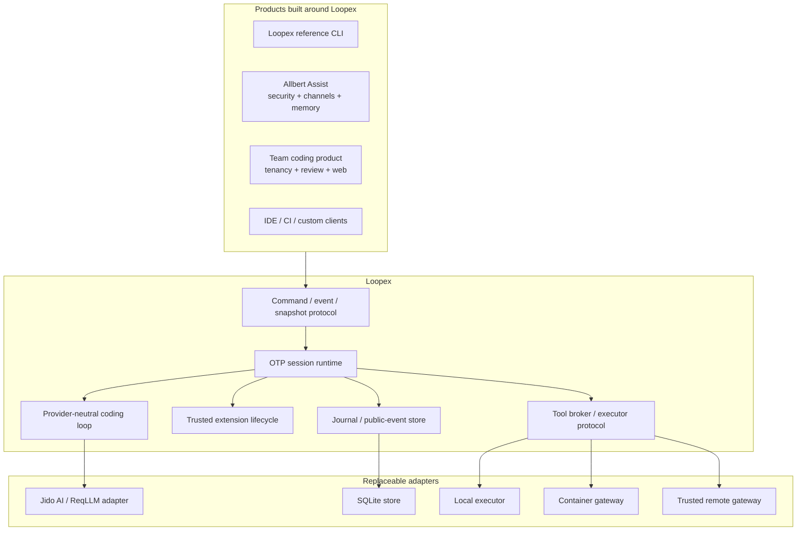
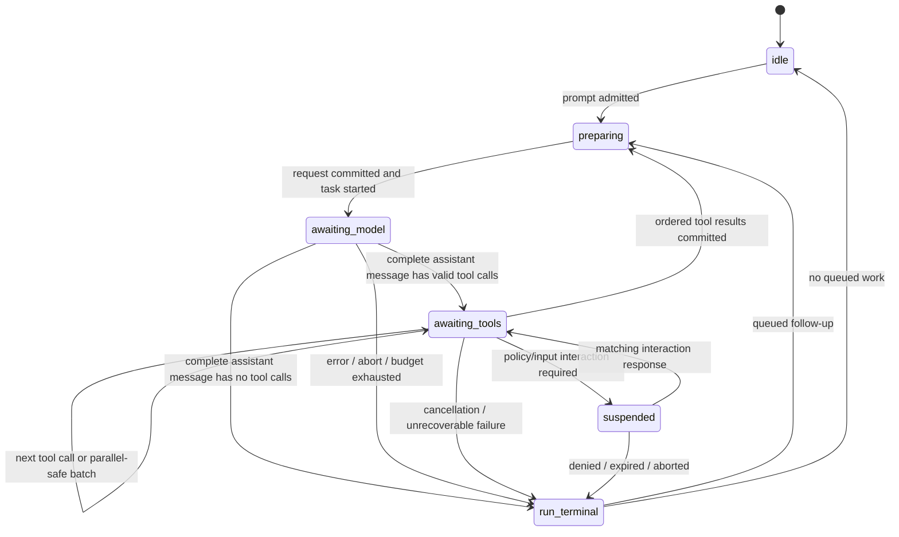

# Loopex — Vision, Architecture, and Project Plan

Status: recommended greenfield project proposal
Research date: 2026-08-14
Scope: Loopex itself. Allbert Assist appears only as a future host/integration example.

## Executive recommendation

Build Loopex as a new repository and a new product boundary:

> **Loopex is an OTP-native, embeddable coding-session runtime: a small,
> provider-neutral agent loop with durable sessions, versioned commands and
> events, location-transparent tool execution, and trusted live extensions.**

Loopex should be to Elixir applications what Pi's agent core and coding-agent SDK
are to TypeScript applications: a useful coding harness on its own and a compact
runtime that other products can embed. It should not be an extraction of
Allbert's kernel, a rewrite of Allbert, or a generic multi-agent framework.

José Valim's two observations are the architectural brief:

1. Elixir already supplies the difficult runtime primitives for a coding
   harness: live code replacement, actors, supervision, concurrency,
   distribution, monitoring, and fault isolation.
2. **"You don't need an external framework for this. The runtime is the
   framework."**

The consequence is stronger than "write Pi in Elixir." Loopex should not hide OTP
behind a second agent framework. Its core should be ordinary Elixir/Erlang:

- one serialized coordinator and supervised subtree per active session;
- pure state transitions over plain data;
- `DynamicSupervisor`, `Registry`, supervised tasks, monitors, and messages;
- an append-only session journal plus rebuildable projections;
- explicit behaviours at the model, store, tool-executor, extension, and
  transport boundaries;
- trusted OTP applications for live extensions;
- a narrow job protocol, not remote anonymous functions, between the session
  "brain" and local or remote "hands."

Jido may be useful in an optional adapter for LLM/provider calls. It must not own
Loopex's loop, session state, tools, events, effects, extension lifecycle, or
public protocol. Loopex's core must still work with a fake model adapter and with
a non-Jido provider adapter.

The first useful release should be deliberately small: one real provider, one
durable session, four default coding tools (`read`, `write`, `edit`, `bash`), an
Elixir API, a JSONL RPC mode, streamed events, steering/follow-up/cancellation,
and a thin terminal client. Sub-agents, plan mode, enterprise policy, social
channels, long-term memory, background objectives, marketplaces, and Phoenix UI
are applications around Loopex, not Loopex core.

## 1. Why a new project is justified

### 1.1 Pi validates the product shape

Pi describes itself as a minimal terminal coding harness that is adapted through
extensions and packages rather than by modifying its internals. Its default
coding surface is four tools; it intentionally omits built-in sub-agents and plan
mode; and it exposes interactive, print, JSON, RPC, and in-process SDK modes.
Those are not incidental CLI features. Together they establish a useful product
shape: **a small loop, a rich extension seam, and more than one way to host it.**
See [Pi's current README](https://github.com/earendil-works/pi/blob/main/packages/coding-agent/README.md)
and [SDK](https://pi.dev/docs/latest/sdk).

Pi's implementation is usefully layered:

- `pi-ai` normalizes providers, models, messages, tool calls, streaming, usage,
  and cross-provider context;
- `pi-agent-core` owns the low-level tool-calling loop, state, queues, abort, and
  events;
- `pi-coding-agent` composes sessions, persistence, resources, extensions,
  compaction, tools, CLI modes, and the TUI;
- SDK and RPC modes make that composition embeddable.

Loopex should reproduce those semantic separations, not Pi's TypeScript module
layout or exact APIs. In particular, Loopex can improve on Pi by making a session
a durable OTP service, making tool location explicit, and specifying reconnect
and replay semantics from the start.

“Pi written in Elixir” means semantic parity at the harness boundary, with
deliberate OTP-native substitutions:

| Pi capability | Loopex disposition |
| --- | --- |
| Minimal provider-neutral tool loop | Core requirement, expressed as a pure reducer plus supervised OTP work |
| Four default coding tools | Same default (`read`, `write`, `edit`, `bash`), behind executor ports |
| Streaming and abort | Core requirement with typed terminal and cancellation semantics |
| Steering and follow-up queues | Core requirement with explicit turn/settled boundaries |
| Persistent, branchable sessions | Core requirement via a private journal, public events, snapshots, and projections |
| Compaction and branch summarization | Same user capability, represented as distinct durable operations |
| Context files, skills, and prompt templates | Data-only resource packs with progressive disclosure |
| Extensions and shareable packages | Trusted OTP extensions plus separate data and hand-package classes |
| Interactive, print, JSON, RPC, and SDK usage | Reference terminal plus embedded Elixir and versioned wire APIs |
| Model/provider breadth | Adapter ecosystem goal; normalize first and add providers after conformance |
| TUI themes and custom rendering | Reference-client/extension concern, never core state |
| No built-in sub-agents or plan mode | Preserve the omission in core; wrappers may compose sessions |
| TypeScript/npm execution model | Do not copy; use OTP applications, Hex/git/local packages, and explicit trust |
| Exact Pi APIs and session JSON | Do not copy or promise compatibility in 0.x |

The OpenClaw analogy demonstrates why this wrapper seam matters, but it is also
a warning against depending on an adjacent project's internal loop forever.
Current OpenClaw documentation describes an OpenClaw-owned reusable agent core
and integrated runtime rather than an external framework dependency. Loopex must
therefore be a stable product boundary in its own right, not merely an internal
implementation detail for its first wrapper. See
[OpenClaw's current runtime architecture](https://github.com/openclaw/openclaw/blob/main/docs/agent-runtime-architecture.md).

### 1.2 OTP changes which problems require a framework

The BEAM already has the substrate usually rebuilt inside an agent framework:

- processes provide isolated state ownership and cheap concurrency;
- supervisors provide lifecycle and restart policy;
- monitors and links make failure observable;
- registries and process groups provide discovery;
- schedulers keep model I/O and tool I/O concurrent;
- code loading and `code_change/3` support deliberate live evolution;
- distribution can coordinate trusted remote runtimes;
- ports and external processes connect to OS-isolated workers.

That makes a headless client/server runtime a natural topology. It does **not**
make the public contract automatic. Stable IDs, authentication boundaries,
command deduplication, schema negotiation, reconnect cursors, backpressure, and
ambiguous-effect handling still require explicit design.

The same qualification applies to hot code and distribution:

- the BEAM keeps current and old module code, but loading a third version can
  purge old code and kill a process still executing it;
- `GenServer.code_change/3` is a deliberate state-migration hook, not automatic
  correctness;
- Mix releases do not provide production hot upgrades out of the box;
- all code loaded into one VM is trusted;
- connected distributed Erlang nodes are mutually trusted, even when TLS
  authenticates and encrypts the connection.

These constraints are explicit in the official
[OTP code-loading documentation](https://www.erlang.org/doc/apps/kernel/code.html),
[Elixir `GenServer` contract](https://hexdocs.pm/elixir/GenServer.html#c:code_change/3),
[Mix release documentation](https://hexdocs.pm/mix/Mix.Tasks.Release.html#module-hot-code-upgrades),
[OTP secure-coding guide](https://www.erlang.org/docs/29/system/secure_coding.html),
and [distributed Erlang guide](https://www.erlang.org/docs/28/system/distributed.html).

Loopex should therefore use OTP for continuity, concurrency, supervision, and
trusted extensibility; an explicit protocol for durable semantics; and OS-level
isolation for generated code and hostile workloads.

### 1.3 Allbert supplies hard-won evidence about the boundary

Allbert's experience is evidence for a greenfield core, not source material to
copy wholesale. The active v1.4 plan and request flow alone are 9,239 lines. At
v1.4 build start the product had 281 actions, 56 settings fragments with 624
effective keys, 42 versioned release gates with 414 ordered steps, and 13
security-evaluation files with 86 obligations. The cost of v1.4 was not simply
moving modules; extraction exposed years of coupling among product policy,
registries, settings, packaging, release evidence, UI, and tests.

The reusable lessons are much smaller than the system that produced them:

- one owner serializes a session;
- durable state is written before notifications are published;
- signals/events are observations, not authority or storage;
- commands and effects need stable idempotency identities;
- model-facing content and client-facing rendering are different payloads;
- cancellation is a protocol, not `Task.shutdown/2` sprinkled through code;
- a lost effect can have an unknown outcome and must not be blindly retried;
- generated code must be compiled and tested away from the coordinator;
- channels render and translate; they do not own a private loop;
- policy and delivery receipts belong to the product that owns the user and
  channel, not to a generic coding loop.

Relevant internal evidence is in
[`docs/plans/v1.4-plan.md`](../plans/v1.4-plan.md),
[`docs/plans/v1.4-request-flow.md`](../plans/v1.4-request-flow.md),
[`docs/developer/delegate-agents.md`](../developer/delegate-agents.md),
[`docs/developer/channel-parity.md`](../developer/channel-parity.md), and
[`ADR 0085`](../adr/0085-cooperative-cancellation-and-child-process-kill.md).

The design conclusion is: **carry the invariants; leave the product subsystems
behind.**

## 2. Product vision

### 2.1 One-sentence vision

Loopex makes a coding agent an embeddable, supervised Elixir service rather than
a terminal process that happens to call tools.

### 2.2 What users should be able to build

The same Loopex runtime should support:

1. **The reference Loopex CLI.** A fast Pi-like terminal harness for one trusted
   developer and one repository.
2. **Allbert Assist.** A policy-rich application that maps identities,
   confirmations, Security Central, long-term memory, and many channels onto
   Loopex sessions and tools.
3. **A team coding service.** A product that supplies tenancy, worktree
   allocation, repository policy, review, audit, quotas, remote workers, and a
   web UI around Loopex.
4. **IDE and editor integrations.** Clients that attach, replay from a cursor,
   submit prompts or steering, and render the same event stream.
5. **Build and CI agents.** Headless processes that use the Elixir API or wire
   protocol without loading a TUI.
6. **Specialized developer tools.** Debugging, migration, documentation,
   incident-response, or data agents that contribute tools and context while
   reusing the same loop.

### 2.3 The north-star experience

A developer starts a Loopex daemon in a repository and attaches a terminal. They
ask for a change. The session streams model output, reads code, edits files, runs
tests, accepts steering while active, and records a branchable history. The
terminal can disconnect without killing the work. A second client can attach as
an observer and reconstruct the state from a snapshot plus later events.

During that session a trusted extension is rebuilt. Loopex compiles and validates
the candidate in a disposable validation VM, queues new work that uses the
extension, lets affected in-flight runs settle, and then replaces the extension
without discarding session history. If post-load health or state migration
fails, Loopex reloads the retained prior artifact before releasing queued work.
This is a brief activation barrier, not simultaneous routing to two same-name
module revisions inside one VM.

The same session can later execute a compiler or tests inside a local container
or on a remote worker. The session still owns the model and history; the worker
owns the workspace and OS processes. A lost worker produces a truthful
`outcome_unknown` when Loopex cannot prove whether an effect completed.

### 2.4 Product principles

1. **The runtime is the framework.** Prefer OTP primitives and small behaviours
   over an agent DSL, workflow engine, or macro layer.
2. **Session before surface.** The runtime is headless. CLI, TUI, Phoenix, IDE,
   chat, and API clients are peers over one contract.
3. **Events are a public contract, not a log format.** Private recovery records,
   durable public events, authoritative snapshots, and transient progress have
   distinct semantics.
4. **Brains and hands are separate.** The model/session coordinator never gains
   implicit host authority merely because a tool exists.
5. **Mechanism in Loopex; policy in the host.** Loopex supplies interception,
   suspension, grants, receipts, and execution boundaries. Hosts decide who may
   do what.
6. **Generated code is a candidate, not an extension.** Compile and test it in
   an isolated hand; promote it through an explicit trusted lifecycle.
7. **Minimal defaults, open composition.** Four default tools, a small prompt,
   no built-in plan mode, no built-in sub-agents, no built-in team workflow.
8. **Plain data crosses boundaries.** Public contracts contain stable IDs and
   versioned values, never PIDs, ports, anonymous functions, or arbitrary Erlang
   terms.
9. **Failure is a first-class result.** Cancellation, timeout, denial,
   unavailable workers, and ambiguous effects are modeled rather than hidden.
10. **Restart and replay before production hot upgrades.** Live extension reload
    is an early feature; full release hot upgrade is a later operations feature.

## 3. Deliberate scope

### 3.1 Loopex owns

- the provider-neutral model request, stream, message, usage, and tool-call
  vocabulary;
- one serial agent loop per session;
- prompt, steering, follow-up, abort, retry, and settled semantics;
- an append-only private session journal, durable public-event projection,
  snapshots, replay, branching, and context projection;
- the public command, event, snapshot, and interaction contracts;
- logical client attachment, snapshot/cursor, command-admission, and interaction
  mechanics;
- tool definitions, validation, execution requests, streamed output, results,
  cancellation, and unknown-outcome semantics;
- local, container-gateway, and trusted-remote executor ports;
- trusted extension discovery, quiescent activation, drain, state migration,
  rollback, and health;
- reference Elixir and JSONL APIs;
- a small reference coding distribution and terminal client.

### 3.2 Hosts and wrappers own

- user, organization, tenant, and channel identity;
- authentication and authorization policy;
- durable confirmation policy and approval UX;
- secrets, credential custody, redaction policy, and audit retention;
- social-channel adapters, provider deduplication, outboxes, delivery retries,
  and "user saw this" receipts;
- long-term personal or organizational memory;
- objectives, schedules, background jobs, multi-agent fan-out, and joins;
- billing, quotas, repository governance, review rules, and deployment policy;
- product-specific settings, onboarding, model recommendations, and fallbacks;
- web workspaces, dashboards, inboxes, and enterprise administration;
- extension trust decisions and package signing policy.

### 3.3 Explicit non-goals for Loopex 0.x core

- an Allbert compatibility layer inside Loopex;
- a generic autonomous-agent framework;
- a workflow DAG or durable objective engine;
- built-in sub-agent scheduling or swarm coordination;
- built-in plan mode or to-do system;
- a social-channel framework;
- MCP server/client parity;
- a marketplace or remote auto-installer;
- arbitrary model-generated Elixir loaded into the brain VM;
- treating a BEAM process, node, or supervision tree as a security sandbox;
- exactly-once remote effects;
- multi-tenant authorization;
- a Phoenix or LiveView dependency in core;
- Jido Agent, Jido Action, or Jido Signal as a public or internal runtime spine;
- production `.appup`/`.relup` hot upgrades before restart/replay and extension
  reload are proven.

## 4. Domain model

Use a small vocabulary consistently:

| Term | Meaning |
| --- | --- |
| **Session** | Durable coding conversation and configuration, identified by `session_id`. An active process is a cache/owner, not the source of truth. |
| **Run** | Work triggered by one prompt or queued follow-up, from admission until terminal outcome. Only one run is active per session in 0.x. |
| **Turn** | One model response plus the tool batch it requests. A run may contain many turns. |
| **Command** | Versioned client request such as prompt, steer, follow-up, abort, compact, fork, or set model. |
| **Journal record** | Private durable transition used to recover the session and reconcile work. It is not a public API. |
| **Public event** | Stable, durable projection of committed journal state for clients. Public event sequences are independent of private journal versions. |
| **Progress** | Transient stream hint such as a token or stdout delta. It is not canonical state. |
| **Snapshot** | Authoritative materialized session view. A public client snapshot is anchored to `event_sequence`; a private recovery snapshot is anchored to `journal_version`. |
| **Channel** | A logical attachment between a client and a session. It carries commands, snapshots, and events; it is not Slack/Discord-specific. |
| **Interaction** | Generic suspended decision/input request whose answer must reference an exact `interaction_id`. A host may render it as an approval, question, or form. |
| **Tool** | Model-visible name, description, parameter schema, result shape, and execution requirements. |
| **Tool call** | One model-requested invocation with a stable `tool_call_id`. |
| **Executor** | Local or remote implementation that performs a tool job. |
| **Brain** | Session, model credentials, context, journal truth, public projection, and scheduling. |
| **Hand** | Workspace, compilers, shell, filesystem mutation, and generated programs. |
| **Workspace** | Opaque executor-owned repository/filesystem reference, not necessarily a local path on the brain. |
| **Artifact** | Content-addressed output too large or unsuitable for inline events. |
| **Extension** | Trusted code package implementing versioned Loopex behaviours. It has full authority in the VM where it is loaded. |
| **Resource pack** | Data-only prompts, skills, and context. It does not execute by itself. |
| **Projection** | Rebuildable view derived from journal records, including model context, public events, and client snapshots. |

## 5. Architecture

### 5.1 Ecosystem boundary



Dependency direction is one-way. Loopex never imports an Allbert module or an
enterprise-product concept. Hosts depend on the Loopex protocol/API and supply
adapters.

### 5.2 “Runtime is the framework” dependency rule

The core should have a hard dependency budget:

- the initial `Loopex` OTP application contains `Loopex.Protocol`, `Loopex.Core`,
  and `Loopex.Runtime` namespaces and depends only on the Elixir/Erlang standard
  runtime;
- JSON, SQLite, Jido/ReqLLM, terminal, HTTP, container, and telemetry libraries
  live in adapter/reference applications;
- no compile-time Phoenix, Ecto, Jido, Docker, Kubernetes, or cloud SDK
  dependency in `Loopex`;
- a namespace becomes a separate OTP application or Hex package only after an
  observed compile, runtime, ownership, or publication boundary requires it.

Do not create an agent DSL. Tools and extensions implement ordinary behaviours.
Do not wrap `GenServer` or `Supervisor` in macros merely to make the code look
framework-like. The codebase should be useful practical learning material for
Elixir and AI: a reader should be able to point from each architectural promise
to the OTP primitive that implements it.

### 5.3 Proposed repository/application layout

Use one monorepo and one version during 0.x. M0 begins with three applications,
not a speculative component framework:

```text
Loopex/
  apps/
    Loopex/                  # Protocol/Core/Runtime namespaces; standard OTP only
    Loopex_llm_jido/        # optional Jido AI / ReqLLM model adapter
    Loopex_cli/             # M0 JSONL/reference-client spike
  examples/
    embedded/
    custom_tool/
    custom_client/
    trusted_extension/
  conformance/
    provider/
    executor/
    store/
    protocol/
```

During v0.1, SQLite and the native executor may become
`Loopex_store_sqlite` and `Loopex_executor_local` once their behaviours and
dependency pressure are real. `Loopex_protocol`, `Loopex_core`, and
`Loopex_runtime` remain namespaces unless separate publication or application
lifecycle is justified by measurements. Later container, cluster,
WebSocket/HTTP, and client packages follow the same rule.

This gives the source tree clear ownership without paying for seven application
contracts before the domain survives M0. The project uses one release train and
does not introduce a configurable Pack system, component catalog, generated
registry, or cross-component release gate merely to preserve folder boundaries.

### 5.4 Supervision topology

```text
Loopex.Runtime.Application
├── Store
├── SessionRegistry
├── ModelAdapterRegistry
├── ExecutorDirectory
├── ExtensionManager
├── SessionSupervisor (DynamicSupervisor)
│   ├── SessionTree[session_id] (Supervisor, :one_for_all)
│   │   ├── Coordinator (GenServer)
│   │   └── WorkSupervisor (Task.Supervisor)
│   └── SessionTree[session_id] ...
└── TransportSupervisor
    ├── Embedded API adapter
    ├── JSONL stdio/RPC adapter
    └── later local socket / WebSocket adapters
```

The `Coordinator` is a serialization shell around a pure transition module:

```text
{new_state, journal_records, public_events, requested_operations}
  = Loopex.Core.Session.reduce(state, input)
```

The coordinator's one permitted synchronous external barrier is a bounded local
journal transaction. That transaction atomically stores private records,
command/operation idempotency rows, and any stable public-event outbox rows. Only
after commit does the coordinator update its cache, publish public events, and
start requested model/tool work. A failed or timed-out append leaves the prior
state authoritative and starts no effect. Provider, compiler, filesystem,
arbitrary database query, and network work never runs inside the coordinator
callback.

Each `SessionTree` uses `:one_for_all` initially. Coordinator or work-supervisor
loss terminates all tasks owned by that session before the subtree restarts. A
new session epoch is then committed before more work is admitted. Every async
message carries `operation_id`, `attempt`, and session/executor epoch. An
unsolicited live completion must match the current dispatch attempt and epochs;
the coordinator rejects an old one. A prior-epoch receipt is considered only
through the separate, solicited reconciliation path below. This prevents a
surviving or late task from completing work against reconstructed state without
making durable recovery evidence unreadable.

Durable session state contains plain serializable data. It never contains PIDs,
ports, monitors, anonymous functions, open streams, or extension process state.
On restart the process loads the latest compatible snapshot, replays later
private records, advances its session epoch, and reconciles any operation that
was active at the last committed journal version.

### 5.5 Durable operation protocol

Command deduplication alone cannot prevent a shell command from running twice.
Every model request and tool job therefore has an operation lifecycle in the
private journal and execution ledger:

```text
intent committed
  -> lease/dispatch attempt recorded
  -> executor accepted or reconciliation required
  -> terminal receipt committed
```

An operation carries stable `operation_id`, `attempt`, session epoch, executor
epoch, idempotency class, and fencing token. The executor must durably deduplicate
effectful `operation_id` values and retain a terminal receipt long enough for
brain recovery. Crash behavior is explicit:

- after intent but before dispatch, recovery may dispatch the same operation ID;
- after dispatch but before the brain stores a result, recovery asks the
  executor for its receipt using a new `reconciliation_query_id` issued under
  the current session epoch;
- if the executor proves no start, policy may create a new attempt;
- if it proves a terminal result, the brain commits that result once;
- if it cannot prove whether an effect ran, the operation becomes
  `outcome_unknown` and is not automatically repeated;
- unsolicited stale results fail their epoch/fencing check;
- a reconciliation response may contain the persisted origin attempt's old
  session/executor epochs only when its outer response matches the current
  recovery query and executor epoch, and its embedded receipt matches the
  journaled `operation_id`, origin attempt/epochs, executor identity, and fencing
  token. The coordinator commits the reconciliation decision under the current
  session epoch; it never reclassifies that old receipt as a live completion.

The native v0.1 executor and `bash` tool must implement this minimum protocol,
process-tree ownership, cancellation escalation, terminal receipts, and unknown
outcomes. v0.4 adds OS isolation and resource controls; it does not introduce
correct effect semantics for the first time.

## 6. The agent loop

### 6.1 Minimal state machine



One active run per session is a feature, not a temporary limitation. It makes
context ordering, tool effects, steering, and recovery understandable. Products
that need concurrency create more sessions and coordinate them outside the core.

### 6.2 One run

1. Admit a prompt with a unique `command_id`; commit a private command-admission
   record and idempotency row before acknowledging it.
2. Project the canonical session history into provider messages using the active
   context policy, model capabilities, tool set, and active extension set.
3. Atomically commit a private model-operation intent and the `run.started`
   public projection; publish after commit, then launch the model stream in a
   supervised task with its operation identity, attempt, and epochs.
4. Publish text/reasoning/tool-call deltas as transient progress. On completion,
   commit one full assistant message to the private journal and emit its stable
   public event.
5. If the message contains no complete tool calls, finish the run. An output
   limit or malformed/truncated tool-call payload never executes a partial call.
6. Validate each requested tool against the active definition and host policy
   port. The decision is `allow`, `deny`, or `defer` with an interaction.
7. Commit each allowed tool-operation intent before dispatching it to an
   executor with deadlines, cancellation, workspace identity, execution
   budgets, stable IDs, attempt, epochs, and fencing token.
8. Stream progress, reconcile a terminal executor receipt, then commit tool
   results and their stable public projections in the model's original
   tool-call order. Client progress may arrive in completion order.
9. Apply pending steering before the next model request and repeat.
10. Commit a typed terminal outcome and corresponding `run.finished` public
    event. If no follow-up is pending, also expose `session.settled`; otherwise
    start the next run.

Pi's current loop makes a valuable distinction between an agent run ending and
the session becoming settled: retries, compaction, or queued follow-ups may still
continue after a lower-level `agent_end`. Loopex should make `run.finished` and
`session.settled` separate public events. See [Pi's agent-core documentation](https://github.com/earendil-works/pi/blob/main/packages/agent/README.md)
and [RPC event contract](https://pi.dev/docs/latest/rpc#events).

### 6.3 Input queues

Loopex 0.x supports three explicit cases:

- **`prompt`**: starts a run only while settled. If active, the caller must say
  whether it means steer or follow-up; Loopex never guesses.
- **`steer`**: queues input for the current run. It is injected after the current
  assistant turn's tool batch finishes and before the next model call. It does
  not pretend to roll back a tool already started.
- **`follow_up`**: queues a new run after the current run and all its steering
  work settle.

`respond_interaction` is also explicit: it supplies the exact pending
`interaction_id`, the answer, and host decision context. A stale, duplicate, or
mismatched response is rejected and cannot resume another interaction.

`abort` is separate. It requests cooperative cancellation of the model and
executor work, escalates through the executor's shutdown contract, and produces
a terminal public event only after cleanup or an explicit unknown outcome. A future
`interrupt` convenience may compose abort plus a priority prompt, but it should
not be in the first protocol.

Queue mode is initially one-at-a-time. “Deliver all” batching can be added later
as an explicit session option after context behavior is tested.

### 6.4 Tool ordering and concurrency

The first implementation executes tool calls sequentially. This matches the
dominant filesystem-mutation case and avoids pretending that multiple edits or
shell commands commute.

Later, a tool definition may declare `parallel_safe: true` and a resource scope.
Only a batch whose complete conflict set is known may run concurrently. Even
then:

- progress may interleave;
- final results are persisted in assistant source order;
- a serial tool forces the relevant batch to serialize;
- cancellation and deadlines apply per call and per batch;
- an extension or host policy may always force serial execution.

### 6.5 Typed outcomes

Do not use free-form exception text as session semantics. Runs and jobs terminate
with a closed initial algebra:

```text
completed
cancelled
denied
failed(category, retryable?)
unavailable(category)
outcome_unknown(reconciliation_ref)
```

`needs_interaction` is a suspended state, not a terminal success. Model-facing
tool content is separate from client-facing details and artifacts. This preserves
Pi's useful split between what helps the next model turn and what a UI needs to
render, without making a terminal renderer part of core.

## 7. Channels, commands, and public events

### 7.1 A channel is an attachment, not a product adapter

Loopex's “channel semantics” are intentionally narrower than Allbert's. A Loopex
channel:

- attaches to one session with a stable client identity supplied by the host;
- obtains an authoritative snapshot and durable cursor;
- submits versioned commands;
- receives correlated command-admission responses;
- streams committed public events and transient progress;
- responds to exact interactions;
- detaches and resumes without owning or terminating the session.

It does not identify a Slack user, retry a Telegram message, infer thread
identity, store email receipts, or decide authorization. Those are wrapper
responsibilities.

### 7.2 Attachments and writer policy

The core does not own a controller lease. A session coordinator already
serializes admitted commands from any number of callers, so a mandatory lease
would turn one reference client's collaboration policy into a universal kernel
rule.

- the embedded API and core protocol accept commands in committed admission
  order;
- authentication and the right to write are decided before a host invokes the
  core;
- read-only subscribers may attach without gaining a command capability;
- the reference daemon may implement one-controller/many-observer leases as an
  adapter policy;
- an enterprise host may implement another policy without changing session
  semantics;
- if a host needs stale-writer fencing, its admitted command metadata may carry
  a host-issued writer epoch, but Loopex does not acquire, renew, or transfer it.

Collaborative editing, takeover, lease TTL, and role policy therefore remain
daemon/host concerns. Determinism comes from durable command admission, not from
a built-in user model.

### 7.3 Attach without a race

An attachment handshake is snapshot-first:

1. negotiate protocol version and features;
2. authorize transport admission in the host;
3. attach to the live session event hub;
4. read an authoritative snapshot at public-event sequence `N`;
5. deliver committed public events from `N + 1` onward;
6. use event IDs and `event_sequence` to suppress duplicates.

The implementation must close the subscription/snapshot race inside the runtime;
clients must not read a process and then separately subscribe.

### 7.4 Command envelope

```json
{
  "protocol_version": 1,
  "command_id": "cmd_...",
  "session_id": "ses_...",
  "client_id": "client_...",
  "type": "prompt",
  "payload": {"content": [{"type": "text", "text": "Fix the test"}]}
}
```

`command_id` is the idempotency key. Admission is serialized by the session.
Repeating the same command returns the prior admission/terminal reference; using
the same ID with different bytes rejects. `client_id` is correlation metadata
from an already-admitted host, not an authentication or authority claim.

An admission response means the command was durably accepted or rejected. Work
after acceptance reports through public events; a client never receives a second
contradictory response for the same command.

### 7.5 Event envelope

```json
{
  "schema_version": 1,
  "event_id": "evt_...",
  "session_id": "ses_...",
  "event_sequence": 42,
  "run_id": "run_...",
  "turn_id": "turn_...",
  "tool_call_id": null,
  "correlation_id": "cmd_...",
  "causation_id": "evt_...",
  "occurred_at": "2026-08-14T12:00:00.000000Z",
  "type": "assistant.message_completed",
  "payload": {}
}
```

Rules:

- `event_sequence` is total only within one session's public-event stream;
- public events are immutable, durably stored, and delivered at least once;
- clients deduplicate by `event_id` or `event_sequence`;
- no global cross-session order is promised;
- a public event is published only after the journal/outbox transaction accepts
  the private transition and public projection;
- unknown event types are ignored or surfaced according to negotiated
  compatibility, never interpreted as authority;
- PIDs, module atoms, stacktraces, provider secrets, and raw arbitrary terms are
  not public payloads.

### 7.6 Public stream planes

Do not expose the recovery journal as the client protocol. Clients see three
planes:

1. **Durable public events** expose stable messages and outcomes and receive
   monotonically increasing public-event sequence numbers.
2. **Authoritative snapshots** are projections at a public-event sequence. A client may
   replace its local canonical state with a compatible snapshot.
3. **Transient progress** carries token, reasoning, stdout/stderr, and tool
   progress deltas. It has a stream offset and `based_on_event_sequence`, but
   does not consume a public-event sequence and must not be reduced into
   canonical state.

If a client disconnects mid-token-stream, Loopex does not promise replay of every
token delta. Once complete, it can replay the durable full assistant message. If
the brain dies mid-stream, the private journal drives retry, cancellation, or
failure and the public stream exposes only the resulting stable outcome; it does
not invent a complete message from transient output.

### 7.7 Initial public taxonomy

Keep the first public vocabulary deliberately smaller than the recovery state
machine:

```text
session.created | session.forked | session.settled
run.started | run.finished
user.message_appended | assistant.message_completed
tool.started | tool.finished {outcome}
interaction.requested | interaction.resolved | interaction.expired
context.compacted | branch.summarized
```

`run.finished` and `tool.finished` use the same closed outcome algebra:
`completed`, `cancelled`, `denied`, `failed`, `unavailable`, or
`outcome_unknown`. Command admission/rejection is a correlated response, not a
session event. Model attempts, dispatch attempts, leases, retries, receipts,
recovery epochs, and extension activation diagnostics are private journal or
administrative records and may evolve without a public protocol migration.

Transient progress:

```text
model.text_delta | model.reasoning_delta | model.tool_call_delta
tool.stdout_delta | tool.stderr_delta | tool.progress
retry.scheduled | context.compaction_progress | extension.reload_progress
```

The retry decision itself is durable in the private journal; `retry.scheduled`
is only a replaceable progress projection and can be re-emitted after recovery.
Extension activation belongs to a separate administrative stream unless a
session-stable consequence must be exposed. Internal telemetry is another
non-protocol plane. Metrics and spans must never change business behavior or
become required public events.

## 8. Durable sessions and context

### 8.1 Journal-store behaviour

`Loopex.JournalStore` is a private recovery port, not the public client protocol.
Its first implementation needs five capabilities:

- transact at an expected private `journal_version`;
- append private journal records and command/operation idempotency rows in that
  transaction;
- append any derived stable public-event outbox rows in the same transaction,
  with their own per-session `event_sequence`;
- load private records after a journal version and public events after an event
  sequence;
- store and load compatible snapshots and terminal effect receipts.

The reducer may propose both private records and public events, but the store
assigns their separate orders atomically. Internal journal record schemas may be
migrated without changing the public protocol. Public event compatibility is a
separate promise and is tested through wire fixtures.

The in-memory adapter supports unit and embedding tests. A separate SQLite
application is the reference durable store. PostgreSQL may be implemented by a
host later without changing core.

SQLite should use one deliberate write-ownership strategy, WAL where appropriate,
and bounded transactions. The runtime must not assume “exactly once” merely
because a transaction committed locally; external tool effects have separate
receipts.

### 8.2 Canonical history versus projections

The journal preserves:

- admitted user content;
- complete assistant messages and provider usage;
- complete tool calls/results and outcome receipts;
- model, reasoning, and active-tool changes;
- queued steering/follow-up state;
- interaction state;
- compaction checkpoints and branch summaries;
- fork lineage;
- extension-set revisions;
- recovery and unknown-outcome decisions.

Model context is a projection of this history, not the history itself. A client
snapshot is another projection. Neither may rewrite the journal records it
summarizes.

### 8.3 Branching and fork semantics

Support both concepts explicitly:

- **navigate/branch** selects a different leaf in the same session history;
- **fork** creates a new session whose origin references the source session and
  source sequence/entry.

The model projection follows the selected lineage. Abandoned-branch summaries
and context compaction are separate operations because they answer different
questions.

### 8.4 Compaction

Compaction appends a checkpoint containing:

- the exact source range/lineage summarized;
- the summary and structured carry-forward fields;
- strategy/extension revision;
- model/provider identity and usage when an LLM produced it;
- the first later entry kept verbatim;
- an integrity digest over the summarized input identities.

Raw journal records remain available. Context projection may substitute the
checkpoint.
An extension may propose or implement a compaction strategy, but a generated
summary never gains authority to alter tool receipts or historical outcomes.

### 8.5 Artifacts

Large outputs, patches, images, test logs, and generated bundles use an
`ArtifactStore` port. Events carry content digest, media type, size, logical
role, and opaque retrieval reference. The store and host decide location,
encryption, retention, and access policy.

## 9. Model/provider boundary

### 9.1 Loopex owns the canonical types

Define Loopex-owned types for:

- model identity and capabilities;
- system/user/assistant/tool messages;
- text, image, reasoning, and artifact-reference content blocks;
- tool definitions and tool calls;
- streamed deltas;
- finish/stop reasons;
- token/cache usage and optional cost;
- retryable and terminal provider errors;
- cancellation and timeout.

Provider-specific metadata may be retained in a versioned opaque map for
diagnostics, but no provider or Jido struct enters the journal or wire protocol.

### 9.2 The adapter contract

`Loopex.LLM` accepts a canonical request and emits canonical stream items from a
supervised task. It does not own a session, queue, tool execution, compaction,
or retry policy. Provider capability negotiation happens before a request is
admitted.

The adapter conformance suite should prove:

- text streaming and final message reconstruction;
- reasoning/thinking levels when supported;
- tool-call delta reconstruction and schema round-trip;
- cancellation and timeout;
- context/tool message conversion;
- usage and stop-reason normalization;
- malformed/truncated tool calls are non-executable;
- provider error categorization;
- cross-model context portability for the supported content subset.

### 9.3 Jido's role

Current Jido AI documentation exposes direct `generate_text/2` and
`stream_text/2` facades, model aliases, provider configuration through ReqLLM,
and a `Turn` normalizer/tool-loop building block. That makes it a reasonable
first adapter and avoids spending Loopex's first month rebuilding provider HTTP
clients. See the [Jido AI LLM facade](https://github.com/agentjido/jido_ai/blob/main/guides/user/llm_facade_quickstart.md)
and [turn/tool result guide](https://github.com/agentjido/jido_ai/blob/main/guides/user/turn_and_tool_results.md).

The dependency rule remains:

```text
Loopex core -> Loopex.LLM behaviour
Loopex_llm_jido -> Jido AI / ReqLLM
```

Not:

```text
Loopex session -> Jido Agent -> Jido Action -> Jido Signal
```

If Jido's API changes, only the adapter and conformance suite change. If a host
prefers direct ReqLLM or another provider library, it implements the same port.

## 10. Tools and the brain/hand boundary

### 10.1 Tool definition

A tool definition has:

- stable `tool_id` and version;
- model-visible name, description, and JSON-compatible parameter schema;
- normalized result schema/content rules;
- effect class (`read_only`, `workspace_write`, `process`, `external_effect`);
- idempotency class (`safe_retry`, `reconcile_then_retry`, `never_blind_retry`);
- required executor capabilities and platform labels;
- default wall time, CPU/memory/process/output budgets;
- concurrency/resource scope;
- optional model prompt snippet and client renderer hint.

Metadata describes mechanics. It does not grant permission. The host policy port
decides whether a call may run and may issue an opaque grant that an executor
validates.

### 10.2 Default coding surface

The reference CLI starts with Pi's four-tool discipline:

- `read` — bounded text/binary-aware file reads;
- `write` — explicit file creation/replacement;
- `edit` — checked patch/replacement with mismatch diagnostics;
- `bash` — argv/shell execution through the selected executor.

`grep`, `find`, `ls`, language servers, browsers, GitHub, databases, and other
tools are extensions or later reference additions. Keep the default tool prompt
small and progressively disclose non-default capabilities.

### 10.3 Executor job protocol

```text
JobRequest
  job_id
  operation_id / attempt
  session_id / run_id / tool_call_id
  session_epoch / executor_epoch
  tool_id / tool_version
  validated_arguments
  workspace_ref / workspace_lease
  capability_grant (opaque to core)
  deadline and resource budgets
  idempotency class
  fencing token
  artifact/output policy
```

Worker events are sequenced per job and echo `operation_id`, `attempt`, both
epochs, and the fencing token:

```text
accepted -> started -> progress/stdout/stderr* -> completed|failed|cancelled|unknown
```

The executor returns structured result content, artifacts, usage, and an effect
receipt. Output is bounded and backpressured; truncation points to an artifact
instead of allowing unbounded messages.

Receipt reconciliation uses a distinct request/response envelope. Its response
echoes a current-epoch `reconciliation_query_id` and may embed a receipt from the
persisted origin attempt and epochs. This is the only path on which prior-epoch
evidence can affect recovered state; the coordinator validates the complete
origin identity and fencing tuple before recommitting the decision in its
current epoch.

### 10.4 Local, sandbox, and trusted-cluster transports

Support three distinct trust models:

1. **Local native executor.** Runs with the user's OS authority. Fast and useful
   for the reference CLI; explicitly not a sandbox.
2. **Sandbox gateway.** A narrow local socket/stdio/HTTP-like protocol to a
   trusted gateway that owns Docker, a process sandbox, or a microVM. Generated
   code never joins the brain's Erlang distribution cluster.
3. **Trusted BEAM gateway.** Native distribution between mutually trusted Loopex
   releases for worker discovery, monitoring, and job routing. The gateway—not
   model-generated code—owns sandbox/container operations.

Native distributed Erlang is appropriate for trusted brains and gateways, not
for hostile hands. TLS and node allowlists authenticate peers but do not make a
connected compromised node least-privileged. Loopex should expose typed jobs,
never `Node.spawn/2` or arbitrary RPC chosen by the model.

Livebook demonstrates the useful topology—separate attached and temporary
runtimes, including remote runtimes—without changing this trust conclusion. See
[Livebook runtimes](https://livebook.hexdocs.pm/runtime.html).

### 10.5 Failure, retry, and fencing

Distribution provides monitoring, not exactly-once effects.

- read-only/safe-idempotent jobs may retry after policy permits;
- an effectful job lost after `started` becomes `outcome_unknown` until the
  executor reconciles it;
- stale worker completions are rejected by lease/fencing token;
- a shell command, commit, deployment, or external write is never blindly
  repeated;
- provider calls may generally retry before a complete assistant message is
  committed, but usage/cost and duplicate provider-side operations remain
  observable;
- recovery decisions append private journal records.

### 10.6 Cancellation

Cancellation is layered:

1. mark the run/job cancellation requested and stop scheduling new work;
2. signal the provider or executor cooperatively;
3. wait a bounded grace interval;
4. ask the trusted gateway to terminate the owned process tree/container;
5. record `cancelled` only when cleanup is confirmed;
6. record `outcome_unknown` when a remote effect cannot be reconciled.

No cancellation result claims rollback of a side effect that already committed.

## 11. Trusted extensions and dynamic code generation

### 11.1 Three package classes

Do not conflate resources, trusted coordinator code, and executable hands:

1. **Resource packs** contain prompts, skills, context, and display metadata.
   They are data and cannot register processes or tools by themselves.
2. **Trusted brain extensions** are compiled OTP applications loaded into the
   brain VM. They may contribute model adapters, context projectors, policy
   interceptors, commands, event projectors, or tool definitions. They have full
   VM/host authority.
3. **Hand/tool packages** implement executor-side tools or runtime images. They
   run behind the executor boundary and declare resource/isolation needs.

### 11.2 Extension manifest

An initial manifest declares:

- extension ID, semantic version, and Loopex extension-API range;
- provenance and content digest;
- OTP application and entry module from already-validated trusted bytes;
- contribution kinds;
- brain/hand placement;
- declared child processes;
- state schema version and migration callback when stateful;
- required Loopex features;
- unload/reload support;
- dependencies and conflicts.

Untrusted strings never become atoms or module names. Installation resolves a
reviewed package into compiled application metadata; runtime activation consumes
that trusted resolution.

### 11.3 Live activation protocol

Hot code is an explicit quiescent transaction. In one brain VM, a module name is
global: Loopex cannot point run A at old `MyExtension` while simultaneously
pointing run B at new `MyExtension`. The first implementation therefore favors
truthful continuity over zero-interruption A/B routing:

1. compile, test, and health-check the trusted candidate in a disposable
   validation VM;
2. validate its manifest, behaviours, dependency direction, API compatibility,
   module/atom budget, and upgrade/downgrade fixtures;
3. retain the exact prior artifact and announce an activation barrier;
4. queue new runs that can invoke the affected extension and let affected
   in-flight runs and callbacks settle;
5. snapshot/version externalized extension state and stop candidate-owned or
   affected supervised children in dependency order; verify that any older code
   left by a previous activation can be soft-purged before consuming the BEAM's
   second code slot;
6. load the candidate application's same-name modules into the brain VM and run
   explicit state migration/`code_change/3` callbacks where applicable;
7. restart affected children and run post-load health checks;
8. on success, record the active extension set and provenance, then release
   queued runs; on failure, stop B-owned children and callbacks, prove that no
   process or fun refers to old A, successfully soft-purge old A, reload the
   retained A artifact as current, run downgrade/restore callbacks and A health
   checks, and only then release the queue;
9. purge old code only after no process or fun still refers to it, and fail
   closed if safe purge cannot be established. In particular, if old A cannot be
   soft-purged before the rollback load, do not attempt that third load: restart
   the brain on retained A and replay its journal before releasing queued work.

Core session state remains in stable Loopex processes, so an extension reload does
not discard the conversation. Stateless extension callbacks are preferred.
Stateful extensions externalize versioned state and implement explicit
upgrade/downgrade fixtures.

The implementation must respect the BEAM's two-code-version limit and atom table.
Do not generate an unbounded new module atom on each edit. A third consecutive
activation must prove that no process still executes the oldest code before the
next load. If a later product requires uninterrupted side-by-side revision
routing, it must put revisions in separate supervised extension-host VMs and
call them through a versioned protocol; that is a later architecture, not an
implicit property of the initial single-VM design.

### 11.4 What “hot reload” does and does not promise

Loopex 0.x may promise:

- a session and its durable history survive extension replacement;
- an activation requested during affected work queues new affected runs and lets
  current affected work settle before code replacement;
- the first released run after a successful barrier observes the new code;
- failed activation restores the retained prior artifact before queued work is
  released;
- state migration and rollback are tested;
- a third activation and repeated-reload stress do not grow code/atoms without
  bound.

It may not promise that arbitrary recompilation is a safe production release
upgrade. Core application hot upgrades require `.appup`/`.relup`, version-pair
fixtures, upgrade/downgrade tests, purge checks, mixed-version protocol tests,
and operator rollback. Until that later work exists, restart plus journal replay
is the core deployment strategy.

### 11.5 Generated extension lifecycle

Dynamic coding generation is central to Loopex, but live authority is not part of
generation:

```text
request
  -> generate source/tests in an isolated workspace
  -> deterministic source checks
  -> compile/test/lint in a disposable hand
  -> bounded repair loop over external diagnostics
  -> candidate artifact + evidence
  -> host/operator trust decision
  -> signed or otherwise approved trusted package
  -> extension activation transaction
```

The model may propose, repair, and explain. Tests and a sandbox report may prove
behavioral properties. Neither the model nor the report authorizes loading code
into the brain. Loopex exposes the candidate/evidence mechanics; Allbert or
another host owns confirmation, signing, organizational review, and trust.

## 12. Public API and transports

### 12.1 Embedded Elixir API

The primary API should be small enough to understand without a framework guide:

```elixir
{:ok, session_id} = Loopex.create_session(session_options)

{:ok, channel} =
  Loopex.attach(session_id,
    client_id: "my-app",
    after_event_sequence: 0
  )

{:accepted, command_id} =
  Loopex.command(channel, %Loopex.Command.Prompt{
    id: Loopex.ID.command(),
    content: [%Loopex.Content.Text{text: "Fix the failing test"}]
  })

for event <- Loopex.events(channel) do
  handle_event(event)
end
```

Exact names may change during M0, but the surface should remain close to:

```text
create_session / open_session / stop_session
attach / detach
command
snapshot
events
list_sessions
```

Model, executor, store, policy, artifact, and extension implementations use
behaviours rather than a global plugin macro.

### 12.2 JSONL RPC

The first language-neutral transport is a long-lived stdin/stdout protocol:

- strict LF-delimited JSON records;
- correlated command responses plus asynchronous events;
- explicit `hello` and feature negotiation;
- attach/snapshot/event handshake;
- no terminal escape sequences on protocol stdout;
- stderr reserved for bounded diagnostics;
- identical command/event DTOs to the embedded API;
- golden-vector and fragmented-frame tests across at least Elixir, Python, and
  JavaScript sample clients.

Pi's current RPC mode is strong precedent for separating “accepted” command
responses from later asynchronous work and for modeling prompt, steer,
follow-up, abort, state, compaction, session, and UI-interaction messages. See
[Pi RPC mode](https://pi.dev/docs/latest/rpc).

### 12.3 Later transports

After protocol v1 is proven:

- Unix-domain socket for a local daemon;
- WebSocket for remote/browser clients;
- HTTP endpoints for administrative queries, not token streaming;
- native BEAM adapter for trusted in-cluster callers;
- generated client SDKs only after wire schemas stabilize.

All transports implement the same admission and snapshot/cursor semantics. A
local caller does not receive a privileged back door into coordinator state.

## 13. How products wrap Loopex

### 13.1 Allbert Assist integration

A future `allbert_Loopex` adapter should map, rather than merge, the systems:

| Allbert concern | Loopex seam |
| --- | --- |
| Channel inbound and TUI/Web input | Loopex command after Allbert authenticates and authorizes the caller |
| Security Central decision | `Loopex.Policy` allow/deny/defer result and opaque executor grant |
| Registered `Actions.Runner.run/3` capability | `Loopex.Executor` implementation or tool provider |
| Confirmation | Loopex generic interaction, with decision stored/authorized by Allbert |
| Conversation/trace | Loopex public events projected into Allbert's durable conversation and audit vocabulary |
| Long-term memory/context | Allbert-owned context projector/resource provider |
| Objectives/fan-out | Allbert orchestrates multiple Loopex sessions; Loopex has no private objective loop |
| External channel delivery receipts | Allbert outbox/receipt layer after consuming Loopex public events |
| Secrets and redaction | Allbert policy/store/transport adapters before persistence or publication |

Loopex session IDs, objective IDs, tool metadata, and model output never grant
Allbert authority. Conversely, Loopex should not need to understand an Allbert
user, confirmation row, setting, channel descriptor, or release Pack.

### 13.2 Team coding product

A team product can add:

- organization identity and role-based controller leases;
- one worktree/workspace lease per task;
- review and merge policy;
- shared observer dashboards;
- repository and secret policy;
- remote executor pools, quotas, and scheduling;
- audit retention and compliance exports;
- multi-session orchestration and joins.

Those features consume the same Loopex contracts without turning the core into an
enterprise product.

### 13.3 Reference CLI posture

The reference CLI should be genuinely useful, not a toy, while remaining honest:

- native local execution has the current user's permissions;
- trusted extensions have full authority in the CLI VM;
- project/resource trust is distinct from OS isolation;
- container execution is an explicit executor selection;
- model-generated code is not auto-installed as a brain extension;
- secrets are never intentionally written to public events, but the reference
  CLI is not a substitute for a policy product such as Allbert.

## 14. Implementation plan

The plan uses vertical releases, not one foundation release that becomes useful
only at the end. Estimates are engineering bands for one experienced Elixir
developer with focused review; they are not calendar commitments. Independent
adapter work can run in parallel after each protocol barrier.

### M0 — Contract spike (10 working days)

Goal: prove the core shape before creating an ecosystem or large test matrix.

Build:

- one `Loopex` OTP application with Protocol, Core, Runtime, and Store namespaces;
- one session coordinator and pure reducer;
- an in-memory private journal with a separate stable public-event projection;
- fake streaming model and one real Jido-backed model adapter;
- one fake tool and one bounded local read tool;
- prompt, one tool round, final answer, and abort;
- embedded API plus minimal JSONL command/event stream;
- snapshot at an explicit journal version and public-event sequence;
- crash/replay experiment;
- same-name A-to-B extension reload between runs, with compilation and health
  checks in a disposable validation VM;
- two disposable, mutually trusted local OS BEAM nodes running one typed,
  read-only executor job, with monitoring and node-loss evidence; no public PID,
  arbitrary RPC, or model-selected module/function crosses the boundary.

Exit evidence:

- the same scripted session produces equivalent stable public events and final
  snapshots through embedded and JSONL APIs;
- killing the model task does not kill the session;
- killing the session subtree reconstructs canonical state from the private
  journal and advances its epoch;
- client disconnect does not end the run;
- abort creates one terminal result;
- the real adapter streams a complete answer and usage;
- a trusted callback changes from A to same-name B between runs without losing
  session history; a deliberately failing post-load B health check stops B,
  proves and soft-purges old A, reloads retained A, and leaves A usable;
- the read-only job crosses an actual node boundary, and node loss is observed
  without turning arbitrary distribution primitives into public API;
- no Jido type appears in core, store, or protocol code.

Decision barrier: freeze protocol vocabulary and process ownership only after
the spike. If replay, tool ordering, or adapter normalization requires changing
the domain model, change it here rather than preserve a false v1 contract.

### v0.1 — Minimal local coding loop (6–10 weeks after M0)

Goal: a useful Pi-like Elixir coding harness.

Build:

- complete single-session loop and supervised provider/tool tasks;
- default `read`, `write`, `edit`, and `bash` tools;
- Jido/ReqLLM adapter with one real provider family in conformance;
- prompt, steer, follow-up, abort, retry, and settled semantics;
- private recovery journal, stable public events, transient deltas, snapshots,
  and idempotent command admission;
- sequential tool execution and split model/client result payloads;
- in-memory and SQLite stores;
- embedded API, long-lived JSONL RPC, and a basic terminal client;
- durable tool-operation intents, an executor idempotency/receipt ledger,
  attempts, epochs, fencing, reconciliation, and `outcome_unknown`;
- native process-tree ownership and cooperative-to-forced `bash` cancellation;
- project context files and data-only skills with progressive disclosure;
- usage/cost capture when providers report it;

Acceptance:

- complete a real multi-file coding change with compile/test feedback;
- attach, detach, and resume without ending the run;
- replay after coordinator and full application restart;
- steer before the next model call and run a follow-up only after settlement;
- no partial tool call executes after truncation;
- crash tests at intent-before-dispatch, dispatch-before-acceptance,
  acceptance-before-result, and result-before-journal-commit produce one
  committed terminal outcome or an explicit unknown;
- duplicate commands, dispatch messages, and late results do not duplicate tool
  work or defeat epoch/fencing checks;
- after a session restart, an unsolicited old-epoch completion is rejected, while
  a matching prior-attempt receipt is accepted only through a current-epoch
  reconciliation query and recommitted under the new epoch;
- loss of an effectful `bash` execution that cannot be reconciled becomes
  `outcome_unknown` and is not automatically repeated;
- formatter, static analysis, property tests, focused integration tests, and one
  real-provider walkthrough are green.

Out of scope: branching UI, compaction, production live-extension support,
containers, distributed scheduling beyond the M0 read-only proof, sub-agents,
MCP, Phoenix.

### v0.2 — Durable daemon and session semantics (3–4 weeks)

Goal: make Loopex a service rather than a durable CLI process.

Build:

- local daemon and Unix-socket transport over protocol v1;
- reference-daemon one-controller/many-observer policy, implemented above the
  core attachment contract;
- race-free snapshot-plus-stream attach;
- session list/open/stop;
- branch navigation, fork lineage, labels, and JSONL export/import;
- print mode and one-way JSON event mode;
- context projection and compaction checkpoints;
- artifact-store port and filesystem reference adapter;
- store migrations, snapshot compatibility, and corruption diagnostics;
- backpressure and slow-consumer policy;
- daemon reconnect/recovery around the v0.1 operation ledger.

Acceptance:

- terminal replacement does not replace the session;
- two observers see the same durable order;
- reconnect from every tested cursor has no public-event gap and at most duplicate
  delivery;
- process and node crash recover queue, branch leaf, transcript, and committed
  terminal state, then reconcile any previously active model/tool operation;
- compaction changes model projection without deleting canonical journal
  records;
- a slow observer cannot block the coordinator or provider stream.

Serial barrier: protocol v1 and snapshot semantics freeze here. Later client and
extension APIs may add fields/events compatibly but may not redefine admission,
durable order, or cursor meaning.

### v0.3 — Trusted extensions and live reload (4–6 weeks)

Goal: realize Valim's live-extensibility advantage without overstating it.

Build:

- manifest and trusted package resolver for local/Hex/git development inputs;
- versioned behaviours for tools, model adapters, context projectors,
  interceptors, commands, and event projectors;
- extension-owned supervision children;
- isolated candidate validation VM and retained prior artifacts;
- activation announce/queue/settle/load/migrate/health/commit-or-rollback barrier;
- state schema and migration callbacks;
- file-watched developer reload;
- resource packs distinct from code extensions;
- bounded code/atom growth strategy;
- extension conformance kit and examples.

Acceptance:

- reload requested during an active session loses no private journal records,
  public events, or queued input;
- an affected run on A settles before loading same-name B, and the first released
  run after a successful barrier uses B;
- failed B post-load health or migration restores the retained A artifact before
  queued work resumes, with stop/ref-check/soft-purge/reload order asserted;
- rollback from B to A is exercised;
- a third activation plus repeated-reload stress proves bounded code/atom growth
  and safe old-code handling;
- extension crash does not crash unrelated sessions;
- no unreviewed/model-generated module can enter the trusted activation path.

### v0.4 — Isolated local hands and generated-code trials (4–6 weeks)

Goal: make brain/hand separation real on one machine.

Build:

- trusted worker gateway and narrow framed job protocol;
- disposable process/container executor;
- workspace and artifact leases;
- CPU/memory/wall-time/process/disk/output budgets;
- mount and environment allowlists;
- extend the v0.1 cancellation, receipt, idempotency, fencing, and reconciliation
  contract across a container/gateway boundary;
- generated extension candidate compile/test/lint/repair workflow;
- explicit promotion handoff to host policy.

Acceptance:

- generated code cannot access brain model credentials by default;
- timeout, cancellation, output flood, process fork, worker crash, and disk limit
  tests produce bounded outcomes;
- an effect lost during disconnect is not blindly retried;
- compilation and tests happen outside the brain VM;
- patch, logs, artifacts, and structured evidence return through the protocol;
- source and packaged reference CLI exercise the same executor contract.

### v0.5 — Remote hands and ecosystem beta (4–6 weeks)

Goal: prove the distributed-Elixir advantage and the wrapper boundary.

Build:

- worker discovery, capability advertisement, leases, heartbeats, and scheduling;
- trusted BEAM gateway transport with TLS/allowlists and compatibility handshake;
- portable narrow wire transport for non-BEAM/sandbox gateways;
- network partition, stale lease, fencing, and reconciliation behavior;
- multiple attached sessions and workers;
- client SDK/reference libraries after protocol v1 conformance;
- an Allbert adapter spike and a small team-product sample host;
- operational telemetry and storage/executor diagnostics;
- installable binary release and library packages.

Acceptance:

- one brain coordinates two workers with different capabilities;
- killing a worker reroutes only safe-retry jobs;
- an ambiguous effect remains unknown until reconciled;
- an untrusted sandbox never becomes a distributed Erlang peer;
- mixed compatible releases pass handshake and protocol tests;
- Allbert can map one secured registered action to a Loopex tool without Loopex
  importing Allbert;
- all examples use public contracts, not internal PIDs or process state.

### Later — production core hot upgrades

Only after v0.5:

- exact old/new release fixtures;
- `.appup`/`.relup` generation and review;
- upgrade and downgrade tests for every state-bearing process;
- current/old-code purge checks;
- mixed-node compatibility;
- interrupted-upgrade rollback;
- storage and protocol migration compatibility;
- operator evidence on packaged releases.

Restart plus replay remains supported even if hot upgrades later ship.

### Delivery estimate

The useful local v0.1 target is approximately **8–12 engineering weeks including
M0**. Reaching the extension, isolated-hand, and remote ecosystem beta is
approximately **23–34 engineering weeks total** for one senior contributor,
before organizational contingency, with review and real-provider/real-executor
validation. Store, Jido adapter, terminal, and later worker implementations can
proceed in parallel only after their contract barriers; session semantics,
effect recovery, and protocol evolution remain serial ownership.

## 15. Workstreams and rejoin points

After M0, use five workstreams:

| Workstream | Owns | Must not own |
| --- | --- | --- |
| Core/runtime | reducer, coordinator, queues, recovery, event ordering | provider HTTP, terminal UI, host policy |
| Protocol/store | DTOs, compatibility, SQLite, snapshot/replay, conformance vectors | session decisions, renderer behavior |
| LLM/context | Jido adapter, canonical conversion, compaction strategies | session ownership, tool execution |
| Executors/tools | tool definitions, local/container/remote gateway, cancellation | model context or authorization policy |
| Clients/extensions | terminal/RPC clients, extension SDK/lifecycle, examples/docs | private process access, alternative loops |

Serial barriers:

1. M0 domain vocabulary and process ownership before parallel production work.
2. v0.1 private-journal, public-event, effect-ledger, and command-admission
   semantics before daemon/client work.
3. v0.2 protocol v1 and snapshot/cursor freeze before published SDKs.
4. v0.3 extension lifecycle freeze before package ecosystem work.
5. v0.4 gateway/isolation conformance before remote worker scheduling.

Every release rejoins with:

- core conformance and property tests;
- all adapter conformance suites;
- direct API versus wire-protocol equivalence;
- crash/cancellation/replay tests;
- real provider and, when relevant, real executor validation;
- documentation examples compiled and executed;
- dependency-direction check;
- one end-to-end coding task from a clean install.

## 16. Verification strategy

### 16.1 Test layers

1. **Pure reducer/property tests.** Generate command/result/failure sequences and
   assert legal states, monotonic sequence, terminal uniqueness, queue ordering,
   and replay equivalence.
2. **Behaviour conformance.** Shared suites for every LLM, store, executor,
   artifact, policy, and transport adapter.
3. **Process fault tests.** Kill provider tasks, tool tasks, coordinators,
   extension children, stores, clients, and workers at each transition.
4. **Protocol vectors.** Canonical JSON fixtures, schema compatibility,
   fragmented frames, unknown fields/events, duplicate commands, reconnect
   cursors, and slow consumers.
5. **Real integrations.** At least one configured provider and the native
   executor in v0.1; a real container executor from v0.4; real trusted remote
   nodes from v0.5, in addition to the M0 two-node proof.
6. **Packaging.** Install and run the exact built artifact, not only source Mix
   tasks.

### 16.2 Core invariants

- one active run per session;
- one terminal public event per admitted run and tool job;
- public events publish only after the journal/outbox transaction commits;
- replay of the private journal reaches the same canonical state as
  uninterrupted execution;
- repeated `command_id` cannot duplicate work;
- every effect intent is committed before dispatch;
- every asynchronous result carries operation identity, attempt, and current
  session/executor epochs, and stale completions are rejected;
- a session subtree owns its work strongly enough that restart cannot leave an
  unfenced child completing against reconstructed state;
- complete tool results match complete tool calls in source order;
- transient progress never becomes canonical client state;
- client disconnect never owns session lifecycle;
- coordinator callbacks perform no blocking external work except the explicit,
  bounded local journal transaction barrier;
- generated code never loads into the brain VM;
- distributed Erlang peers are trusted gateways only;
- no effectful unknown outcome is blindly retried;
- same-VM extension activation is settlement-gated and rollback-safe; it never
  claims simultaneous same-name revision routing;
- model/provider/Jido types do not cross core or protocol boundaries.

### 16.3 Minimalism budgets

These are architectural tests, not slogans:

- four tools enabled by default;
- default core system/tool prompt target under 1,000 tokens before project
  context;
- no built-in sub-agent, plan, objective, background-job, social-channel, or
  policy engine;
- no external runtime dependency in the `Loopex` core application;
- no public PIDs, module atoms, functions, or raw Erlang terms;
- one canonical command/event contract across all transports;
- one page is enough to embed a session and stream its events;
- each new core concept must demonstrate that it cannot be an extension,
  adapter, or host concern.

### 16.4 Performance evidence

Measure rather than promise BEAM-scale numbers in advance. From M0 onward record:

- command admission latency excluding client transport;
- journal append and snapshot latency;
- provider first-token and total-run time separately from Loopex overhead;
- event fan-out cost and slow-consumer drops/disconnects;
- coordinator mailbox length and reductions;
- active/idle session memory;
- replay time by private journal-record count;
- tool output throughput and backpressure;
- extension reload drain time and code/atom growth;
- worker scheduling and reconciliation time.

Set release budgets after M0 baselines. Never “optimize” by doing provider/tool
work inside a session process or by weakening durable admission.

## 17. Risks and countermeasures

| Risk | Countermeasure |
| --- | --- |
| Loopex becomes Allbert Core 2.0 | Enforce the owns/host-owns table and minimalism budgets; reject identity, memory, objectives, social channels, and enterprise workflow from core. |
| “Runtime is the framework” becomes unstructured OTP code | Keep pure reducers, stable behaviours, explicit ownership, dependency checks, and protocol conformance—without adding a DSL. |
| Jido API churn shapes Loopex | Optional adapter only; Loopex canonical types and fake adapter must compile/test without Jido. |
| Provider differences leak into sessions | Capability negotiation, canonical conversion, opaque diagnostics, and per-adapter conformance. |
| Event sourcing becomes infrastructure theater | Keep a private recovery journal with only records required for deterministic recovery; project a smaller public event vocabulary; keep token deltas and telemetry transient. |
| Hot reload is oversold | Transactional trusted-extension scope first; document two-code-version/atom limits; restart/replay for core releases. |
| Generated Elixir compromises the brain | Compile/run only in disposable hands; explicit human/host promotion before trusted activation. |
| Distributed Erlang is mistaken for sandboxing | Connect only mutually trusted gateways; use a narrow non-distribution protocol to hostile sandboxes. |
| Remote effect runs twice | Stable IDs, receipts, idempotency class, leases/fencing, reconciliation, and `outcome_unknown`. |
| Multiple clients create racey control | Core serializes durable admission; the reference daemon or host applies controller/observer policy and writer fencing when needed. |
| The protocol freezes too early | M0 is disposable; freeze protocol v1 only at v0.2 after direct and daemon paths exist. |
| Package ecosystem recreates a supply-chain problem | Resource/code/hand package classes, explicit trust, content digests, no model-driven installer, no auto-loading. |
| Planning outruns a working harness | Ten-day M0, real-provider vertical slice, useful v0.1 before extension/distribution work. |
| Name collision | Treat “Loopex” as the working name until Hex, GitHub, domain, company, and trademark checks are completed; an [existing company uses “Loopex AI”](https://nl.linkedin.com/company/Loopexbv). |

## 18. Project and ecosystem posture

### 18.1 API stability

- 0.x follows semantic versioning; minor versions may break explicitly marked
  experimental APIs.
- protocol versions are independent from package versions.
- private journal records require store migrations for supported upgrades;
  frozen public events require compatible evolution or long support windows.
- internal process topology, messages, and structs are never public API.
- extensions declare an API range and receive compatibility diagnostics before
  activation.
- no exact Pi API/protocol compatibility is promised. A compatibility adapter,
  if useful, is a later separate package.

### 18.2 Licensing

Recommended default: Apache-2.0 for a permissive ecosystem plus an explicit
patent grant suitable for enterprise wrappers. Pi is MIT-licensed, so behavioral
research is straightforward, but Loopex should be an independent OTP-native
implementation rather than a line-by-line port. If maximum minimal-license
friction is judged more important than the patent grant, MIT is a reasonable
operator choice before the first public commit.

### 18.3 Documentation as a product feature

Valim's follow-up point about limited practical Elixir-and-AI learning material
should shape the repository:

- every OTP process has an ownership-focused moduledoc;
- every public behavior includes a smallest working adapter;
- examples progress from fake model to real model, custom tool, durable store,
  RPC client, trusted extension, container hand, and remote hand;
- architecture docs say which OTP primitive provides each property;
- examples avoid macros and hidden global application state;
- conformance suites are documented as extension-author tools;
- a “build the loop from first principles” guide is maintained against real
  code, not a toy parallel implementation.

The goal is not merely to use Elixir for AI. Loopex should make the case legible in
code.

## 19. Decisions recommended now

1. Create Loopex as a greenfield repository, not an Allbert branch or extracted
   application.
2. Adopt **“the runtime is the framework”** as the project doctrine.
3. Keep the `Loopex` core application free of external runtime/framework
   dependencies; use internal Protocol/Core/Runtime namespaces until separate
   OTP applications have measured lifecycle or dependency value.
4. Use Jido only behind an optional `Loopex.LLM` adapter initially; retain the
   right to use ReqLLM directly or replace it.
5. Freeze the boundary: Loopex owns coding-session mechanics; wrappers own
   identity, policy, channels, memory, objectives, and product UI.
6. Time-box M0 to ten working days and require one real provider, one tool round,
   replay, abort, JSONL equivalence, a same-name reload experiment, and one typed
   job across two disposable BEAM nodes before expanding the plan.
7. Target a useful local v0.1 before production extension, sandbox, or
   distributed-worker work.
8. Treat trusted extension reload, generated-code isolation, and remote hands as
   three separate milestones.
9. Use restart plus journal replay as the core continuity mechanism; add
   production hot release upgrades only after v0.5.
10. Keep the name Loopex provisional until public-name clearance, and select
    Apache-2.0 or MIT before the first public release.

## 20. Research sources

Primary external sources:

- José Valim, [Elixir coding-harness observation](https://x.com/josevalim/status/2088186994849468659),
  plus the follow-up “the runtime is the framework” exchange supplied in the
  project brief.
- Pi: [coding-agent README](https://github.com/earendil-works/pi/blob/main/packages/coding-agent/README.md),
  [agent core](https://github.com/earendil-works/pi/blob/main/packages/agent/README.md),
  [AI/provider layer](https://github.com/earendil-works/pi/blob/main/packages/ai/README.md),
  [SDK](https://pi.dev/docs/latest/sdk),
  [RPC](https://pi.dev/docs/latest/rpc),
  [session format](https://pi.dev/docs/latest/session-format),
  [extensions](https://pi.dev/docs/latest/extensions),
  [security](https://pi.dev/docs/latest/security), and
  [experimental protocol](https://github.com/earendil-works/pi/blob/main/packages/protocol/README.md).
- OpenCode: [server architecture](https://dev.opencode.ai/docs/server/) and
  [plugin model](https://opencode.ai/v2/docs/build/plugins).
- OpenClaw: [current agent-runtime architecture](https://github.com/openclaw/openclaw/blob/main/docs/agent-runtime-architecture.md).
- Jido AI: [LLM facade](https://github.com/agentjido/jido_ai/blob/main/guides/user/llm_facade_quickstart.md)
  and [turn/tool loop](https://github.com/agentjido/jido_ai/blob/main/guides/user/turn_and_tool_results.md).
- Erlang/Elixir: [code loading](https://www.erlang.org/doc/apps/kernel/code.html),
  [release handling](https://www.erlang.org/doc/system/release_handling.html),
  [secure coding](https://www.erlang.org/docs/29/system/secure_coding.html),
  [distributed Erlang](https://www.erlang.org/docs/28/system/distributed.html),
  [TLS distribution](https://www.erlang.org/doc/apps/ssl/ssl_distribution.html),
  [Elixir `GenServer`](https://hexdocs.pm/elixir/GenServer.html), and
  [Livebook runtimes](https://livebook.hexdocs.pm/runtime.html).

Allbert lessons consulted:

- [`docs/plans/v1.4-plan.md`](../plans/v1.4-plan.md)
- [`docs/plans/v1.4-request-flow.md`](../plans/v1.4-request-flow.md)
- [`docs/plans/archives/v1.1-plan.md`](../plans/archives/v1.1-plan.md)
- [`docs/plans/archives/v1.1-request-flow.md`](../plans/archives/v1.1-request-flow.md)
- [`docs/adr/0083-objectives-parallel-child-fanout.md`](../adr/0083-objectives-parallel-child-fanout.md)
- [`docs/adr/0084-autonomous-channel-notification-authority.md`](../adr/0084-autonomous-channel-notification-authority.md)
- [`docs/adr/0085-cooperative-cancellation-and-child-process-kill.md`](../adr/0085-cooperative-cancellation-and-child-process-kill.md)
- [`docs/adr/0091-daemon-backed-tui-session-protocol.md`](../adr/0091-daemon-backed-tui-session-protocol.md)
- [`docs/adr/0032-dynamic-plugin-generation-and-sandboxed-loading.md`](../adr/0032-dynamic-plugin-generation-and-sandboxed-loading.md)
- [`docs/developer/delegate-agents.md`](../developer/delegate-agents.md)
- [`docs/developer/channel-parity.md`](../developer/channel-parity.md)
- [`docs/developer/cross-channel-threading.md`](../developer/cross-channel-threading.md)
- [`docs/research/codegen-agent-loop-research.md`](codegen-agent-loop-research.md)

## Closing thesis

Pi demonstrates that a coding harness becomes powerful by keeping its loop small
and its extension surface open. Allbert demonstrates that identity, policy,
channels, durable delivery, memory, objectives, and release assurance are real
product concerns—but also that they should not all be prerequisites for evolving
the loop.

Elixir supplies the missing middle. A session can be an actor. A client can come
and go while the actor lives. Provider and tool I/O can be concurrent without
making state concurrent. Trusted behavior can change while session state remains
in place. A brain can monitor and coordinate hands on other machines. Failures
can be observed and recovered under supervision.

Loopex should expose those runtime properties directly, with durable commands and
events around them, and stop there. That small boundary is what lets a personal
assistant, a team coding platform, a terminal harness, and future applications
all wrap the same core without forcing the core to become any one of them.
