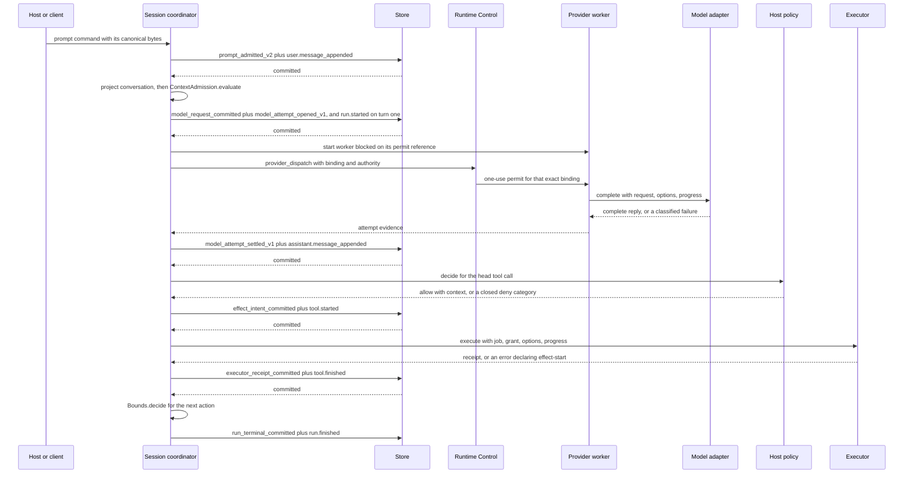

# Loopex Architecture — Technical Depth

<a id="technical-depth"></a>
## Technical depth

Concept: [Loopex architecture](architecture.md#concept).

This companion carries the invariants a change must not break, the module that
enforces each, the record shapes by name, where each concern lives, how a new
adapter joins a port, and the repository commands that hold the shape.

<a id="technical-arch-applications"></a>
## Exact Inventory and the Checks That Hold It

Concept: [The eight applications and one direction](architecture.md#concept-arch-applications).

The umbrella's declared dependencies are the whole of the direction claim:

| Application | Role | Declared dependencies |
| --- | --- | --- |
| `loopex_protocol` | `:contract` | none |
| `loopex` | `:core` | `loopex_protocol` |
| `loopex_store_local` | `:edge` | `loopex` |
| `loopex_executor_local` | `:edge` | `loopex` |
| `loopex_llm_reqllm` | `:edge` | `req_llm ~> 1.17.1`, `loopex`, `loopex_protocol` |
| `loopex_composition` | `:composition` | `loopex`, `loopex_store_local`, `loopex_llm_reqllm`, `loopex_executor_local` |
| `loopex_reference_client` | `:client` | `loopex`; the three edges `only: :test` |
| `loopex_cli` | `:client` | `loopex`, `loopex_composition` |

`Loopex.Checks.DepsBudget` is the one parser authority for both the pre-Mix gate
check and `mix loopex.deps_budget`. It requires the physical project set to equal
the ordinary stage-zero Git entries, parses each `mix.exs` as AST without
evaluating it, and derives only the fields carrying dependency authority: the
application identity, the role, the exact dependency records, and the owned
literal compile roots. The planned identities and the single permitted external
requirement are an overlay; an unknown, alternate-source, or redirected
application fails closed rather than being classified generously. The role
enumeration also declares `:extension`, which no application in the repository
carries today; a standalone extension retains the protocol-only shape
[ADR 0003](../adr/0003-extension-contract-boundary.md#concept) fixed for it.

`mix loopex.core_only` runs core's own project in a **separate virtual machine**,
not the one the task occupies. At an umbrella root every compiled child sits on
the load path, so an ambient check would fail on any adapter that merely exists.
The lane proves two things: core builds and runs with no adapter application
resolved or started, and core reads no per-runtime state from application
environment. The state root is read through `System.fetch_env/1` in
`Loopex.SessionDirectory`, never `Application.get_env` or a compile-time
default, because two runtimes in one virtual machine must not collide on a
shared value; the runtime's placement identity itself is generated once and
persisted under that root, and a later process re-presents it from disk.

Every application reads the root `VERSION` file at compile time, so the umbrella
is one version train by construction; `mix loopex.version_train` covers the case
construction cannot, an application that computes its version some other way.

<a id="technical-arch-session-owner"></a>
## Succession, the Post-Commit Fence, and the Invariants

Concept: [One serial session owner](architecture.md#concept-arch-session-owner).

### The Supervision Tree

`Loopex.Runtime.Supervisor` is the unnamed root of one runtime instance. Its
children start under `:rest_for_one` in this order: the tool registry, runtime
control, a `Task.Supervisor` for workers, a `DynamicSupervisor` for owner groups,
a `DynamicSupervisor` for session coordinators, and the event dispatcher. The
order encodes what must reset together — control and every coordinator resolve
tools through the registry, while a dispatcher failure leaves coordinators alive
because committed events can be re-read from the durable outbox.
`Loopex.Runtime` hands callers an opaque reference holding the root pid and an
unforgeable runtime-local token, so a supervised restart never turns a stale
child pid into the public identity.

A coordinator is an unnamed temporary `DynamicSupervisor` child: a crashed or
superseded coordinator is never restarted in place. Startup reads transaction
status and the non-authorizing ownership head, then commits one fresh
compare-and-set `advance_owner` succession before admission opens.

### The Invariants

| Invariant | Enforced by |
| --- | --- |
| A fact commits before it is published; an effect's intent commits before dispatch. | `Loopex.Runtime.SessionCoordinator`, `Loopex.Store.OwnerLane` |
| A committed result becomes current only through the post-commit fence. | `Loopex.Runtime.Control.current_owner_post_commit_fence/3` |
| An outbox row is delivered only at or below the acknowledged position. | `Loopex.Runtime.EventDispatcher` |
| One provider attempt is dispatched under exactly one permit, spent once. | `Loopex.Runtime.Control`, `spent_attempts` |
| A live result or a receipt is admitted only on the full identity set. | `Loopex.Effect`, `Loopex.Runtime.SessionCoordinator.reconciliation_fields/0` |
| Durable and public data is bounded plain data under one normalizer. | `Loopex.Store.normalize_and_measure_item/2` |
| A superseded owner stops only when nothing it owns is outstanding. | `Loopex.Runtime.SessionCoordinator.continue_after_owner_loss/1` |
| Cancellation observation windows derive from one formula in core. | `Loopex.Executor.cancellation_bounds/1` |

**Commit before publication, and the post-commit fence.** The coordinator
proposes state through the pure reducer, commits it through its retained
`Loopex.Store.OwnerLane`, and then offers the result to runtime control. Only
control may install the runtime-local current cache or expose pending work, and
it does so only while its own `handle_call` holds the session, so the active
generation and owner pair cannot be replaced concurrently. A delayed reply may
truthfully report that an old transaction committed; the coordinator does not
adopt proposed state until that exact generation and owner pair is admitted.
Public delivery never rides the mutation reply — the dispatcher scans the Store
outbox independently, and no reply-driven publication or Store-head read is
inserted after commit.

**The one-use provider permit.** The provider worker is started blocked. Its
first act is a selective receive for one fresh `make_ref/0` and the exact full
attempt binding, so a duplicate, stale, or wrong permit cannot match it and
cannot reach the adapter. The worker carries no timeout of its own, because a
bound there would manufacture a dispatch verdict out of scheduling latency.
`Loopex.Runtime.Control` compares every member of the request against its own
serialized state — the caller is still the prepared current owner, the journal
position carrying the open row is current, the worker is the one the coordinator
started, the deadline has not elapsed, and the full attempt identity has never
been permitted, and the binding itself equals the one rebuilt from the committed
attempt-open row at that journal position, so the caller's map is compared and
never trusted — and then spends and sends together, so a succession linearizes
entirely before or entirely after the send. The binding is
`session_id`, `run_id`, `turn_id`, `operation_id`, `attempt`, and
`staged_request_digest`. Spent identities are dropped only when control stops
holding the session at all; dropping them at succession would hand a successor a
second call on an attempt that may already have been billed. Fixed by
[ADR 0018](../adr/0018-provider-attempt-authority-and-recovery.md#concept).

**The effect identity set.** `Loopex.Effect` is pure and process-free. A request
is exactly `operation_id`, `attempt`, `domain`, `domain_version`, and `payload`;
the `canonical_request_digest` is SHA-256 over the `:deterministic` external term
format of exactly that five-field projection, and `tx_id` is derived from the
request and its digest, so the same operation attempt always names the same
transaction and a changed payload can never inherit a previous fence.

A live result is admitted only when it matches the journaled intent on `tx_id`,
`operation_id`, `attempt`, `canonical_request_digest`, `executor_identity`,
`executor_epoch`, and `fencing_token`, and carries the coordinator's **current**
`session_epoch`. A receipt for an effect whose outcome went unknown is narrower:
it must additionally match the current `reconciliation_query_id`, the current
`session_epoch`, the expected `executor_identity`, and carry a
`session_epoch_at_dispatch` equal to the epoch journaled in the intent. Requiring
the query identifier is what makes the answer solicited, so an executor cannot
resolve a fence by volunteering one. Every comparison returns the first field
that failed, because the difference between a wrong attempt and a stale epoch is
what a recovery diagnosis needs.

The session coordinator does not call `Loopex.Effect`; it applies the same rule
over its own eleven-field solicited set, published as
`Loopex.Runtime.SessionCoordinator.reconciliation_fields/0`:
`reconciliation_query_id`, `current_session_epoch`,
`expected_executor_identity`, `current_recovery_contract`,
`journaled_operation_id`, `original_attempt`,
`journaled_canonical_request_digest`, `original_session_epoch`,
`original_executor_epoch`, `origin_executor_identity`, and
`origin_fencing_token`. Presence is part of the comparison in both places:
reading an absent key as `nil` would let an answer that simply omitted a field
match an expected value that is legitimately `nil`.

**The owner-loss stop predicate.** `continue_after_owner_loss/1` stops the
coordinator `:normal` only when it is superseded *and* its in-flight map, pending
cleanup map, and stream map are empty and no pending fault is retained. Every
site that learns it was superseded routes through this one predicate; a path that
set the flag without re-evaluating it leaves a coordinator alive with nothing to
do, which is a real defect this shape closed.

**The cancellation bounds formula.** [ADR 0016](../adr/0016-configured-cancellation-observation.md#concept)
puts the formula in core so no caller invents a wait and no executor is asked for
its configuration. From a committed `grace_ms`:

```text
quarter  = max(1, div(grace_ms + 3, 4))
observe  = max(10_000, grace_ms + 2_000)
reserve  = quarter + 2_000
terminal = max(10_000, reserve)

executor_observe_ms      = observe
receipt_retention_ms     = quarter
execute_result_reserve_ms = reserve
terminal_reserve_ms      = terminal
session_cache_ms         = terminal
cli_backstop_ms          = observe + reserve + terminal
```

The domain is exactly `1..18_446_744_073_709_551_615`; anything else — a float, a
zero, a negative, or one above the range — is `{:error, :invalid_cleanup_grace}`
and reaches no callback. The intervals stay distinct and no bound is derived from
another's already-spent instant. `Loopex.Executor.default_cleanup_grace_ms/0` is
`5_000` and lives on the port because the session declares it and the executor
performs it; a default defined twice is two numbers that agree until one is
edited. `cancel/3` retains
[ADR 0012](../adr/0012-executor-cancellation-capability.md#concept)'s fixed
60-second defensive bound for a direct caller with no committed value, and
production coordination never selects it.

### Record and Event Shapes by Name

Private recovery records the reducer builds and admits, the complete set of
kinds its replay filter accepts:

| Kind | What it fixes |
| --- | --- |
| `owner_advanced` | The succession that made this coordinator the current owner. |
| `prompt_admitted_v2` | One accepted prompt: its content, bounds, cleanup grace, and context ceiling, before any request stages. |
| `command_admitted` | One admitted `steer`, `follow_up`, or `abort`, or a prompt the session refused at admission with its reason. |
| `command_admission_refused_v1` | A command refused before admission because its own bytes exceed the Store's item ceiling. |
| `context_admission_refused_v1` | A request refused at context admission: the dimension, the observed value, the limit, and the descriptor counts behind the digest. |
| `deadline_staging_failed_v1` | A request whose derived deadline could not be staged: the clock domain or the overflow that refused it. |
| `model_request_committed` | The exact staged request bytes, its `staged_request_digest`, the applied steer, and the context receipt. |
| `model_attempt_opened_v1` | `run_id`, `turn_id`, `operation_id`, `attempt`, `staged_request_digest`. |
| `model_attempt_settled_v1` | Those five plus `transport`, `termination`, `conversation`, `next`, `result`, `accounting`. |
| `model_termination_admitted_v1` | Those five plus `cause`, `deadline`, `observed`. |
| `effect_intent_committed` | The tool operation's intent, durable before dispatch. |
| `executor_receipt_committed` | The receipt matched against the dispatched job. |
| `tool_result_committed` | A terminal tool outcome, including a denial or an unresolvable name. |
| `outcome_unknown_committed` | An effect whose outcome can no longer be expected, and whose domain is fenced. |
| `run_terminal_committed` | The run's terminal disposition. |

`executor_receipt_candidate` is not committed. It is the kind a projected receipt
is validated under so an oversized or non-plain receipt becomes a truthful
unproven outcome rather than an exception that kills the owner.

Public event kinds are `run.started`, `run.finished`, `user.message_appended`,
`assistant.message_appended`, `tool.started`, `tool.finished`, `steer.resolved`,
and `follow_up.resolved`. Each carries an `event_id` and receives an
`event_sequence` stamped by the Store.

Two request digests exist and they are not interchangeable. A model request has
no operation or attempt member, so a provider retry dispatches the same staged
bytes under a newly recorded attempt and reuses their `staged_request_digest`. An
executor job canonicalization covers attempt identity, so two attempts of one
tool operation produce two different `canonical_request_digest` values by
construction.

### One Turn, End to End



Staging is refused before any provider call when the request exceeds either
committed ceiling, and a denial, an unresolvable tool name, or a passed run
deadline commits a terminal `tool_result_committed` instead of an intent. The
loop returns to the next remaining tool call in the assistant's own order and
reaches the terminal step only when the last one is answered.

<a id="technical-arch-truth-planes"></a>
## The Publication Fence and Each Plane's Owner

Concept: [Five truth planes](architecture.md#concept-arch-truth-planes).

`Loopex.Runtime.EventDispatcher` reads the Store outbox as truth and owns finite
attachment queues. Delivery is fenced at the acknowledged position: a durable
outbox row is delivered only once runtime control has recorded the commit that
produced it as resolved, so a session whose owner holds an unresolved
`commit_unknown` publishes nothing from that transaction until re-presentation
settles it. The fence binds both paths to the outbox — an attaching caller's
snapshot scan stops at the same position, and the attachment's first read starts
there rather than at the durable tail — because an unfenced scan would anchor on
truth every already-attached consumer is withheld from. A session with no current
owner in this runtime carries no fence, since no transaction of this runtime's is
outstanding against it.

A queue never exceeds its configured capacity; the first live event that cannot
fit disconnects the attachment at its last consumed sequence, so a slow caller
never delays a session commit. Historical replay from a supplied cursor is paged
lazily, so a reconnecting caller can drain more than one queueful without a false
overflow. Attachments, queued events, progress, and diagnostics disappear on
dispatcher restart; the same durable rows are then attachable again with
identical identifiers and sequences.

Transient progress belongs to a **stream domain**, the identity of one attempt's
stream. There are two kinds, one per model attempt and one per executor operation
attempt, and both belong to an attempt rather than a turn, so several domains
under one turn are the ordinary shape of a retried turn. The identifier is the
lowercase hexadecimal of the first sixteen bytes of the SHA-256 of the
canonically encoded tuple
`{"loopex.stream_domain.v1", domain_kind, session_id, operation_id, attempt}`,
where `attempt` is the integer itself. The encoding is length-aware and therefore
injective over arbitrary binary identifiers. `Loopex.Runtime.StreamRelay` is the
sole emitter into a domain, including any closing item, so nothing appears after
closure.

### One Normalizer and Its Ceilings

`Loopex.Store.normalize_and_measure_item/2` is the single normalizer for both the
`:record` and `:event` planes, and its ceilings are the durable envelope:

| Ceiling | Value |
| --- | --- |
| identifier bytes | 256 |
| item bytes | 65,536 |
| mutation bytes | 1,048,576 |
| collection cardinality | 1,024 |
| nesting depth | 12 |

Classification order is fixed: form, then depth, then bounded cardinality, then
key validity, then children. That order lets an untrusted collection be refused
before anything about it is allocated, and list cardinality is counted one cons
cell at a time so an enormous or improper list is never walked past its first
rejected witness. Caller atom key spellings become bounded binaries and `kind`
becomes a binary; arbitrary atom values are refused, so a cold virtual machine
can decode the private log with safe external-term decoding without creating
atoms. In `:event` mode the atom and binary spellings of `event_sequence`,
`owner_epoch`, and `owner_incarnation_id` are reserved at every map. The reported
cost is the normalized item's own deterministic external-term size, so a caller
can hand the returned item straight to `transact/2` and know what it will be
measured as.

`Loopex.Runtime.ContextAdmission` evaluates a candidate in a fixed order and the
first failure wins: the `system` provenance class against its strict 1,000-token
ceiling, the whole provider-visible request against the run's committed
`context_token_budget`, the durable record's structure, and then that record's
exact encoded byte cost against the Store item ceiling. Structure precedes bytes
because a structurally inadmissible record has no meaningful size, and both are
measured through `Loopex.Store` so the caller and the Store compare the same
count against the same ceiling rather than two drifting estimates. Fixed by
[ADR 0017](../adr/0017-durable-context-admission-budget.md#concept).

Store references are runtime-local handles and may contain a pid; they are never
durable or public data. Read-only status and ownership-head observations
intentionally expose no incarnation capability and no transaction bytes, so they
cannot authorize a mutation.

<a id="technical-arch-ports"></a>
## Callbacks, Adding an Adapter, and the Conformance Suites

Concept: [Five replaceable boundaries](architecture.md#concept-arch-ports).

| Port | Callbacks |
| --- | --- |
| `Loopex.Store` | `transact/2`, `transaction_status/4`, `runtime_command/2`, `ownership_head/3`, `load_records/4`, `load_events/4` |
| `Loopex.Model` | `complete/3` |
| `Loopex.Executor` | `execute/5`, `cancel/2` |
| `Loopex.ArtifactStore` | `put/3`, `fetch/2`, `stat/2`, `describe/2` |
| `Loopex.Policy` | `decide/1` |

`transact/2` is the one Store mutation callback. The closed transaction maps bind
their exact deterministic canonical bytes and raw SHA-256 digest before the
adapter call; an adapter resolves a known transaction before testing current
ownership, compares every immutable binding including both bytes and digest, and
performs lookup, ordered compare, mutation, sequence stamping, outbox insertion,
and terminal-resolution retention at one linearization point.
`Loopex.Store.Transitions` is the closed catalogue of the four accepted mutation
shapes — runtime-controlled session creation, owner-attempt staging, session-owner
succession, and an ordinary session commit — each exposing the same three phase
identities around its linearization point, so mutation coverage is derived from
production declarations rather than maintained by a separate list.

A `Loopex.Executor` implementation declares a refusal that reached the caller
before the effect started by returning `{:error, {:refused_before_effect, reason}}`.
Nothing else is a declaration: a bare `{:error, reason}` claims nothing, and a
caller must read it as unproven, which is also the reading for an executor that
never adopts the tag.

Core-owned facades sit in front of several of these callbacks and are part of the
contract. `Loopex.ArtifactStore.put/3` normalizes the closed provenance record
first, so an adapter receives exactly `%{media_type:, role:, metadata:}`; core
then computes the expected digest and size from the input bytes, requires the
adapter's answer to match, reconstructs the use record from the validated object
triple, and resolves the adapter's `use_locator` through `describe/2` before the
reference may reach anything durable. `Loopex.Policy.decide/2` catches a raise,
exit, or timeout and resolves it to `{:deny, :policy_unavailable}`, because a
crashing policy must produce a decision rather than take the session down.

### Adding an Adapter

1. Create an umbrella application whose `mix.exs` declares the `:edge` role and
   depends inward on `loopex`, plus `loopex_protocol` when it needs the canonical
   encoding. Any external package is declared here, never in `loopex`.
2. Implement the behaviour. Return bounded plain data across the boundary: no
   pids, ports, monitors, functions, task handles, arbitrary terms, atoms derived
   from untrusted input, or implementation structs.
3. Add the implementation to the port's conformance suite, which is written
   against the behaviour rather than against a module, so a second implementation
   joins by being listed rather than by acquiring a second suite that can drift.
4. Wire it in a composition. `loopex_composition` names the reference stack's four
   concrete modules in one place; a different stack composes the ports and the
   `Loopex` facade directly.
5. Run `mix loopex.deps_budget`, which reads the declared inventory and refuses an
   identity or dependency outside the planned set.

| Port | Suite an implementation must satisfy |
| --- | --- |
| `Loopex.Store` | `apps/loopex_store_local/test/store_conformance_test.exs` |
| `Loopex.ArtifactStore` | `apps/loopex_store_local/test/artifact_store_conformance_test.exs` |
| `Loopex.Model` | `apps/loopex_llm_reqllm/test/streaming_conformance_test.exs` |
| `Loopex.Executor` | `apps/loopex_executor_local/test/local_authority_contract_test.exs` and `apps/loopex/test/cancellation_observation_contract_test.exs` |
| `Loopex.Policy` | `apps/loopex_executor_local/test/host_policy_test.exs` |

Declaring that an adapter does not stream is conformance rather than an
exemption: the model suite carries a non-streaming member as a first-class case.

<a id="technical-arch-brains-hands"></a>
## The Policy, Grant, and Lease Path

Concept: [Brains, hands, and what the host keeps](architecture.md#concept-arch-brains-hands).

Resolution happens once per tool call, from the model-visible name through the
run's committed name-to-generation mapping, before argument validation and before
the host policy is asked. The resolved definition generation — `tool_id`,
`tool_version`, and the canonical digest — is journaled with the intent and is
covered by the job's `canonical_request_digest`, so a registry change cannot alter
an in-flight operation's semantics.
[ADR 0009](../adr/0009-tool-executor-and-grant-contracts.md#concept) fixes both
the definition shape and the name rule; two active generations claiming one name
refuse session start rather than being ordered, preferred, or silently renamed.

The policy request carries session and run identity, the resolved generation
triple, validated arguments, effect class, idempotency class, and the workspace
lease reference. It carries no pid, no credential, and no provider value, so a
policy cannot be handed the authority it was supposed to be granting. A grant is
minted only from an explicit allow in the bounded shape; every other observation,
including a malformed allow, a category outside the declared enumeration, and the
declared-but-refused `{:defer, request}`, resolves to a deny.

`Loopex.Executor.issue_grant/3` refuses without that allow, and the executor
revalidates the ADR 0007 bindings at one serialized boundary immediately before
the effect. The local executor resolves a host-held workspace lease, constructs
the child environment from nothing with `/usr/bin/env -i`, passes only validated
bounded arguments to a fixed code-owned tool, monitors the lease for the job's
whole lifetime, and durably retains the terminal receipt before replying. Losing
the lease ends the owned process group or abandons the filesystem effect, and the
job is retained as unproven rather than complete. Exact duplicate jobs return the
retained receipt without another start.

Credentials stay on the host side of the line. The reference model adapter reads
`LOOPEX_PROVIDER_API_KEY`, passes it as a per-request option, and never returns,
logs, or writes it; no other provider variable is consulted, so a key that
happens to sit in the operator's environment cannot be spent by accident. Its
classified failures carry the literal `"model_call_failed"` and no provider term,
so nothing rides out on the failure plane.

## Where Each Concern Lives

| Concern | Path |
| --- | --- |
| Public embedded facade | `apps/loopex/lib/loopex.ex` |
| Runtime instance and supervision | `apps/loopex/lib/loopex/runtime.ex`, `runtime/supervisor.ex` |
| Serial runtime authority | `apps/loopex/lib/loopex/runtime/control.ex` |
| Session ownership and command reduction | `apps/loopex/lib/loopex/runtime/session_coordinator.ex`, `runtime/session_state.ex` |
| Public delivery and attachment queues | `apps/loopex/lib/loopex/runtime/event_dispatcher.ex` |
| Progress relay and executor streams | `apps/loopex/lib/loopex/runtime/stream_relay.ex`, `runtime/executor_stream.ex` |
| Provider attempt vocabulary | `apps/loopex/lib/loopex/runtime/provider_attempt.ex` |
| Context and record admission | `apps/loopex/lib/loopex/runtime/context_admission.ex` |
| Ports | `apps/loopex/lib/loopex/{store,model,executor,artifact_store,policy}.ex` |
| Store lane, catalogue, job shape | `apps/loopex/lib/loopex/store/`, `apps/loopex/lib/loopex/executor/job_request.ex` |
| Effect identity and admission | `apps/loopex/lib/loopex/effect.ex` |
| Run bounds and stream identity | `apps/loopex/lib/loopex/bounds.ex`, `stream_domain.ex` |
| Conversation projection and tools | `apps/loopex/lib/loopex/conversation.ex`, `tool_registry.ex` |
| Project resources and session directory | `apps/loopex/lib/loopex/project_resource.ex`, `session_directory.ex` |
| Canonical encoding and tool definitions | `apps/loopex_protocol/lib/loopex_protocol/` |
| Edge implementations | `apps/loopex_store_local/lib/`, `apps/loopex_llm_reqllm/lib/`, `apps/loopex_executor_local/lib/` |
| Reference stack and surfaces | `apps/loopex_composition/lib/`, `apps/loopex_cli/lib/`, `apps/loopex_reference_client/lib/` |
| Repository checks | `apps/loopex/lib/mix/tasks/` |

`Loopex.Journal`, `Loopex.Session`, `Loopex.Coordinator`, and
`Loopex.VmGeneration` are retained M0 feasibility modules. They keep their own
evidence and stay separately callable, and they are not the current runtime path:
the Store and the session coordinator replaced them rather than implementing
them.

## Repository Checks

Every check runs locally from a clean checkout with the toolchain in
[DEVELOPMENT.md](../../DEVELOPMENT.md); hosted continuous integration calls the
same commands and never redefines or waives one.

| Command | What it holds |
| --- | --- |
| `mix test --exclude real_provider` | The complete credential-free suite. |
| `mix loopex.deps_budget` | The eight-application inventory, roles, and inward direction. |
| `mix loopex.core_only` | Core in a separate virtual machine, no adapter resolvable, no per-runtime state in application environment. |
| `mix loopex.docs_check` | Compiled documentation read through `Code.fetch_docs/1` orders the depth sections on covered public code. |
| `mix loopex.status` | Governance rows, index chains, link grammar, paired documents, and bound artifacts at every reachable revision. |
| `mix loopex.format_scope` | The effective formatter configuration actually reaches application sources. |
| `mix loopex.matrix` | The running toolchain is one of the two validated `(Elixir, OTP)` pairs in `.tool-versions`. |
| `mix loopex.version_train` | One version across the umbrella. |
| `mix loopex.hook_registration` | Each named client hook is registered under the event and matcher that makes it run. |

`mix loopex.docs_check` proves ordering and presence only; whether a section
explains anything stays a review obligation.

The locked milestone gate runners under `scripts/` compose these entrypoints with
the milestone's own selectors; the exact selectors and evidence grammar live with
[the plans](../plans/README.md).
