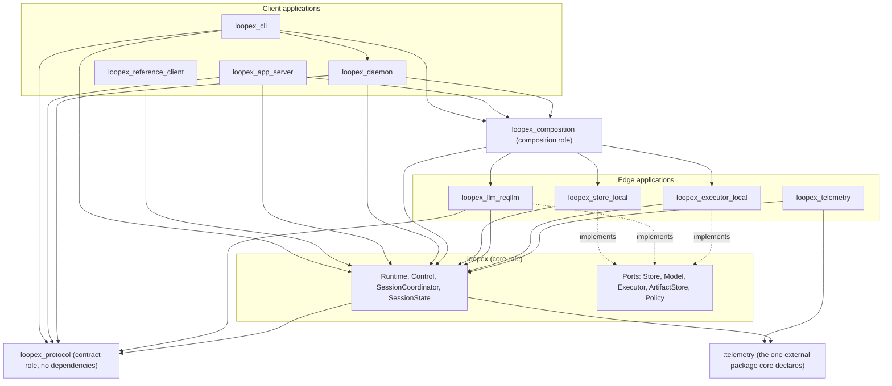
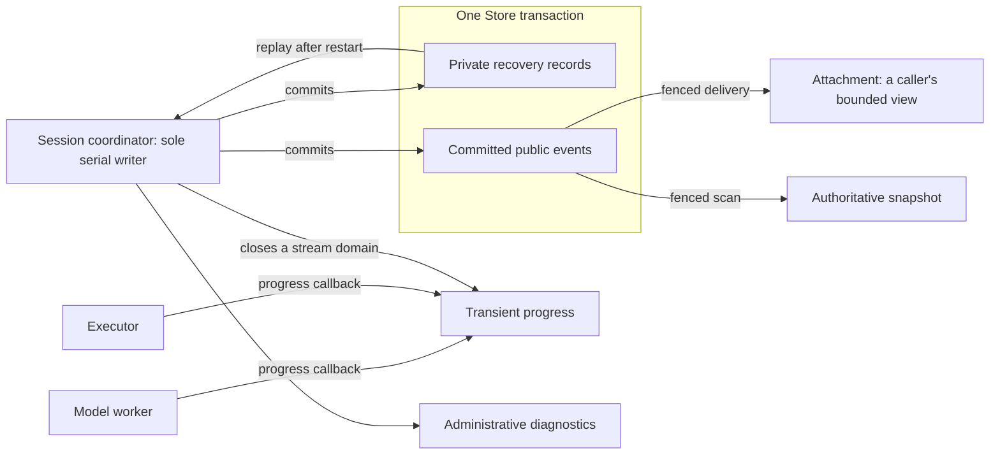

# Loopex Architecture

## Concept

Technical depth: [Architecture invariants and mechanics](architecture-technical.md#technical-depth).

Loopex is an embeddable OTP runtime for durable coding-agent sessions and
controlled effects. This document is the map a developer needs before touching
anything: which applications exist, which way their dependencies point, which
boundaries are replaceable, which kinds of truth the system keeps apart, and
which single process is allowed to write each session's history.

Three shapes explain almost every design choice in the tree. Dependency runs one
way, inward, so the kernel never learns a host's, a provider's, or a store's
concepts. Truth is separated into planes with different guarantees, so a
best-effort token stream can never be mistaken for a committed fact. And one
process at a time owns each session's durable writes, so recovery after a crash
is a replay rather than a guess.

The founding authority is the [vision pair](../vision.md#concept). This document
describes the system as it stands and cites the accepted decision behind each
boundary; where the two differ, the vision and the accepted decisions lead.

## The Eleven Applications and One Direction

Loopex is a single Elixir umbrella. Eleven applications carry five roles today,
and the role is what fixes which dependencies an application may declare.

| Application | Role | What it holds |
| --- | --- | --- |
| `loopex_protocol` | contract | Canonical encoding, tool-definition types, and the experimental public session schema and vectors, with no dependencies at all. |
| `loopex` | core | The kernel: ports, the runtime supervision tree, the session reducer, the coordinator, durable interactions, and the telemetry emission points. |
| `loopex_store_local` | edge | The durable single-machine Store and artifact store, including bounded artifact transfers. |
| `loopex_llm_reqllm` | edge | The reference model adapter over the ReqLLM library. |
| `loopex_executor_local` | edge | The trusted-local executor, workspace lease, and the bootstrap coding tools. |
| `loopex_telemetry` | edge | The one Loopex-attached telemetry handler, which hands core's spans to a runtime's diagnostics plane. |
| `loopex_composition` | composition | One page that wires the reference stack and returns a started runtime. |
| `loopex_reference_client` | client | A thin embedded client over the public facade. |
| `loopex_cli` | client | `loopex`, the command an operator runs. |
| `loopex_app_server` | client | The foreground server that speaks the experimental session protocol over standard input and output. |
| `loopex_daemon` | host | The durable local service that owns one state root and serves independent clients over a Unix-domain socket. Its `:host` role obeys every client rule, may depend on no client or host, and is the one host the reference CLI may depend on to start it from `loopex daemon`. |

Every arrow points inward. `loopex_protocol` depends on nothing, so a contributor
can compile against the contract without acquiring the runtime. `loopex` depends
on `loopex_protocol` and on exactly one external package, `:telemetry`, the
dependency-free event dispatcher the vision's dependency doctrine admits by
name; [ADR 0030](../adr/0030-observability-tracing-and-telemetry.md#concept)
records that admission and supersedes only the ADR 0001 clauses that required
an empty core dependency list. The kernel still builds and runs with no adapter
present, and it attaches no telemetry handler of its own. Every edge and client
depends on `loopex`; nothing depends outward from it.

`loopex_app_server` and `loopex_daemon` also name the contract application
directly, because the schemas they speak live there under
[ADR 0023](../adr/0023-experimental-public-session-protocol.md#concept);
declaring that edge makes what a client speaks visible in its own project file
rather than hiding it behind core. They reach sessions only through the public
facade, so they are peers of the CLI rather than second runtimes. `loopex_composition` is the one production application
that names concrete Store, Model, Executor, and ArtifactStore implementations,
which is exactly what makes the direction checkable — a second place that named
a Store would be a second place to audit. The one boundary it deliberately does
not compose is host policy: the composition ships no permissive policy an
embedder would inherit, so the `loopex` command names its own policy modules and
every host makes that decision for itself. This layout is fixed by
[ADR 0001](../adr/0001-repository-and-application-layout.md#concept).

M3 adds `LoopexComposition.with_runtime/2`
for an embedding host that needs a temporary reference stack for one operation.
It returns the operation's result after confirmed shutdown of the runtime and
its directly owned processes. Forced or unconfirmed cleanup returns an error;
an operation that raises propagates after cleanup. The existing `start/1`
behavior remains. Prepared CLI recovery uses this helper to inspect the saved session before
opening the final runtime with its
exact retained resource snapshot and trusted launch configuration.

M5 adds `loopex_daemon` as another peer client and host of the same reference
composition. It owns service lifetime, socket transport, collaboration and
residency policy while core remains the only owner of session truth.

Technical depth: [Exact inventory and temporary stack ownership](architecture-technical.md#technical-arch-applications).

The direction is not a convention a reviewer remembers. `mix loopex.deps_budget`
reads the umbrella's actual project inventory and refuses an application whose
role, identity, or declared dependencies fall outside the planned set, and
`mix loopex.core_only` builds and runs core in a separate virtual machine with no
adapter resolvable, so an edge that became reachable from the kernel fails a run
rather than passing review.

## Five Replaceable Boundaries

A port is an Elixir behaviour declared in `loopex` and implemented in an edge
application. Core holds a runtime-local reference to each implementation and
never resolves one from a registered name, application environment, or a
compile-time default. Five ports exist, and each owns one question.

**Store** is the private boundary through which durable truth commits. It
allocates a session with its runtime command mapping, advances session ownership
before commands are admitted, and atomically appends private records and public
outbox events for the current owner. It has exactly three mutation outcomes: a
confirmed commit is durable, a confirmed non-commit changed nothing, and an
unknown commit fences its caller until that same transaction is resolved. A
timeout is never converted into a non-commit. Fixed by
[ADR 0006](../adr/0006-store-transaction-and-owner-epoch.md#concept) and
[ADR 0008](../adr/0008-owner-succession-recovery-and-runtime-placement.md#concept).

**Model** is the provider-neutral boundary. A session commits one canonical
request before any adapter sees it; the adapter receives those exact bytes and
their digest with the plain semantic request, and returns one complete reply.
Streaming is an extra argument on the same call, so an adapter that cannot stream
emits nothing, returns the same reply, and is conformant. Fixed by
[ADR 0010](../adr/0010-provider-continuation-and-context-staging.md#concept) and
[ADR 0011](../adr/0011-session-input-algebra-and-streaming.md#concept).

Provider accounting preserves the validated reply's usage even when its full
settlement cannot fit the Store. That compact record retains the normalized
usage and the exact byte or depth refusal observation; rejected raw replies
retain no validated evidence and consume estimated remaining allowance. New
settlements use version 2. Replay accepts an unambiguous version-1 prefix, then
version 2 exclusively, under
[ADR 0021](../adr/0021-compacted-provider-accounting-provenance.md#concept).

**Executor** is the authority and effect-start boundary. It defines one
transport-neutral job, the host-grant bindings an executor revalidates
immediately before an effect, and the cancellation callback. It also declares,
for every error it returns, whether that error reached the caller before the
effect started — nothing else can know, because the executor is the only party
present at the boundary. Fixed by
[ADR 0007](../adr/0007-local-executor-grant-job-receipt.md#concept),
[ADR 0009](../adr/0009-tool-executor-and-grant-contracts.md#concept), and
[ADR 0012](../adr/0012-executor-cancellation-capability.md#concept).

**ArtifactStore** is where a tool's output goes when there is more of it than the
model should be shown. The model receives a bounded result that says what was
truncated, and the whole of it is retained where an operator can read it back,
up to the per-tool collection ceiling of 8 MiB beyond which the executor drops
output rather than retaining it. An
artifact has two identities: the *object* is the stored bytes, so identical bytes
are one object however often they are retained, and the *use* is why one caller
retained them. Fixed by
[ADR 0009](../adr/0009-tool-executor-and-grant-contracts.md#concept) and
[ADR 0015](../adr/0015-artifact-object-and-use-identity.md#concept).

An artifact store may also offer a bounded transfer: a caller holding an
artifact reference opens a window, the store verifies the complete object once,
and the caller then reads it back in digested chunks and closes it. The
capability is optional, so an adapter written before it stays conformant and
the facade refuses the transfer family rather than falling back to an
unbounded fetch. Fixed by
[ADR 0028](../adr/0028-bounded-artifact-retrieval.md#concept).

**Policy** is the seam where a host says yes or no to an effect. Every
executor-backed tool call consults it; there is no tool, effect class, or
argument shape that skips it, because an exemption predicate would itself be a
dispatch branch nothing policed. Resolution is exhaustive and fails closed: a
policy that is broken, slow, or malformed denies, and a denial is a truthful
committed outcome that is never retried. Fixed by
[ADR 0009](../adr/0009-tool-executor-and-grant-contracts.md#concept).

A policy may also defer: instead of deciding, it asks the operator one bounded
question. The session coordinator commits that question as a durable
interaction and suspends the tool call; when an answer commits, the same host
policy is asked again with the answer attached, and only its allow can lead to
a grant. The answer is evidence for that new decision, never a grant itself.
Fixed by
[ADR 0024](../adr/0024-durable-interaction-lifecycle-and-host-policy-authority.md#concept).

Technical depth: [Callbacks, adding an adapter, and the conformance suites](architecture-technical.md#technical-arch-ports).

## Five Truth Planes

The single most common way a durable system tells an operator something untrue is
by mixing evidence classes. Loopex keeps five apart, and their guarantees differ
by design.

| Plane | Guarantee | Who may put something on it |
| --- | --- | --- |
| Private recovery records | Durable, ordered, replayable; the only source recovery reads. | The session's current owner, through one Store transaction. |
| Committed public events | Durable, immutable, ordered within one session; delivered at least once. | The same Store transaction that committed the record they project. |
| Authoritative snapshots | A replaceable projection anchored to a public event sequence. | The runtime, derived from committed outbox rows. |
| Transient progress | Best-effort deltas within one attempt's stream domain; may be coalesced or dropped. | A model adapter or executor through its progress callback, relayed by the owner. |
| Administrative diagnostics | Operational observation; not session history and not an input to behavior. | The runtime, and nothing durable; since M4 also the telemetry edge's handler and a host-started trace session, both bounded and redacted. |

Two rules connect them. A fact is committed before it is published, and an
effect's intent is committed before the effect is dispatched — so a published
event always has its committed fact behind it, and an intent without an outcome
is a fence rather than a retry. The converse does not hold: publication reads
the committed outbox on its own schedule, so a caller whose mutation reply was
lost learns what happened from the durable record, never from the absence of a
reply. Public delivery reads the Store outbox as truth and
never rides on a mutation reply, because a reply is exactly what a lost message
does not deliver.

Progress is never durable truth. A consumer that receives no closing item for a
stream has an incomplete transient view and falls back to the durable record; it
must never read an absence as abandonment, because that inference needs a timeout
and a timeout is a guess.

Technical depth: [The publication fence and each plane's owner](architecture-technical.md#technical-arch-truth-planes).

## One Serial Session Owner

Each session has exactly one process that may write its durable truth, and
ownership is a Store fact rather than an inference from process liveness.

**Runtime Control** is the serial, runtime-local owner of session creation,
coordinator routing, and post-commit consequences. It exists so that the process
which received a Store reply is not the process that decides whether it is still
the current owner. Every ordinary session commit is offered back to Control,
which admits it only when the exact generation and owner pair is still current;
only an admitted result installs the runtime-local cache and makes committed
pending work visible.

**The session coordinator** is the sole serial Store-backed owner of one live
session. It recovers durable state, commits a fresh owner succession before
admission opens, and reduces one command at a time. Its transitions are proposed
by a pure reducer that performs no input or output, so replaying the same records
in the same order always produces the same state — which is what makes a restart
a recovery rather than a guess.

**Workers** return evidence and nothing else. An executor call runs in a
supervised task. A provider operation occupies two sibling children under the
owner generation's private task supervisor: a dormant guard and the worker that
waits for the exact permit. Only that permitted worker asks the guard to create
its linked adapter callback. Terminal paths stop and await the guard, which
cannot finish before the callback, and abrupt owner loss cannot advance past the
generation barrier while any of the three lives. Neither worker, guard, nor
callback may mutate
session state, publish a durable fact, or decide its own admission. A process
that dies contributes no raw provider evidence. The guard returns only a fixed
private failure, which the coordinator settles conservatively for the attempt it
opened rather than inheriting a claim from a process that is gone.

Ownership can move while work is in flight, and the design assumes it will. A
superseded coordinator can never newly commit, its ephemeral refusals are its own
to retain only while it is still authoritative, and it stops only once every
in-flight call, open stream, executor reserve, and model reserve it owns has
settled, every pending cleanup has either settled or been closed as
abandoned, and no fault hook is still pending. A cleanup whose model worker
the supersession itself terminated is
closed that way at once, since a superseded owner commits nothing, while an
executor cleanup keeps its worker alive until it answers, so a superseded owner
lives exactly as long as that effectful work does.

Control retains spent provider identities while their settlement is unresolved.
After the matching durable settlement closes the attempt, it removes the spent
entry. Current ownership and the exact current attempt still govern every permit,
so removing an old entry cannot authorize another provider call. A terminal
settlement requires its matching consecutive terminal record. An attempt with
only a run terminal remains retained until the session is released, as required by
[ADR 0027](../adr/0027-provider-permit-retirement.md#concept).

Technical depth: [Succession, the post-commit fence, and the invariants](architecture-technical.md#technical-arch-session-owner).

## Brains, Hands, and What the Host Keeps

The runtime is the brain: it coordinates sessions, orders commits, and decides
what happens next. Hands own workspaces and operating-system effects, and they
sit behind the Executor port — the local executor validates bounded arguments
against a fixed code-owned tool, holds a monitored workspace lease for the job's
whole lifetime, and durably retains its receipt before replying. Only the shell
tool starts an operating-system child, in its own process group and with an
environment built from nothing; the read, write, and edit tools run inside the
runtime against the leased workspace.

The host keeps everything Loopex deliberately does not own: identity, policy,
credentials, tenancy, quotas, placement, retention, and presentation. Authority
never arrives from data. An identifier, a model's output, an injected context
block, or a piece of metadata grants nothing; a grant is minted only from an
explicit host allow, and the executor revalidates audience, operation, attempt,
digest, lease, expiry, and fence before any effect starts.

Surfaces are peers. The CLI, the reference client, the app server, and any
embedder reach the same semantic contract through the public facade, and none
of them owns a loop, a cursor, or durable session truth. The app server adds a
wire and a process boundary, not a second semantics: an independent program in
another language drives a session over it, as the Node consumer in
[`clients/node`](../../clients/node/README.md) does. If a surface disappeared,
everything it does would still be reachable.

Project skills use that same division. The host discovers or imports bounded
resource packs and retains their provenance. Core holds an immutable snapshot,
records the operator's admission and selection, and stages the selected bytes.
The fixed resource class adds no application, behaviour, tool or plugin loader.
Downloaded metadata and scripts remain data; ordinary host policy and executor
grants still decide whether a requested effect runs.

Technical depth: [The policy, grant, and lease path](architecture-technical.md#technical-arch-brains-hands).

## Where to Read Next

- [Runtime and embedding](runtime-and-embedding.md#concept) — composing a runtime,
  the embedded API, and recovery.
- [Agent loop and tools](agent-loop-and-tools.md#concept) — the turn machine, the
  tool contract, bounds, streaming, and artifacts.
- [Compatibility surfaces](compatibility-surfaces.md#concept) — what is exposed
  today and why nothing is frozen yet.
- [App server protocol](app-server-protocol.md#concept) — the experimental wire
  contract the app server speaks.
- [Observability](observability.md#concept) — trace sessions and the telemetry
  event catalog.
- [Decisions](../adr/README.md) — the accepted decisions cited above.
