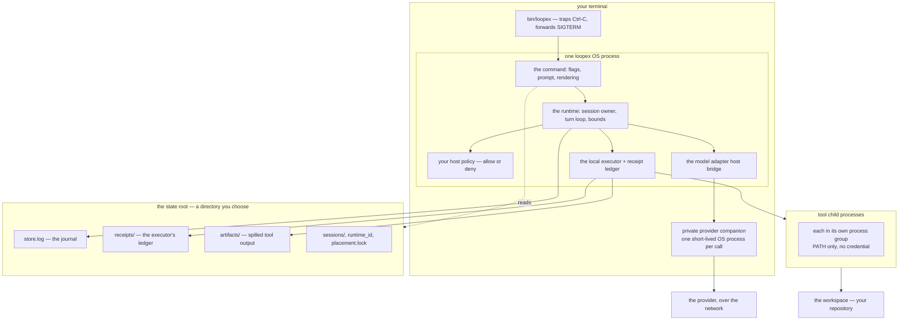

# How a Run Works

<a id="concept"></a>
## Concept

Technical depth:
[What a run makes durable](how-a-run-works-technical.md#technical-depth).

You stand in a repository, type one sentence, and a few seconds later files on
your disk have changed. This page is the picture of what happened in between: in
what order, who decided what, and which of it survives if the terminal dies
halfway through. Read it to know what to expect from a run, where to look when
one goes wrong, and what the safety properties do and do not cover.

It is a walkthrough rather than a reference. The references are
[Coding sessions](coding-sessions.md#concept) for the commands and their flags,
[Tools and policy](tools-and-policy.md#concept) for the four tools and the
authority in front of them, [The daemon](daemon.md#concept) for sessions that
outlive a command, and [Runtime operations](runtime.md#concept) for driving the
same loop from a host program. To try it first, follow
[getting started](getting-started.md).

<a id="concept-run-words"></a>
## The Words on This Page

Technical depth:
[Two planes reach your terminal](how-a-run-works-technical.md#technical-run-planes).

| Word | What it means |
| --- | --- |
| **Session** | One continuing conversation with its whole history. It outlives the terminal that started it, and `loopex resume` picks it back up. |
| **Run** | One prompt worked to an ending inside a session. A session can hold many runs, one after another. |
| **Turn** | One model request and the reply it produced. A run is a series of turns. |
| **State root** | The directory Loopex writes to. It holds the journal, the receipts and the artifacts. It is *not* your repository. |
| **Workspace** | The directory the tools act on. This *is* your repository, and by default it is the directory you ran the command in. |
| **Journal** | The append-only record of everything the session durably decided. It is the truth; the terminal is a view of it. |

Two more, used constantly. A **host policy** is the stance you name with
`--policy` that answers allow or deny for every tool call; Loopex owns no opinion
about which calls are acceptable. The **executor** is the part that actually
runs a tool — it opens the file, or starts the shell command — and it is the only
part that touches your machine.

<a id="concept-run-flow"></a>
## One Run, From Prompt to Answer

Technical depth:
[What is durable at each step](how-a-run-works-technical.md#technical-run-durability).

```mermaid
flowchart TD
    TYPE["you type a prompt<br/>bin/loopex run --policy ... 'add a changelog entry'"]
    CHECK["flags checked; workspace and state root resolved"]
    LOCK["placement lock taken<br/>one loopex owns this state root"]
    FOUND{"AGENTS.md at the<br/>workspace root?"}
    ASK["you are shown the file, its size and digests<br/>admit these project resources for this run? [y/N]"]
    OPEN["journal opened, session created, interrupt handler installed"]
    SKILLS{"project skills under<br/>.agents/skills?"}
    TRUST["you are shown every skill identity and the complete manifest digest<br/>trust this exact skill manifest for the next run? [y/N]"]
    SELECT["selected instructions and supporting labels are committed<br/>unselected files remain outside model context"]
    PROMPT["your prompt is committed, then echoed as '&gt; ...'"]
    STAGE["the exact request bytes are committed"]
    MODEL["model call over the network<br/>the answer streams onto your screen as it is written"]
    REPLY["the turn's reply is committed"]
    WANTS{"did the reply ask<br/>for tools?"}
    POLICY{"host policy decides<br/>each tool call"}
    DENY["denied, and the denial is committed<br/>no process starts"]
    GRANT["effect intent and the grant are committed"]
    RUNTOOL["the executor runs the tool in the workspace<br/>(bash in its own process group; read, write, edit inside the runtime)"]
    RECEIPT["the receipt is committed, then the result goes back to the model"]
    BOUNDS{"max turns, token budget,<br/>deadline still clear?"}
    DONE["run.finished — 'loopex: done'"]
    STOP["run.finished — the bound, the failure,<br/>or 'the effect's outcome is unknown'"]
    CTRLC(["Ctrl-C, or loopex cancel"])

    TYPE --> CHECK --> LOCK --> FOUND
    FOUND -- yes --> ASK --> OPEN
    FOUND -- no --> OPEN
    OPEN --> SKILLS
    SKILLS -- yes --> TRUST --> SELECT --> PROMPT
    SKILLS -- no --> PROMPT
    PROMPT --> STAGE --> MODEL --> REPLY --> WANTS
    WANTS -- no --> DONE
    WANTS -- yes --> POLICY
    POLICY -- deny --> DENY --> BOUNDS
    POLICY -- allow --> GRANT --> RUNTOOL --> RECEIPT --> BOUNDS
    BOUNDS -- clear --> STAGE
    BOUNDS -- reached --> STOP
    CTRLC -.-> STOP
```



**You type the prompt.** Run it through `bin/loopex`, not the escript beside it;
that is what makes Ctrl-C mean anything. Mistakes in the flags are refused here,
before a single file is opened — a `--context-token-budget` that is not a
positive whole number, `--steer` and `--follow-up` together, a missing
`--policy`, an empty prompt.

**The placement lock is taken.** One `loopex` process at a time owns a state
root, because two would race for ownership of every session in it. A lock left
behind by a process that died is reclaimed automatically; a live one refuses and
names the process holding it.

**Project resources are shown, and you decide.** If the workspace root carries an
`AGENTS.md`, the command shows it before the run starts — the resolved path, the
byte count, the content digest, and the manifest digest your answer would be
bound to:

```text
loopex: project resources found in this workspace:
  · AGENTS.md at /home/you/code/my-project/AGENTS.md (18244 bytes, digest
    4c1f…, provenance workspace_root, trust class project_resource)
loopex: manifest digest 9ab2…
loopex: admit these project resources for this run? [y/N]
```

Only `y` or `yes` admits. Anything else, including pressing return, withholds
it, and the run continues without it rather than refusing to work. Where the
input is a pipe or a redirect there is nobody to ask, so nothing is asked and the
block is staged empty. The decision and what it binds are set out in
[Project resources are your decision](coding-sessions.md#operator-sessions-project-trust).

**The journal opens and the session starts.** Now the state root gets its files —
the journal, the receipt ledger, the artifact directory, the session entry. The
interrupt handler goes on at this point too, so an interrupt from here onward
stops the run properly rather than killing the process.

**Project skills are admitted and selected before the prompt.** Loopex discovers
only `.agents/skills/<name>/` in this workspace. When it finds skills, it shows
their source-qualified identities and the complete manifest digest. A yes
admits that exact manifest for this run; any other answer withholds skill
content. `--skill` selects an admitted instruction file, and repeatable
`--skill-resource` flags select named supporting files for that same skill.
Unselected files never enter the request. See
[Install, inspect, and select project skills](coding-sessions.md#operator-sessions-skills).

**Your prompt is committed, then echoed.** The echo comes from the journal, not
from what you typed, so what you see is what the session recorded:

```text
> add a changelog entry for the parser fix
```

**The model is called, and the answer streams.** The exact bytes of the request
are committed before the call goes out. The reply then appears on your screen as
the model writes it. That live text is decoration; the durable reply is
committed separately when the turn completes.

**Tool calls go to your policy first.** Every executor-backed call, including a
read, is decided by the stance you named. A denial starts no process and is
recorded truthfully:

```text
  · loopex.bash: denied
```

**An allowed call runs in the workspace.** The terminal shows the call starting
and then its outcome, on standard error, so redirecting standard output keeps the
answer clean:

```text
  · loopex.read (call_7f31)
  · loopex.read: ok
  · loopex.bash (call_7f32)
  · loopex.bash: ok
    output beyond the tool's bound was retained: 240113 bytes,
    read it with `loopex artifact -- '3f9c1a…d80b'`
```

**The result goes back to the model and the loop turns again**, until the model
stops asking for tools or a bound stops it. The ending says which:

```text
loopex: done
loopex: stopped at the max_turns bound (16 against 16)
loopex: failed context_budget_exceeded (retryable false; context_tokens 9014 against 8192)
loopex: stopped, but the effect's outcome is unknown
loopex: reconcile with reconciliation_9f2c…
```

<a id="concept-run-parts"></a>
## What Runs Where

Technical depth:
[Where the files live](how-a-run-works-technical.md#technical-run-state-root).

Everything except the provider is on your machine. Session authority, policy,
storage and the executor live in the main Loopex process; each model call uses a
separate short-lived provider companion process, and each `bash` command its own
child process group.



Three separations matter more than the rest.

**The state root is not the workspace.** The journal, the receipts and the
artifacts go to the state root; the tools change files in the workspace. Point
`--state-root` somewhere of your choosing and it will not litter the repository
you are working in.

**The tool children are separate processes, and they are the only thing that
executes model-supplied commands.** Each starts in its own process group with a
fixed `PATH` and nothing else in its environment. Ordinary descendants stay in
that group and are stopped together. An unsandboxed command can deliberately
escape or sabotage cleanup; then Loopex reports the effect unproven and
quarantines the executor's ledger rather than claiming a clean stop.

**The provider is the only thing off the machine.** The command reads the
credential once, when it composes its runtime, into private custody. For each model call it is
delivered to the protected companion only after that process proves its entry
and build identity. It is never written to the journal, never given to a tool
child, and never printed.

<a id="concept-run-interrupt"></a>
## Where Ctrl-C Enters

Technical depth:
[The numbers you control](how-a-run-works-technical.md#technical-run-bounds).

Ctrl-C is not a kill. It becomes the same abort that `loopex cancel` submits and
that a host program would submit through the API, and the run then reports what
actually happened before the process exits.

That works through `bin/loopex` and only through it. The emulator underneath
reserves the interrupt for itself and will not hand it to a program, so the
launcher catches it outside and forwards a signal the command handles.
`SIGTERM`, `SIGHUP` and `SIGQUIT` arrive the same way and mean the same thing.

A stop that reached a clean end — every operation finished with a validated
fact, every tool process group confirmed gone — ends `cancelled`. Anything less
ends `outcome_unknown` and prints a reconciliation reference, because a
half-finished shell command that may still have written a file is not a
cancellation. The rule and its consequences are set out in
[Stopping a task](coding-sessions.md#operator-sessions-stopping).

Run the escript directly, without the launcher, and Ctrl-C ends the process
where it stands with no report. The session is still intact — it lives in the
journal, not in that process — and `loopex cancel` reconciles it.

<a id="concept-run-again"></a>
## Where Resume and Cancel Pick Up

Technical depth:
[Crash, and what recovery proves](how-a-run-works-technical.md#technical-run-recovery).

Both start from the journal, and both start the same way: take ownership of the
session, rebuild its entire history, and *hold* whatever work was in flight
without letting it move.

From that held position the two commands do opposite things. `loopex resume`
releases the work and follows it to its ending. `loopex cancel` never releases
it — it submits the abort while the work is still held, which is what stops a
command asked to end a run from being the thing that starts it.

```text
loopex sessions
loopex resume s-4f21 --policy allow-all
loopex cancel s-4f21
```

A resumed session keeps the numbers it was started with. Leave
`--cleanup-grace-ms` and `--context-token-budget` off and it recovers what the
session committed; name one that disagrees and it is refused before anything
moves, and the ownership it had taken is given back first so your next attempt
is not blocked.

`loopex cancel` applies only where no live process holds the placement lock. It
refuses against a live owner and names the process, rather than reconciling a
session out from under something still running.

Moving a state root back to an older Loopex build is not always possible: once a
newer build has written certain records, an older one refuses that history
rather than misreading it. Stop every owner and back up the whole state root
before any rollback; the technical companion lists the boundaries.

<a id="concept-run-daemon"></a>
## When a Daemon Holds the Root

Technical depth:
[What changes under a daemon](how-a-run-works-technical.md#technical-run-daemon).

Everything above describes one `loopex` process that composes a runtime for one
command. [`loopex daemon`](daemon.md#concept) composes that same runtime once and
keeps it running, and the command you type becomes a client that talks to it
over a socket inside the state root. The run itself does not change: the same
session owner, turn loop, policy, executor, provider companion and journal do the
same work in the daemon's process instead of the command's.

Three things do change. The daemon, not the command, chose the workspace, policy
and credential when it started. Several commands may watch one session at once,
and one at a time controls it. And Ctrl-C on a client detaches: the client
releases its control and exits, and the run continues in the daemon. Stopping
work there is the daemon's orderly stop, which drains every session through the
runtime before anything it depends on stops.

<a id="concept-run-safe"></a>
## What Makes This Safe, and What It Does Not Claim

Technical depth:
[Authority, refusal, and the credential](how-a-run-works-technical.md#technical-run-authority).

Four properties do the work.

**Nothing runs without an authority you named.** `--policy` has no default. The
runtime refuses to start without one, so no tool call is decided by something
you did not choose.

**Intent is written before it is acted on.** The request bytes are committed
before the model is called; the effect and its grant are committed before the
executor is asked to do anything. A process that dies mid-effect leaves a record
of what it was about to do, which is what lets recovery ask rather than guess.

**An unproven outcome is reported as unproven.** Loopex will not retry an
effectful call whose result nobody can state, and will not describe it as
cancelled. `outcome_unknown` is a real ending with a real meaning.

**Your decisions are bound to exactly what you were shown.** A project-resource
answer binds the workspace, its revision, the manifest and the content digests.
Change any of them and the answer no longer applies.

Now the limits, stated as plainly.

This is **not a sandbox.** `bash` runs a real command on your machine as you,
with your permissions, confined by nothing but the policy you named. The
workspace root is a check the filesystem tools perform, not isolation the
operating system enforces. `--policy shell-allowlist` is scope, not
containment: it matches the leading word of a command, and a compound command
walks past it. The full statement is
[What local execution can reach](tools-and-policy.md#operator-tools-reach).

The journal is **unencrypted on your disk**, and it holds your prompts, the
model's replies, and the contents of every file the session read. See
[What is kept on disk](tools-and-policy.md#operator-tools-disclosure).

And every surface on this page is experimental source-tree work: not packaged or
installed, and with no compatibility promise.

## Related

- [Getting started](getting-started.md) — build the command and run a first session.
- [Coding sessions](coding-sessions.md#concept) — the commands, their flags, streaming, steering and stopping.
- [Tools and policy](tools-and-policy.md#concept) — the four tools, host authority, artifacts and what is kept on disk.
- [Runtime operations](runtime.md#concept) — driving the same loop from a host program.
- [What a run makes durable](how-a-run-works-technical.md#technical-depth) — this page's technical companion.
- [Operator documentation index](README.md).
